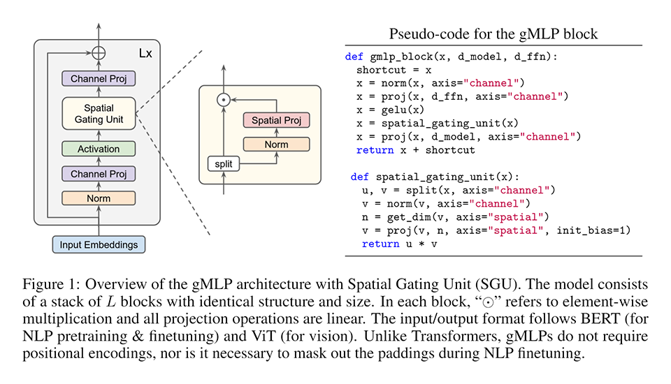
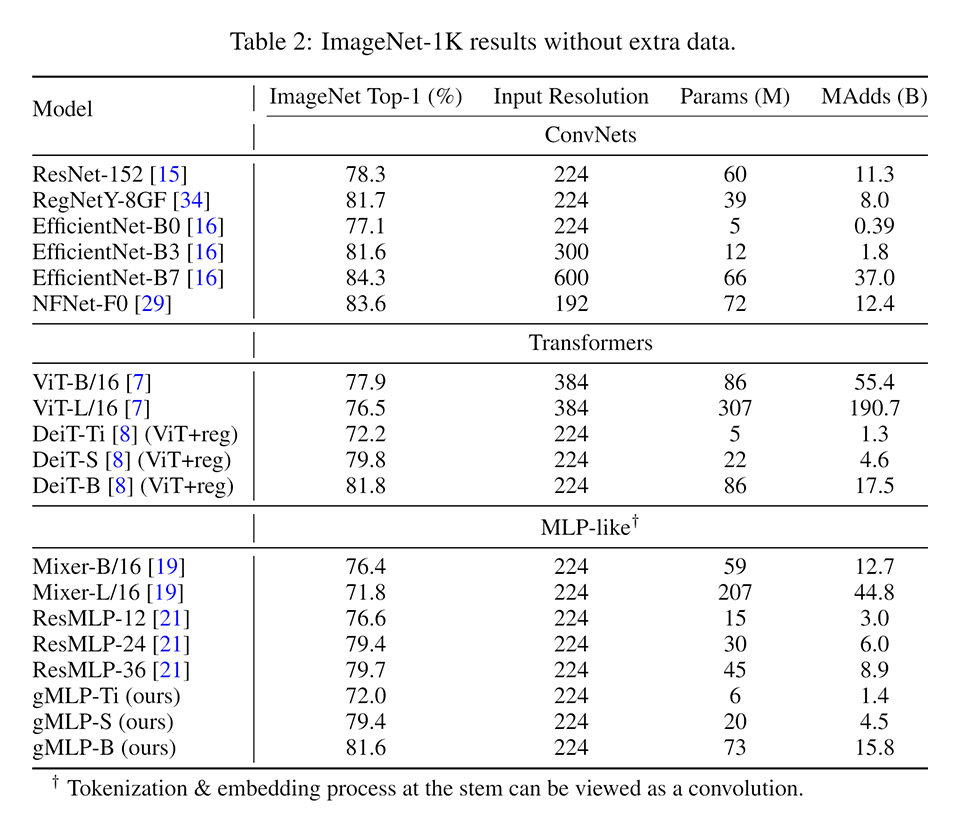
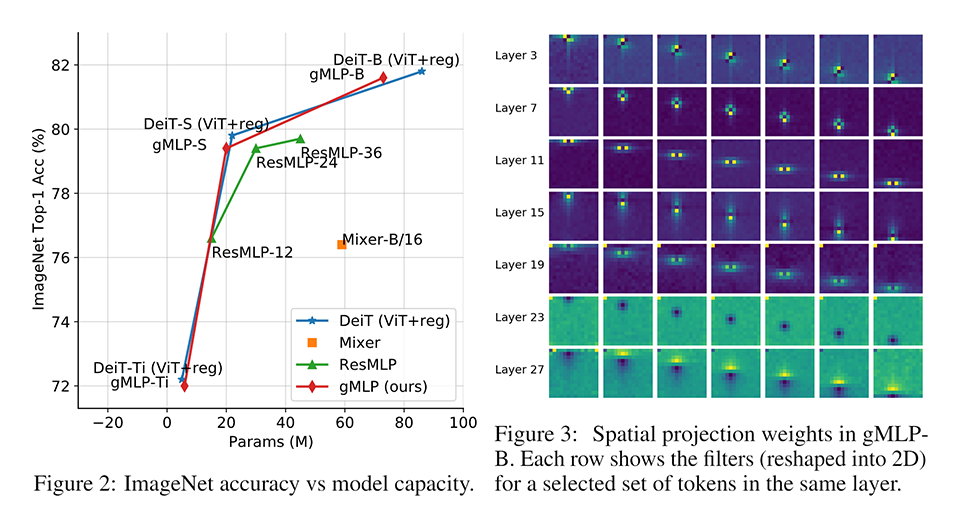

# [\[arxiv\]](https://arxiv.org/abs/2105.08050v1) Pay Attention to MLPs

- 著者
    - Hanxiao Liu *1
    - Zihang Dai *1
    - David R. So *1
    - Quoc V. Le *1
- 所属
    - 1: Google Research, Brain Team

## どんなもの？
### gMLP (Gated Multi Layer Perceptron?)
- Transformer をゲート付き MLP で単純化したアーキテクチャである（位置情報の埋め込みもない）。
- gMLP は Transformer と同様にモデルサイズを大きくする性能改善が効く。

## 先行研究と比べてどこがすごい？
- MLP-Mixer では Transformer の性能に及ばなかったが、gMLP は Transformer と同等の性能である。
- Transformer にとって辞書引きアーキテクチャ（コンテンツ間インタラクション）が本質的に重要ではないことを示した。

## 技術や手法の肝は？
### gMLP (Gated Multi Layer Perceptron?)
- gMLP は単純な MLP で空間方向とチャネル方向の情報を同時にミックス（２回）し、その途中でゲートを通過させる。

## どうやって有効だと検証した？

### ImageNet での性能比較

## 議論はある？
- とくになし

### 私見
- 論文ではアテンションフリーにできたと主張しているが、ゲート（どの位置の情報を重視するかを表す重み）はアテンションなので表現が適切ではない。辞書引きアーキテクチャ（コンテンツ間インタラクション）が不要と言った方が適切である。
- MLP-Mixer は空間方向とチャネル方向の情報を独立してミックスしていたので gMLP に近いが、gMLP の方がより柔軟な写像ができる。柔軟な代わりに学習が難しくなるのでゲートを追加したと考えられる。

## 次に読むべきタイトルは？

### MLP-Mixer
[\[arxiv\]](https://arxiv.org/abs/2105.01601) I. Tolstikhin, N. Houlsby, A. Kolesnikov, L. Beyer, X. Zhai, T. Un-terthiner, J. Yung, D. Keysers, J. Uszkoreit, M. Lucic, A. Dosovitskiy, "Mlp-mixer: An all-mlp architecture for vision", arxiv preprint, 2021.
