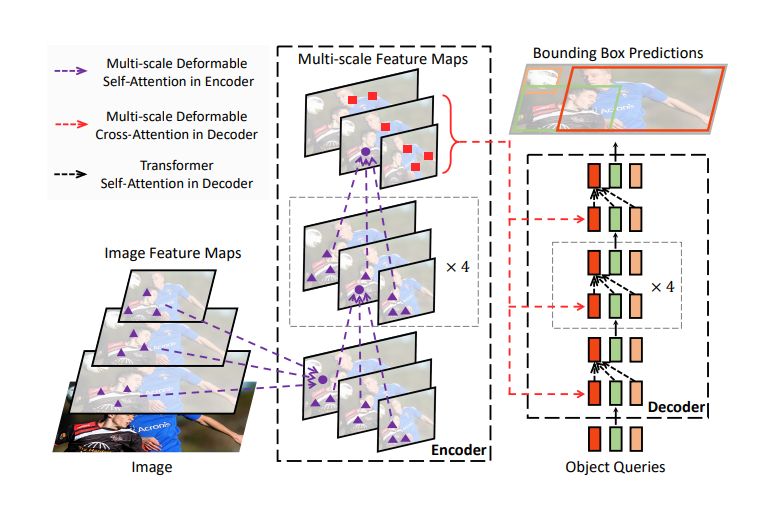
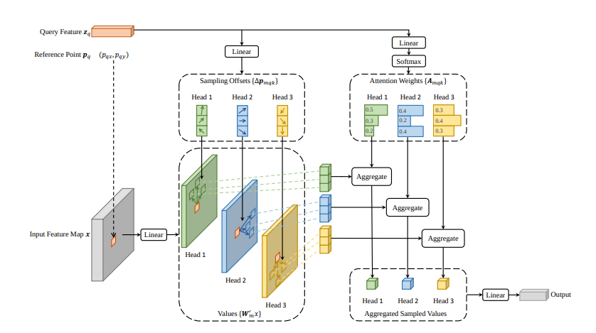
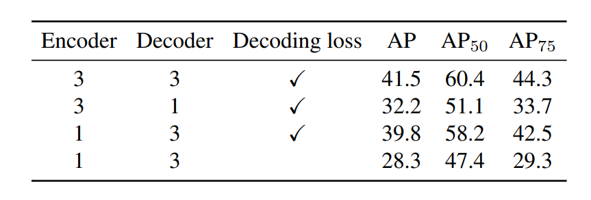
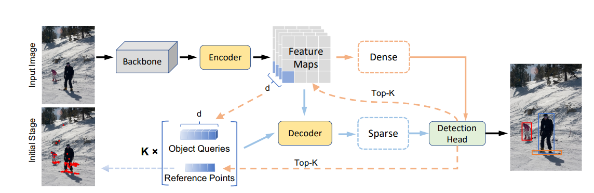
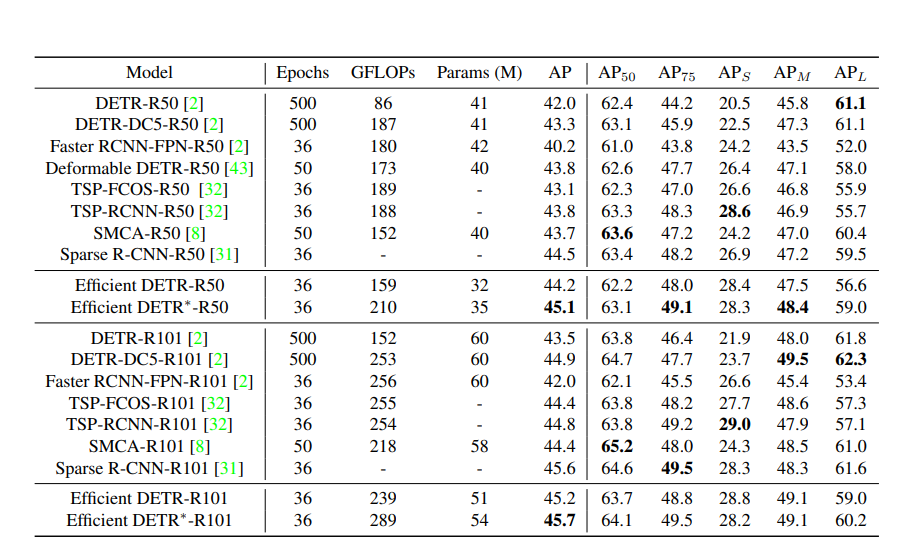
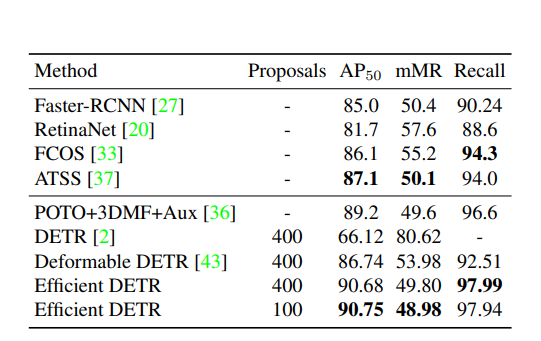

# Efficient DETR: Improving End-to-End Object Detector with Dense Prior
[https://arxiv.org/abs/2104.01318](https://arxiv.org/abs/2104.01318)

（まとめ @n-kats）

著者
* Zhuyu Yao
* Jiangbo Ai
* Boxun Li
* Chi Zhang

# どんなもの？
自然言語で使われるトランスフォーマーを物体検出に取り入れたDETR、その派生のDeformable DETR、Efficient DETRはこれらに続く研究。

DETR系は、画像→特徴抽出→エンコーダー→デコーダー→推論の構造をしている。デコーダー部分を工夫し性能改善した。

そのために、DETRのデコーダーの弱点を分析しているのもこの研究の重要な点。

# 先行研究と比べてどこがすごい？
* DETR以前のよくある検出手法・・・NMSが入っていてend-to-endと言い切れない
* DETR・・・それらと比べて10倍くらい学習が遅く、小さいものの性能が悪い
* Deformable DETR・・・Attentionを範囲を狭め、feature pyramidを活用して性能改善。

しかし、Deformable DETRでもデコーダー部分が6個の

# 技術や手法の肝は？
## DETR/Deformable DETR 復習
### DETR
(1月の発表のコピペ)

簡単のため、検出の場合について。

1. 入力（画像）
2. 特徴抽出（backbone）
3. 位置情報付与（positional encoding）
4. エンコーダー
5. デコーダー（クエリー複数を入れると対応した結果を出す）
6. 分類やBBoxの認識

デコーダーに入力するオブジェクトクエリーは学習で獲得（気持ちとしては「ここら辺にあるものは何ですか」みたいな意味のクエリー）。

デコーダー内のアテンション機構のおかげで（損失関数の工夫もあり）、NMSの後処理をせずとも重複して検出しないように学習する。

### Deformable DETR

Deformable DETRは次の特徴がある。
* multi scale feature map（複数の層を使う）
* deformable attention module

reference pointという点を考えて、そこから周辺の情報を集める（deformable conv風に）のが特徴

### DETR/Deformable DETRの課題
DETR等のデコーダー部分には6層のattentionが入っている。これを変更すると、次の表のように精度が大きく落ちる。

また、
* エンコーダーの方で同じことを試してもそこまで急激には落ちない。
* 補助タスクとして、デコーダの途中でheadをつけて学習していて、これを取り除くと落ちる。

ここで考察
1. エンコーダーとデコーダーの差は何か？補助タスクの効果が大きい
2. 何故補助タスクがいい？デコーダーの計算が進む毎に認識内容を補正する効果がある
3. どういう現象？オブジェクトクエリがより良いものに変化しているとも言える
4. じゃあ、最初からオブジェクトクエリが良ければいいのでは？

## Efficient DETR メタアーキテクチャ

1. （黒）画像から特徴マップを作ってエンコーダーに入れる（これまでと同じ）
2. （ベージュ実線）いきなり認識（検出等）してしまう
3. （ベージュ破線）確信度の高いものK個を選んで、reference pointとオブジェクトクエリ（特徴マップから取り出す）を取得
4. （水色）デコーダーに入れてもう一度認識する（2番と同じパラメータを使う）

オブジェクトクエリにするベクトルはそこから検出ができる程度に良いベクトル。位置情報もreference pointとして持っているため優れている。

# どうやって有効だと検証した？
backboneは他研究に合わせてresnetを使用。
先行研究より良い結果だが、本気モードの結果とはいえないので、参考程度。

## COCO
学習も速く、精度も良い。

## CroudHuman
小さい人が大量に映っているデータセット

# 議論はある？
reference pointsがよくあるアンカーに相当する。
これまでは、オブジェクトクエリが雑なために訓練が遅かったと考えられる。

## 私見
1月に紹介したTrackFormerでも認識直前の内容を次のフレームのトラッキングクエリに使っていたので、似ている。
一度認識して再利用するのは2-stageの匂いを感じるが・・・補助タスクで訓練するよりは明示的につかえていていいのかな。

# 次に読むべき論文は？
* SparseRCNN・・・名前がでていて気になった
* [Finding a Needle in a Haystack: Tiny Flying Object Detection in 4K Videos using a Joint Detection-and-Tracking Approach](https://arxiv.org/abs/2105.08253)  
  ・・・4K動画で高性能な認識をしたらしい。気になる