HOTA: A Higher Order Metric for Evaluating Multi-object Tracking
===

Jonathon Luiten · Aljo˘sa O˘sep · Patrick Dendorfer · Philip Torr · Andreas Geiger · Laura Leal-Taixé · Bastian Leibe

Published: 08 October 2020

https://link.springer.com/article/10.1007/s11263-020-01375-2

（まとめ: 山口眞太）

## どんなもの？

### 概要

+ HOTA （Higher Order Tracking Accuracy）は複数物体トラッキングの評価指標として新たに提案されたものである.
    + 既存の MOTA という評価指標は検出能力に強く依存している.
    + 既存の IDF1 という評価指標は ID 付与能力に強く依存している.
    + これらの指標に対して, HOTA は良いバランスを示している. 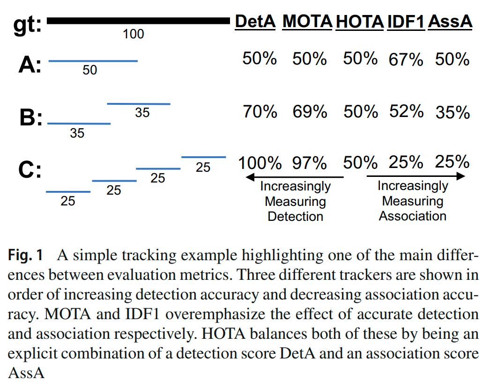
    + KITTI MOT も MOT Challenge も評価指標として導入している.

## 先行研究と比べて何がすごい？

### 先行研究: MOTA

+ MOTA はフレーム毎に検出の真値と推測値の間のマッチングを行い, TP, FN, FP, IDSW の数をフレームにわたって累計する. CLEAR MOT Metrics の原論文（ https://jivp-eurasipjournals.springeropen.com/articles/10.1155/2008/246309 ）中の以下の図では FN が Miss, IDSW が Mismatch と表現されている. o が object, h が hypothesis の略である. 
+ 以下の式で評価を行う. 

#### MOTA の問題点

+ MOTA における検出能力の比重は ID 付与能力に対して大きすぎる. 
+ MOTA における検出の Precision の比重は検出の Recall に対して大きすぎる.
    + 複数物体トラッキングにおいては, IDSW よりも FP, FP よりも FN がずっと多く出ると言われている. 例えば https://arxiv.org/abs/1907.12740 参照.
+ MOTA の IDSW は ID 付与能力のうち短期の整合性のみを評価している.
+ MOTA は AssPr を考慮していない.（後述）
+ MOTA は ID 付与を間違えたものを元の ID に修正したトラッキング結果を IDSW が2回生じたとして低く評価する. 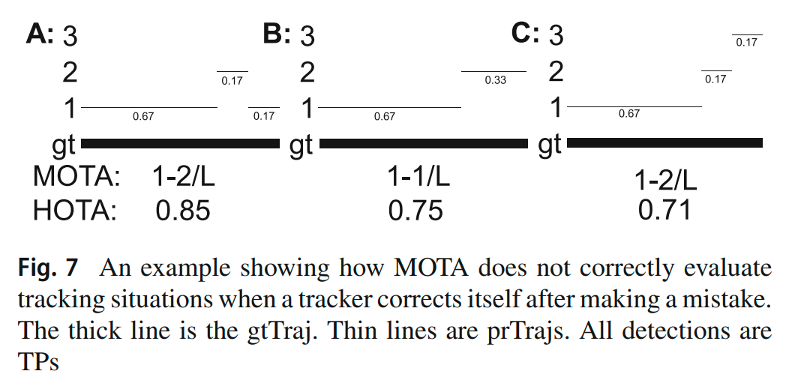
+ MOTA はトラッキングが長く続いたものを高く評価しない. 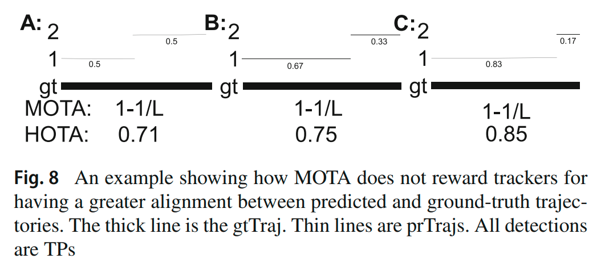
+ MOTA における IDSW による影響はフレームレートに大きく依存する. 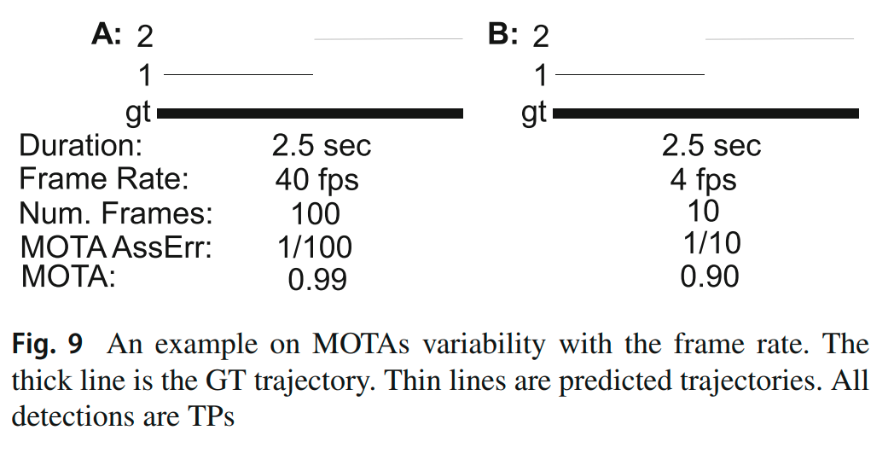
+ MOTA は位置推定の正確さを考慮していない.
+ MOTA の値は負になりうる.

### 先行研究: IDF1

+ 複雑なので詳細は割愛するが, シークエンス内の ID の真値と推測値の間のマッチングを FN, FP が最も小さくなるように行う.（原論文は https://arxiv.org/abs/1609.01775 .）
+ ID 間のマッチングで得られた検出の真値と推測値の対応を IDTP, マッチングの対象にならなかった検出の真値を IDFN, 同様にマッチングの対象にならなかった検出の推測値を IDFP としたとき, IDF1 は以下の式で算出される. 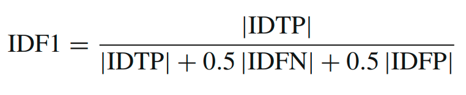

#### IDF1 の問題点

+ IDF1 のアルゴリズムによって得られる ID 間のマッチング結果は反直感的である場合が少なくない. 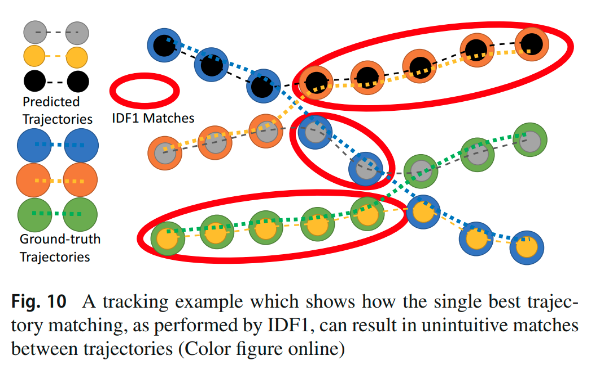
+ IDF1 は検出能力の向上で低下する場合がある. 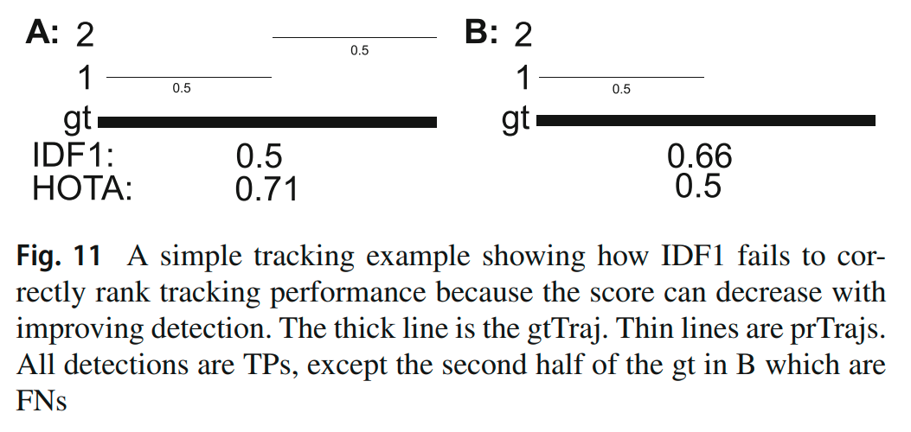
+ IDF1 はマッチング外の ID 付与を無視してしまう. 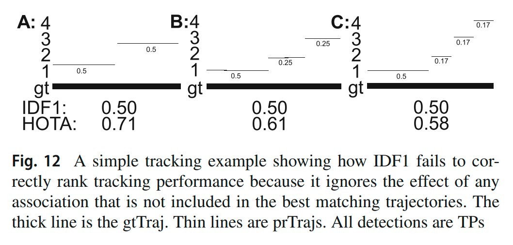
+ IDF1 のスコアが高いことは, 検出能力や ID 付与能力というよりも, シーン内の物体の数を正確に推測する能力に強く依存している.
+ IDF1 は位置推定の正確さを考慮していない.

## 技術や手法の肝は？

### HOTA

+ まず, 位置推定の正確さを考慮に入れるために, 空間類似度（バウンディングボックスならば IoU など, 0 から 1 の値を取るような検出の真値と推測値の間の指標.）に対する閾値を 0.05 刻みで与え, その閾値毎にスコアを算出し, 最後に平均するという方法を取る. HOTA は以下のように多数のサブスコアに分解することができる. 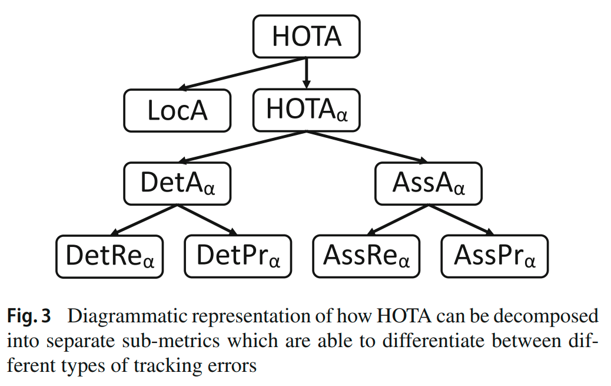
+ MOTA と同様, フレーム毎に検出の真値と推測値の間のマッチングを行うのだが, マッチングの際の重みに単に近いもの同士をマッチングするのではなく, シークエンス全体の整合性の情報を利用する点が MOTA と大きく異なる. マッチングの際の条件には上の閾値を使用する.
+ 検出能力の評価には, 上のマッチングによる TP, FN, FP を使用して以下を算出する. 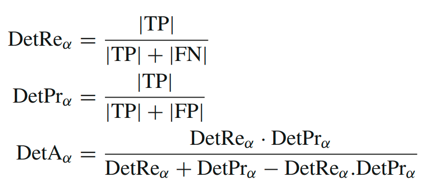 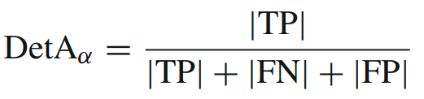
+ TP の各対応 c に対して下の図のように TPA(c), FNA(c), FPA(c) が算出できる. 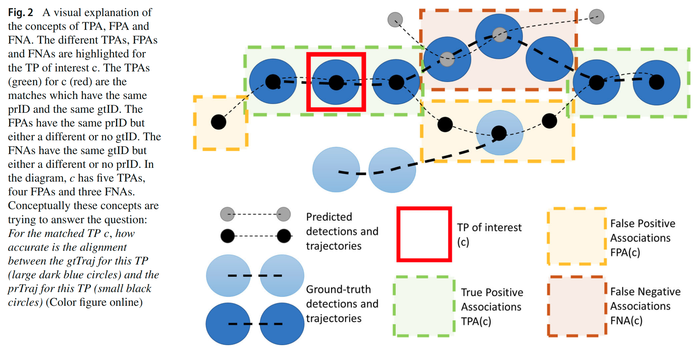 これらに対して, ID 付与能力の評価として以下を算出する. 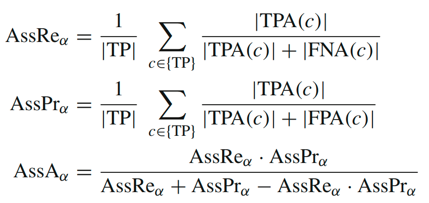 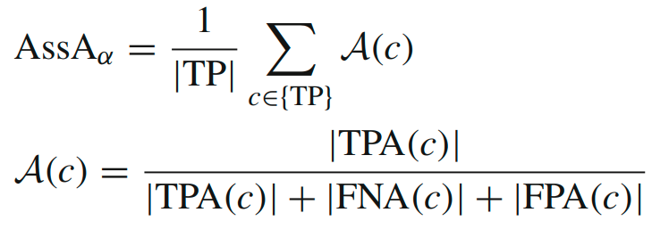
+ 各閾値に対する HOTA の値は以下である. 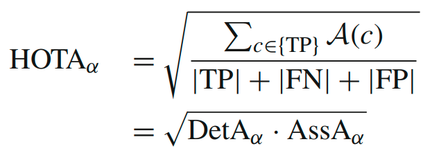
+ LocA は位置推定の正確さの指標である.（省略.）

## どうやって有効だと検証した？

+ どちらの指標が人間の判断により近いかを MOTA, IDF1 と比較することで検証した. 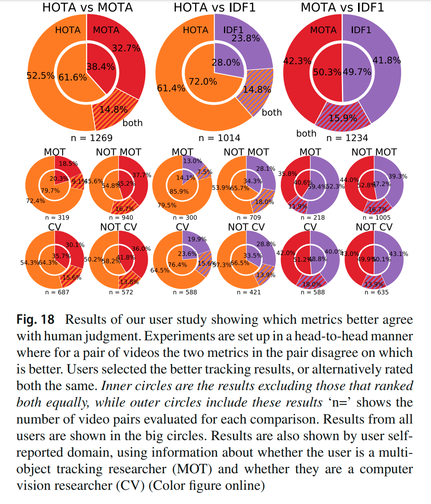

## 議論はある？

+ 様々な拡張が論文内で提案されている.（多すぎるので省略.）
+ MOTA, IDF1 の弱点らしい弱点の多くが克服されているため, HOTA も弱点が発見されるのを待っている段階だと思われる.

## 次に読むべき論文
+ Evaluating Multiple Object Tracking Performance: The CLEAR MOT Metrics https://jivp-eurasipjournals.springeropen.com/articles/10.1155/2008/246309
    + 古い. MOTA の説明がなされている. 本論文でも説明があるので, 読まなくてもいいかもしれない.
+ Performance Measures and a Data Set for Multi-Target, Multi-Camera Tracking https://arxiv.org/abs/1609.01775
    + 古い. IDF1 の説明がなされている. 上と同様, 本論文でも説明がある.
+ Deep Learning in Video Multi-Object Tracking: A Survey https://arxiv.org/abs/1907.12740
    + 少し古いが, 評価指標について詳しい. 他にも当時のトレンドや問題の切り分け方が参考になる.