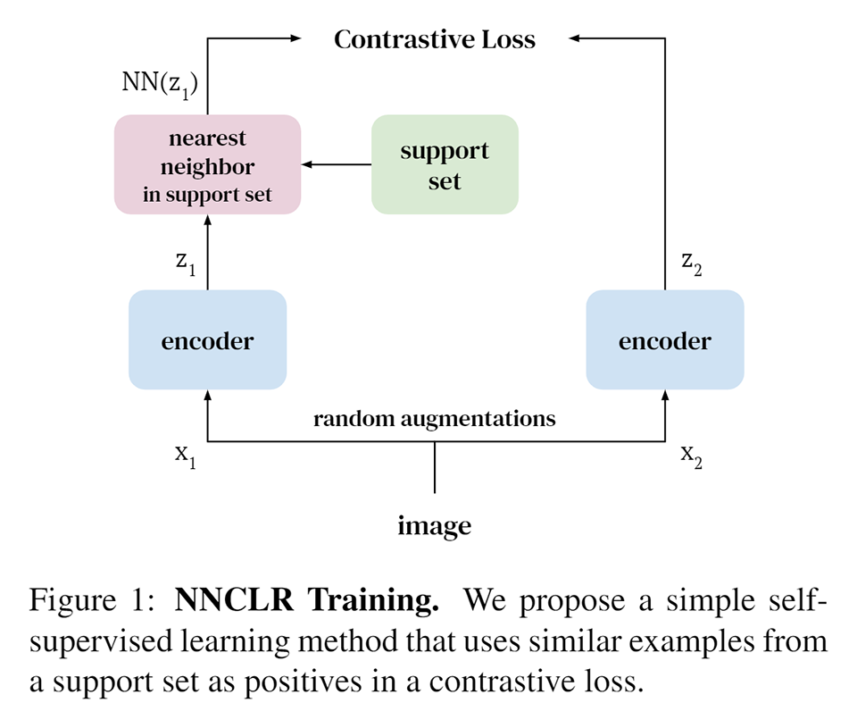
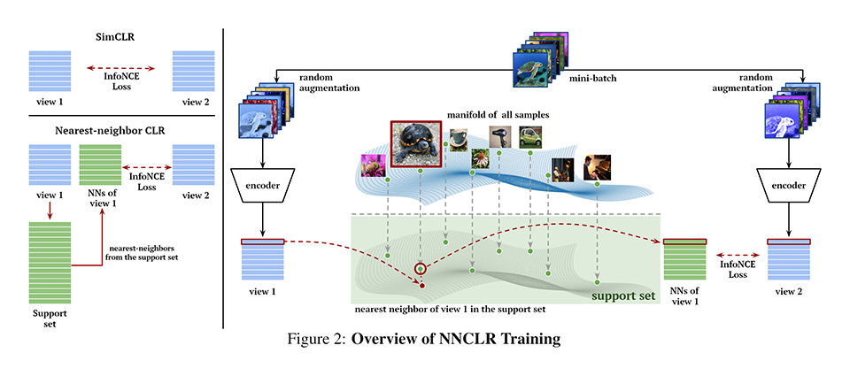
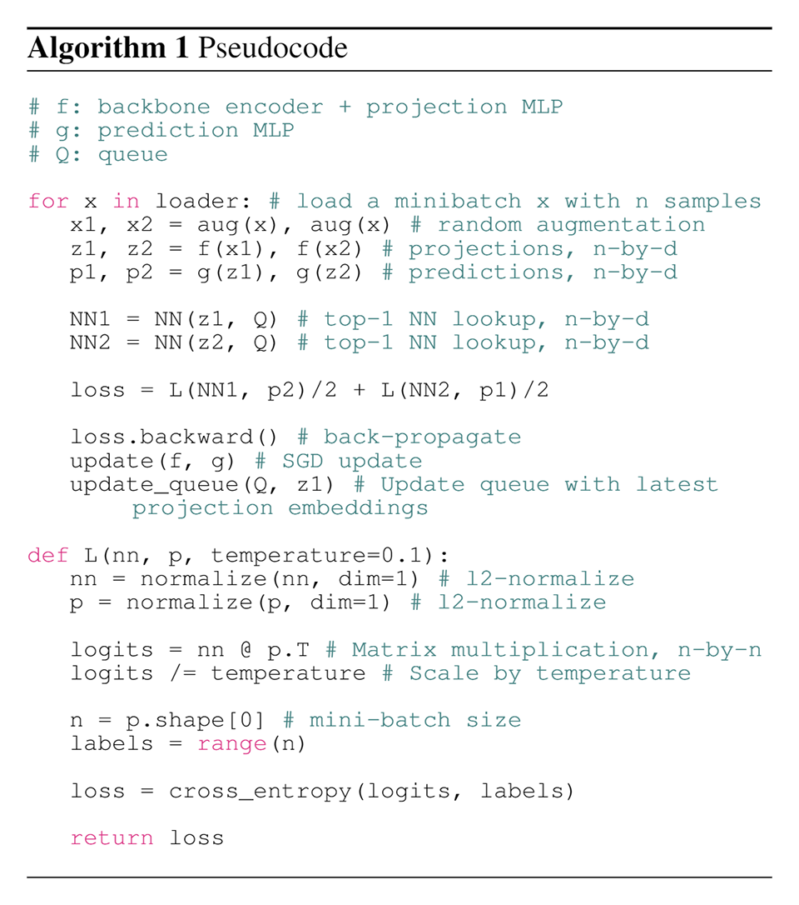
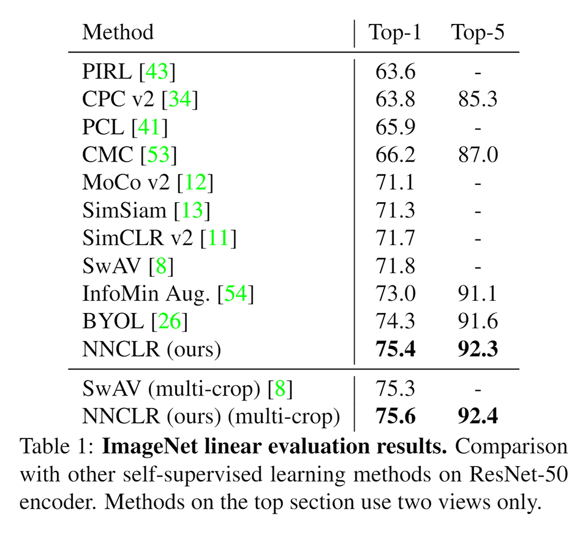
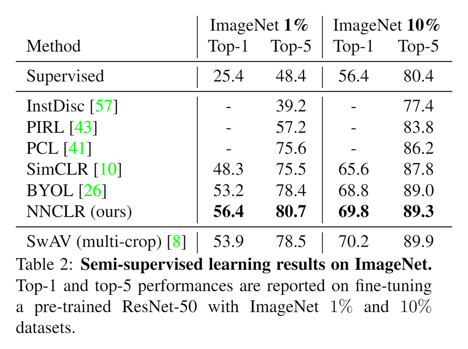
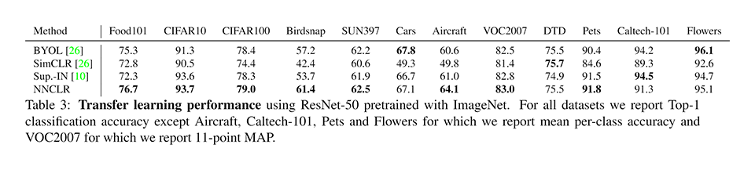
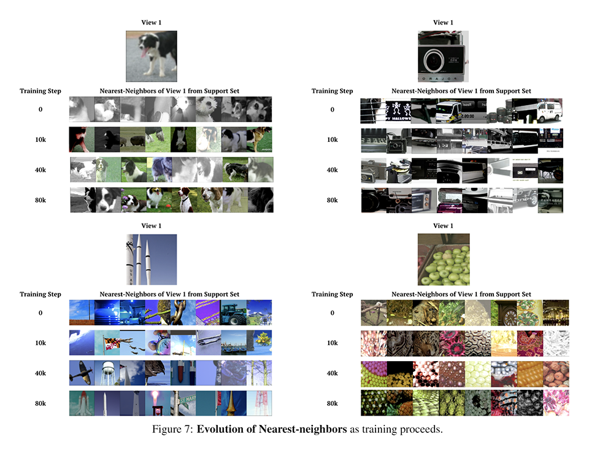

# [\[arxiv\]](https://arxiv.org/abs/2104.14548v1) With a Little Help from My Friends: Nearest-Neighbor Contrastive Learning of Visual Representations

- 著者
    - Debidatta Dwibedi *1
    - Yusuf Aytar *2
    - Jonathan Tompson *1
    - Pierre Sermanet *1
    - Andrew Zisserman *2
- 所属
    - 1: Google Research
    - 2: Brain Team

## どんなもの？
### NNCLR (Nearest-Neighbor Contrastive Learining of visual Representations)
近傍法 (Nearest-Neighbor) を用いて類似ペア（正事例）を生成する自己教師あり対比学習 (Self-Supervied Contrastive Learining) である。

## 先行研究と比べてどこがすごい？
- 強力なオーグメント手法に頼らずに（crop のみで）従来手法を上回る性能を達成した。

## 技術や手法の肝は？
### NNCLR (Nearest-Neighbor Contrastive Learining)
- 従来の自己教師あり対比学習は同じデータからオーグメントで得られたデータの組を類似ペアとするが、NNCLR ではオーグメントで得られたデータに最も似ている（特徴ベクトルが近い）ものをサポートセット（オーグメントで得られたデータの特徴ベクトルが格納されたキュー）から選び出して類似ペアとする。
- 従来手法ではオーグメントで生み出せる範囲のものが近傍に集まる特徴空間しか作れないが、NNCLR ではそれに加えてそもそも似ているデータも近傍に集まる特徴空間を作れる（より適切な特徴空間となる）。
- 従来手法ではそもそも似ているデータが非類ペアとして扱われるために学習に悪影響があるが、NNCLR ではそのような悪影響はない。似ていないデータが類似ペアになってしまう可能性はあるが、特徴空間の次元数が低すぎなければそのような心配はあまりない。

## どうやって有効だと検証した？

### 従来手法との比較 / 線形識別タスク
「エンコーダをファインチューンせずにどれだけ良い性能がだせるか」という観点で各手法を次の手順で比較し、NNCLR が優れていることを確認した。

+ ImageNet2012 dataset（画像：128万枚，アノテーション：不使用）を使用して ResNet-50 エンコーダ（特徴空間：2048次元）を各種手法で事前学習する。
+ 事前学習によって獲得したエンコーダに線形識別層を追加して、その層だけ追加学習する。そうして得られた線形識別器の性能を測定する。

### 従来手法との比較 / 半教師あり学習
「少ない教師でどれだけよい性能がだせるか」という観点で各手法を次の手順で比較し、NNCLR が優れていることを確認した。ただし、SwAV (multi-crop) には勝てなかった。

+ ImageNet2012 dataset（画像：1% or 10%，アノテーション：使用）を使用して線形識別タスクで獲得したエンコーダをファインチューンする。そうして得られた識別器の性能を測定する。

### 従来手法との比較 / 転移学習（＆線形識別タスク）
「ImageNet2012 dataset で事前学習したエンコーダが他のデータセット上のタスクにどれだけ通用するか」という観点で各手法を次の手順で比較し、NNCLR が優れていることを確認した。いくつかのタスクでは勝てなかったが、おおむね勝てている。

+ 線形識別タスクで獲得したエンコーダい線形識別層を追加して、その層だけ各種データセットで追加学習する。そうして得られた識別器の性能を測定する。

### 切除実験
切除実験によって次の性質を確認した。

- NN (Nearest Neighbor) で類似ペアを作ることは性能を改善する。
- NNCLR はオーグメントを弱めても性能が劣化しづらい。
- 事前学習時間を固定した場合、NNCLR は従来手法より性能がよい。
- サポートセットのサイズは大きくした方が性能がよい。
- NN の近傍数は 1 で良い（大きくしても性能は改善しない）。
- NNCLR のバッチサイズにはスイートスポットがある（本研究では 4096 がよかった）。
- 特徴空間の次元数は 128 で良い（大きくしても性能は改善しない）。
- ソフトな NN と ハードな NN では後者の方が性能が良い（大きく違う）。
- NNCLR においても prediction MLP を導入すると性能を僅かに改善できる。
- サポートセット内の特徴ベクトルを最新のエンコーダで求め直しても性能は改善しない。古いエンコーダで求めた特徴ベクトルがサポートセットに入っていても性能に影響しない。
- サポートセットのサイズを大きくしても、深刻なレベルで計算量やメモリ使用量が増加することはない。

### NN を用いて生成した類似ペアの観察
- １列目（クエリ）に対して２列目以降（上位 8 位）の多様性が大きいことが分かる。オーグメントでは得られない多様性を獲得できている。
- 訓練ステップが進むと類似するものが上位に来やすくなっている。

## 議論はある？
- NNCLR は、過去の類似例を思い出して今見ているものと比較するというプロセスを実現している。
- NN で似ているデータを選択する際に、真に似ているもの（Ground Truth）が必ず選ばれるようにすると、性能が改善するのか？ 3% 程度改善する。つまり、似ているデータを選択するアルゴリズムを工夫すれば性能を改善できる可能性がある。
- NNCLR の訓練時の損失は SimCLR の訓練時の損失よりも大きい。これは NNCLR の方がより予測が難しい類似ペアを扱っているためである。だから性能が良い。

## 次に読むべきタイトルは？

### SwAV
[\[arxiv\]](https://arxiv.org/abs/2006.09882) M. Caron, I. Misra, J. Mairal, P. Goyal, P. Bojanowski, A. Joulin, "Unsupervised learningof visual features by contrasting cluster assignments", arxiv preprint arXiv, 2020.
