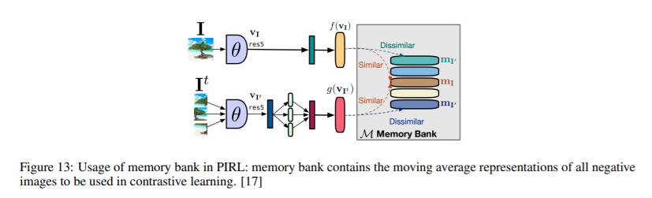
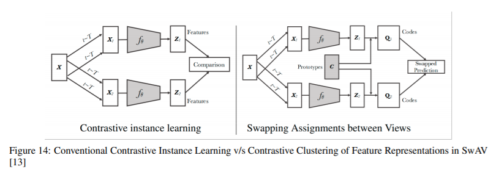
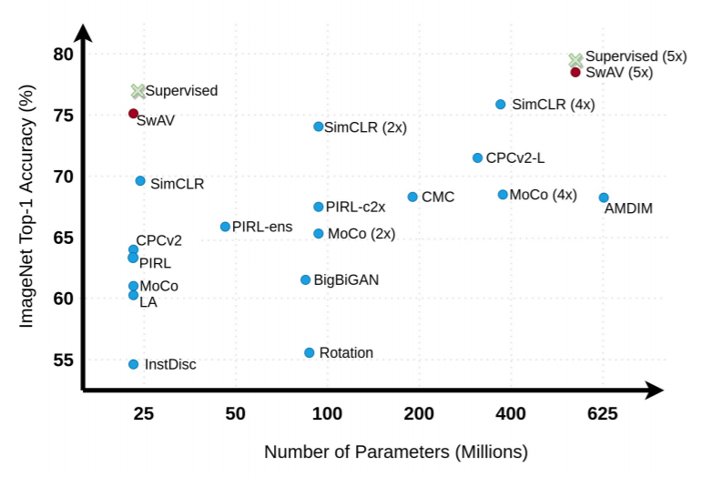
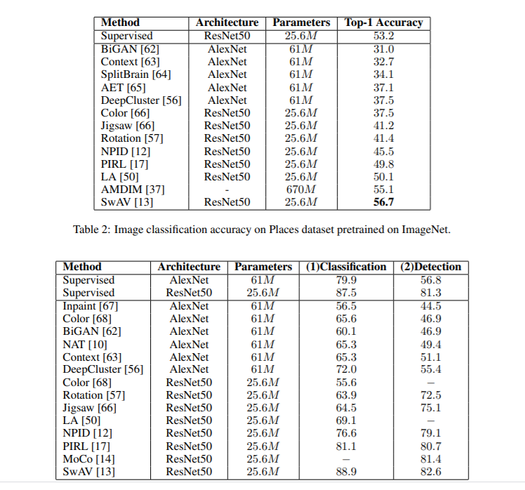

# A SURVEY ON CONTRASTIVE SELF-SUPERVISED LEARNING
https://arxiv.org/abs/2011.00362v3

(まとめ @ma)

著者
* Ashish Jaiswal
* Ashwin Ramesh Babu
* Mohammad Zaki Zadeh
* Debapriya Banerjee
* Fillia Makedon

The University of Texas at Arlington

# どんなもの？
自己教師学習（対比学習）の要約

ComuterVisionがメイン、NLPも

# 先行研究と比べてどこがすごい？
全体像つかめる、アーキテクチャーの経緯がわかる

# 技術や手法の肝は？

対比学習概要

４つのアーキテクチャーの説明

# どうやって有効だと検証した？

## データセット　ImageNet

注意領域が広がっている？

# 議論はある？

## 私見
去年位まで、教師あり学習（データ＋ラベル）が意味ある予測には当然と思ってましたが、自己教師あり＋（ラベル）が普通になるのかなと思ってるので、この領域の発展目が離せない。

SwAVが取り入れたデータ拡張のやり方がほかのアーキテクチャーでも結構効いている。データ拡張新しい主張だけの論文とかでてくるか気になる。

# 次に読むべき論文は？
* [Unsupervised Learning of Visual Features by Contrasting Cluster Assignments](https://arxiv.org/abs/2006.09882)

  SwAVの仕組みがよくわからないので

