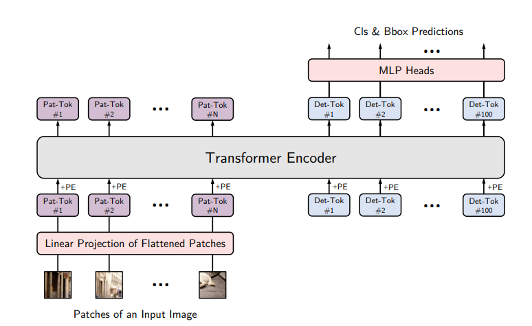
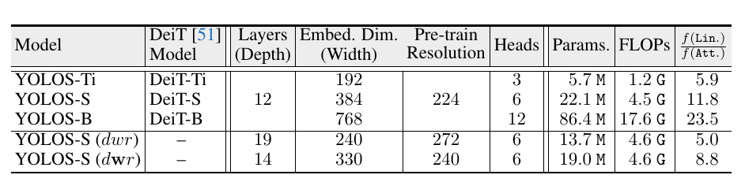
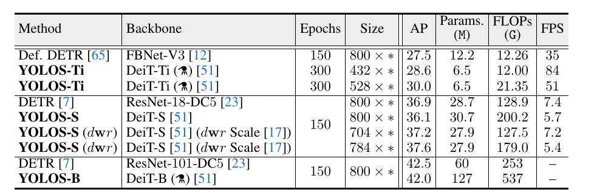
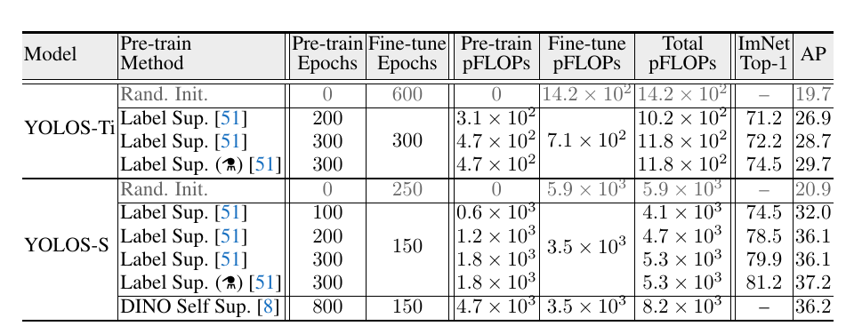

# You Only Look at One Sequence: Rethinking Transformer in Vision through Object Detection
[https://arxiv.org/abs/2106.00666](https://arxiv.org/abs/2106.00666)

（まとめ @n-kats）

著者
* Yuxin Fang
* Bencheng Liao
* Xinggang Wang
* Jiemin Fang
* Jiyang Qi
* Rui Wu
* Jianwei Niu
* Wenyu Liu

# どんなもの？
DETRやViTで流行中のvisual transformer。今回の論文が提案する YOLOS は、DETRのように検出にtransfomerを使う系だが、

* 畳み込みはしない（ViT要素）
* sequence-to-sequence 風に処理する

という特徴がある。

なお、YOLOとは関係がない

# 先行研究と比べてどこがすごい？
pure ViTの転移学習が検出のような複雑なタスクで有効かという疑問を元に、

* sequence-to-sequenceの方法でグリッド状の形状を利用したinductive biasを入れない
* ViT をfine tuneして使う

という研究をしている。

YOLOSはSequence-to-sequenceの形になっていてとてもシンプルな手法（ViT-FRCNNとかDETRと比べ）。

ただし、計算リソースの都合上、でかいくて強いモデルを作ることはできていない。

# 技術や手法の肝は？

## 復習
### ViT

画像をパッチに切って、全結合層を通した後、positional embeddingと合わせて、transformerに入力する。

### DETR
(1月の発表のコピペ)

簡単のため、検出の場合について。

1. 入力（画像）
2. 特徴抽出（backbone）
3. 位置情報付与（positional encoding）
4. エンコーダー
5. デコーダー（クエリー複数を入れると対応した結果を出す）
6. 分類やBBoxの認識

デコーダーに入力するオブジェクトクエリーは学習で獲得（気持ちとしては「ここら辺にあるものは何ですか」みたいな意味のクエリー）。

デコーダー内のアテンション機構のおかげで（損失関数の工夫もあり）、NMSの後処理をせずとも重複して検出しないように学習する。

## YOLOS メタアーキテクチャ

パッチ由来のシーケンスと "Det-Tok"（検出のトークン）のシーケンスとを結合させ、トランスフォーマーにかける。以上。

## YOLOS設定
* Det-Tokは100個。ランダムに初期化して訓練。
* バッチサイズ8。
* cosine decay
* multi-scale augmentaion（短辺は256から608ピクセルまで、長辺は864ピクセルまで）
* random crop(DETRと同様)

比較実験のため、数種類の亜種を考える。YOLOS-SのdwrとdWrはFLOPSが同じだけど、設定の異なるパターン。

# どうやって有効だと検証した？
## COCO
残念ながら、この論文は精度を上げたって論文じゃない。けどDETRと同程度の精度になっているので、今後の発展に期待。

## pretrainを使わない時

ランダムだと20程度。（とはいえ、もっと学習回したら変わるかもよ？）

# 議論はある？
大規模なモデルのケースはこの研究ではできていない。また、解像度が大きい場合や、密な推論（セグメンテーションとかデプスとか？）もしていない。（自然言語の方では、数千個のトークンを使って認識している。）

ViT系はFLOPsに関わる要素がCNNと違う。

## 私見
Det-Tokはがランダムに初期化するが、これだと苦労するような（efficient detrの主張）

# 次に読むべき論文は？
* [Fast and Accurate Model Scaling](https://arxiv.org/abs/2103.06877)  
  dwrとdWrのくだりの理解に役に立ちそう
