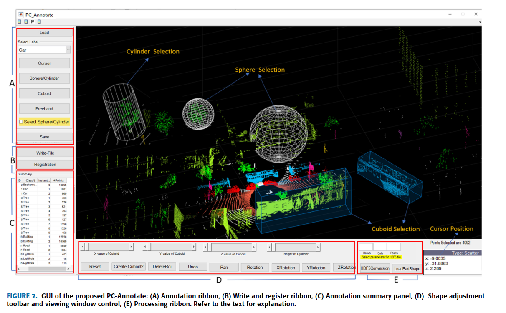
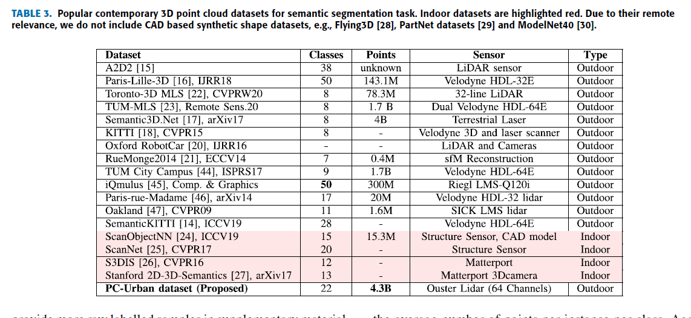
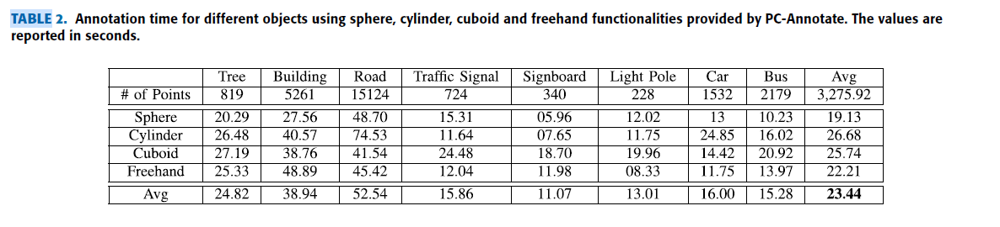
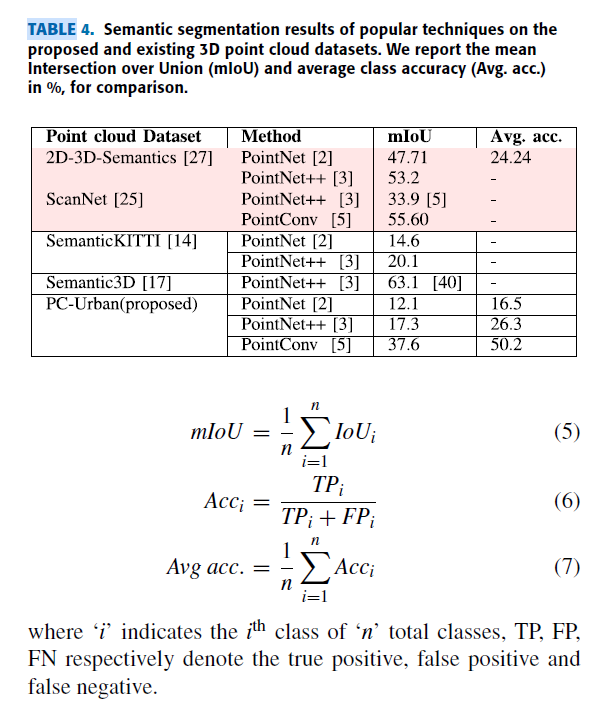
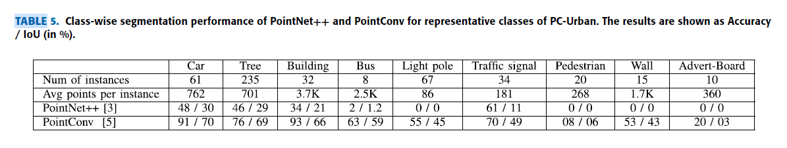

Annotation Tool and Urban Dataset for 3D Point Cloud Semantic Segmentation
===

2021/02/26 MUHAMMAD IBRAHIM , NAVEED AKHTAR , MICHAEL WISE, AJMAL MIAN , (Senior Member, IEEE)

https://ieeexplore.ieee.org/document/9363898

（まとめ：yuji38kwmt）

---

## どんなもの？

* 3D点群をSemantic Segmentationでアノテーションする無料のツールがないので、PC-Annotate"というツールを作った。そして、"PC-Urban"というデータセットも作った。 

#### PC-Annotate
* ローカルにインストールするツール。
    * ベンダーに法外な料金を支払わなくてもよい（Playment, Scale, BasicAI)
    * Supervisely のようなwebbasedなツールだと、「アノテーションがコピーされていない」という保証はない

### PC-Urban
* Ouster LiDARを使った
* 4.3billion points, 66K frames, 25 annotated class

---

## 技術や手法の肝は？
* 他のデータセットに比べて、点の数が多く、クラス数も多い
    * バス停、樹木、レターボックス、ゴミ箱、広告板などの汎用的なクラスも含まれている
* 他のデータセット比較して、垂直FOVが45°で大きい。
* インストール型のツール

---

## どうやって有効だと検証した？
* 何も知らいない学生にアノテーションさせたところ、1frame平均16分だった。
* 1個のオブジェクトをアノテーションするのに、平均30秒以下だった。
    * objectによって、得意な形状が変わる

---

## 議論はある？
* 既存のデータセット比較して精度が低い
    * >This is mainly due to the variety of objects and challenging conditions captured in real-life outdoor setup in the propose data.

---

## 次に読むべき論文は？
* [PointAtMe: Efficient 3D Point Cloud Labeling in Virtual Reality](https://ieeexplore.ieee.org/document/8814115)
    * アノテーション効率化のためVRでアノテーションする
