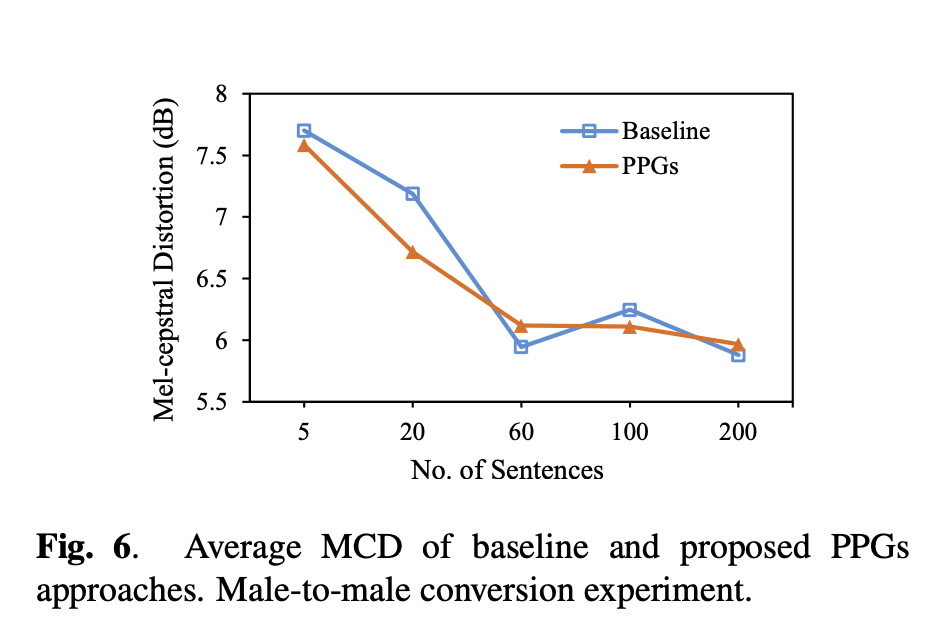
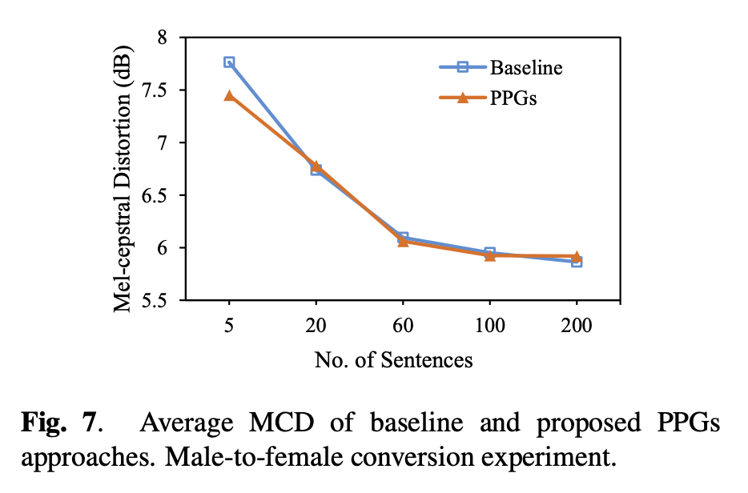
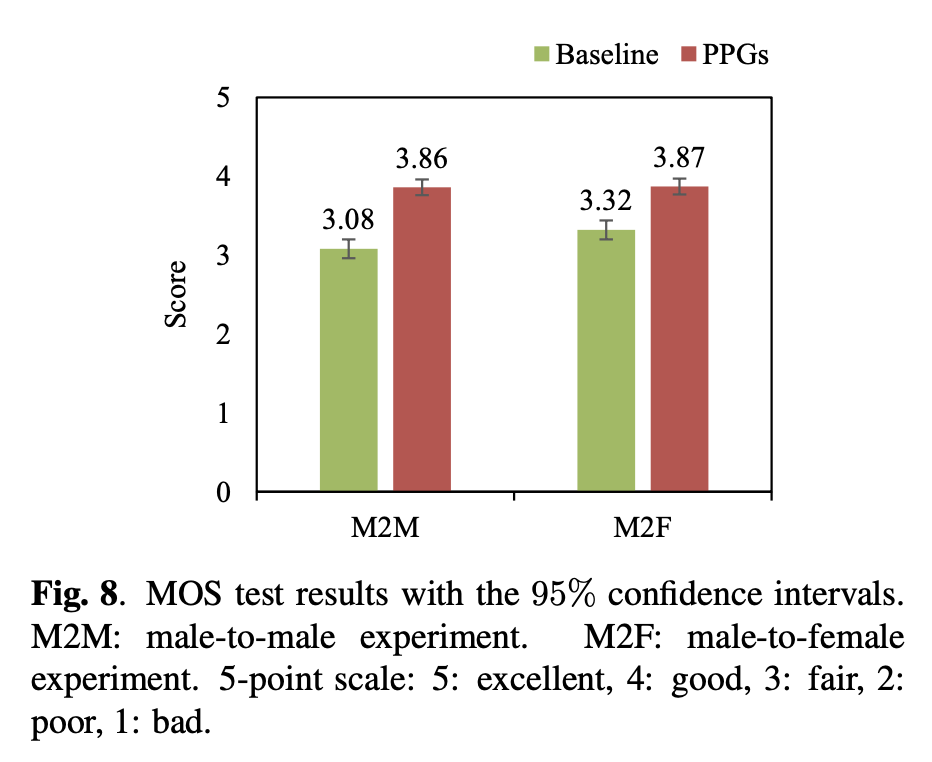
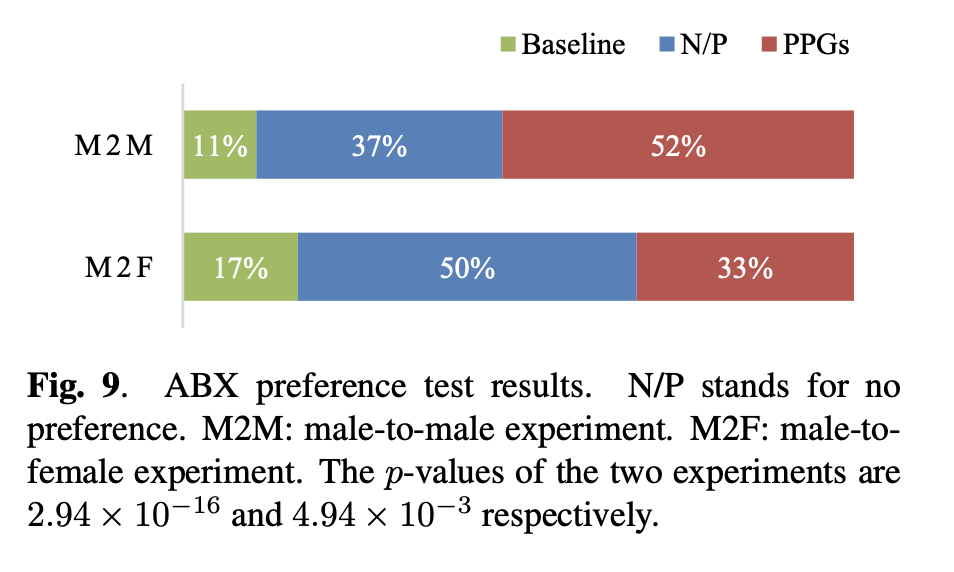
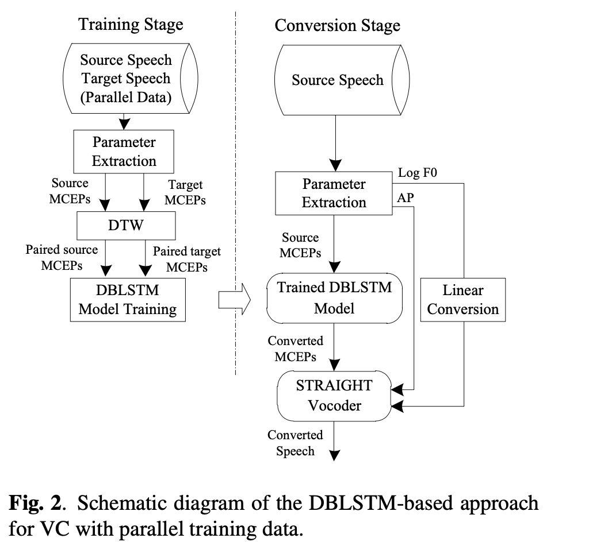
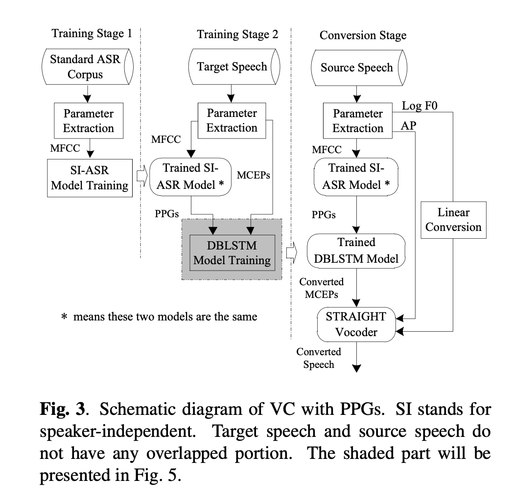
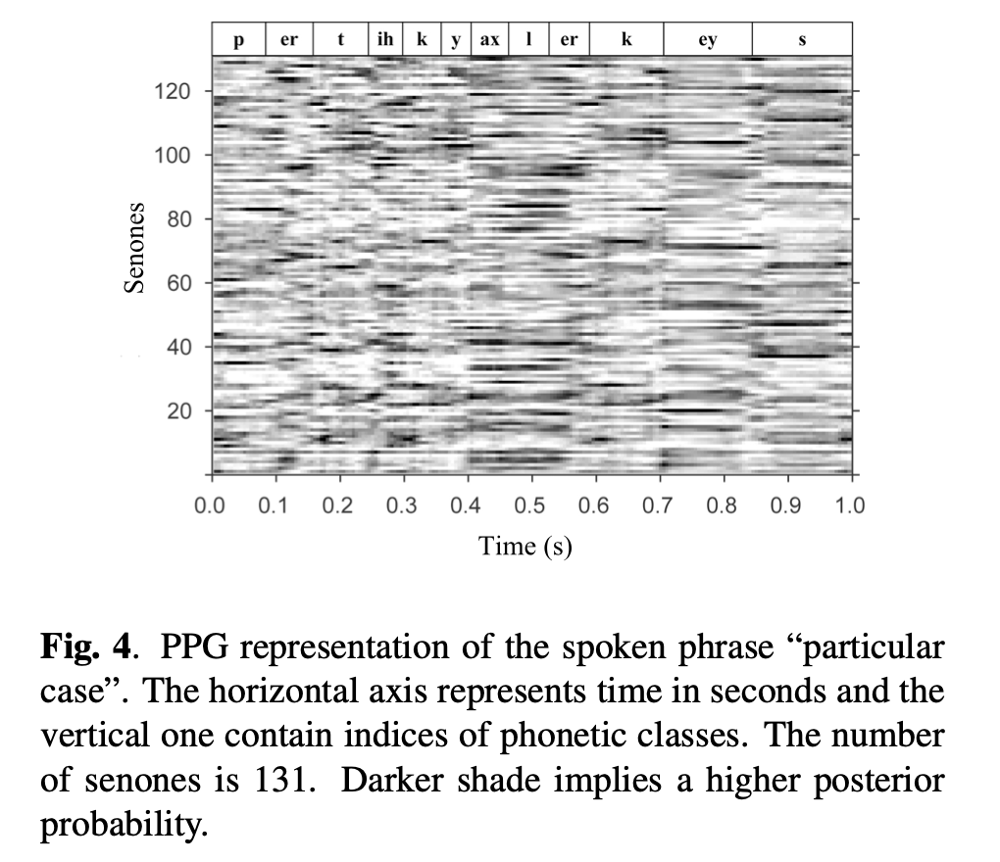

Phonetic posteriorgrams for many-to-one voice conversion without parallel data training
===

2016/07/11-15 

https://www.researchgate.net/publication/307434911_Phonetic_posteriorgrams_for_many-to-one_voice_conversion_without_parallel_data_training

著者
* Lifa Sun
* Kun Li
* Hao Wang
* Shiyin Kang
* Helen Meng

（まとめ：くぼた）

---

## どんなもの？
+ LSTMによるボイスチェンジャー。
+ 誰の声でも目標とする人の声に変換出来る。

---

## どうやって有効だと検証した？

+ 既存手法と提案手法で男性→男性、男性→女性の声質変換を行い、下記の指標で性能を比較した。
+ 客観指標-メルケプストラム歪み(MCD)による客観指標
    +  男性声→男性声の変換 青：既存手法、赤：提案手法

    +  男性声→女性声の変換 青：既存手法、赤：提案手法

+ 主観指標-声の明瞭度、変換先の声にどれくらい似ているかを基準にして21人の実験協力者に評価してもらった。
    + 主観指標①-既存手法、提案手法それぞれを5点満点で評価してもらう。
    
    緑：既存手法の平均点、赤：提案手法の平均点

    + 主観指標②-既存手法、提案手法の両方を聞いてもらい、どちらが良いかを評価してもらう。この時、実験協力者にはどちらが提案手法かは教えない。
    
    緑：既存手法、青：どちらでもない、赤：提案手法
---

## 技術や手法の肝は？

+ 既往研究のモデル 
    + 訓練ステージ
        + パラレルデータを用いて、変換元と変換先話者のMCEPの関係をDBLSTMによって学習。
    + 変換ステージ
        + 変換元話者の音声を入力して、変換先話者の声に変換する。学習済みモデルを使って変換元話者の音声から抽出したMCEPから変換後の音声のMCEPを生成。これに非周期成分(AP)と声の高さを表現するF0を合成させて声質変換後の音声波系を生成。F0は線形変換して、APは変換なしでそのままコピーする。

+ 提案モデル 
    + 訓練ステージ1
        + 複数話者の音声データセットを使ってメル周波数ケプストラム係数(MFCC)から音素事後確率(PPG)を推定するモデルを構築。音声認識をする際によく使われる手法。
    + 訓練ステージ2
        + 変換先話者の音声データセットを使ってPPGとメルケプストラム係数(MCEP)の関係をDBLSTMによって学習し、PPGからMCEPを推定するモデルを構築。
    + 変換ステージ
        + 変換元話者の音声を入力して、変換先話者の声に変換する。ステージ1,2の学習済みモデルを使って変換元話者の音声から抽出したMFCCからPPGを推定し、そこから変換後の音声のMCEPを生成。AP,F0の扱いは既存モデルと同じ。
    
+ 2人の声の関係を学習するのではなく、音素事後確率(PPG)と変換先話者の声の関係を学習する事で話者に依存しない変換を可能にしている事がポイント。

+ 音素事後確率(PPG)とは 
    + 各時間フレームにおいて観測音声に対する各音素の事後確率。配列の形状は(時間フレーム数,音素の種類)。図は縦軸が131種類の音素事後確率、横軸が時間フレームで、"particular case"と発話している音声のPPGをグラフ化したもの。

---

## 議論はある？

+ 提案手法は実行に時間がかかるため、リアルタイムで声質変換したい場合は別のアルゴリズムを使った方が良い。
+ 雑音環境下では声質変換が期待通りに行われない。

---

## 先行研究と比べて何がすごい？

+ 多対一の変換を可能にした。
+ ノンパラレルデータによる変換を可能にした。
+ 特別な装置を用いない声質変換法を提案した。
+ その上で、パラレルデータによる一対一変換より高い精度の声質変換を実現した。

---

## 次に読むべき論文は？
+ エンタメ活用へ向けたAIによる音声生成（Part2）(https://engineer.dena.com/posts/2020.03/voice-conversion-for-entertainment/)
    + 論文ではなく技術ブログですが、この記事がきっかけで今回紹介した論文を知ったので紹介します。iPhoneでリアルタイム音声変換を行う上での課題や改善法を提案された論文の紹介などがあったためそちらも参考になります。
+ Joint Adversarial Training of Speech Recognition and Synthesis Models for Many-to-One Voice Conversion Using Phonetic Posteriorgrams (https://www.jstage.jst.go.jp/article/transinf/E103.D/9/E103.D_2019EDP7297/_pdf/-char/ja)
    + LSTMとは異なる学習モデルが使われており、それを使うと実行時間が短縮され、音質も良くなるらしい。
