# [\[arxiv\]](https://arxiv.org/abs/2103.13201v3) DRO: Deep Recurrent Optimizer for Structure-from-Motion

- 著者
    - Xiaodong Gu *1
    - Weihao Yuan *1
    - Zuozhuo Dai *1
    - Chengzhou Tang *2
    - Siyu Zhu1 Ping Tan *1 *2
- 所属
    - 1: Alibaba A.I. Labs
    - 2: Simon Fraser University

## どんなもの？
### DRO (Deep Recurrent Optimizer for Structure-from-Motion)
- 教師なし（自己教師あり）SfM である。教師ありにもできる。
- BA の最適化アルゴリズムにおける解の探索方法（解の改善方法）を学習で獲得できるようにした BA-Net である。

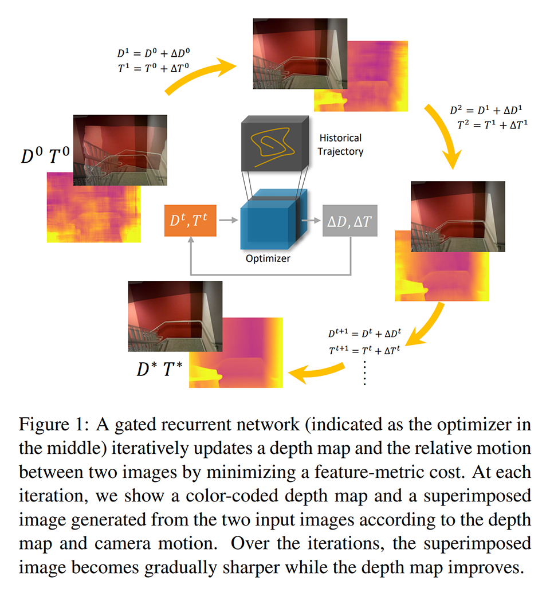

### BA-Net (Dense Bundle Adjustment Network)
- BA の全プロセスをニューラルネット化した。CRF as RNN のアイデア（再帰処理の再帰回数を固定して CNN で表現）を BA の最適化アルゴリズム（Levenverg-Marquardt 法）に応用した手法と見なせる。
- feature BA を提案し、geometric BA や photometric BA がかかえる問題を解決した。
    - geometric BA：キーポイントの再投影誤差を最小化する。キーポイントだけに注目して計算するので計算量が小さいが、ノイズや歪みに弱い。
    - photometric BA：再投影された画素の輝度差を最小化する。画像全体の情報が使えるのでキーポイントが抽出しづらい環境でも使えるが、計算量が多い。照明環境の変化や移動物に弱い。初期値依存性も高い。
    - feature BA：再投影された特徴量（深度を求める一歩手前の推論結果）の差を最小化する。マッチングに適した凸性の高い特徴を獲得できるので、照明環境の変化に強くなる。初期値依存性も低くなる。

### そもそも Bundle Adjustment とは
複数のカメラ画像に写る同一キーポイントが幾何制約を満たすように、キーポイントとカメラ原点を結ぶ光線束 (= bundle) の位置と方向を調整して、カメラの姿勢とキーポイントの３次元位置を求めることを指す。カメラの姿勢推定や撮影対象の形状復元に応用される。

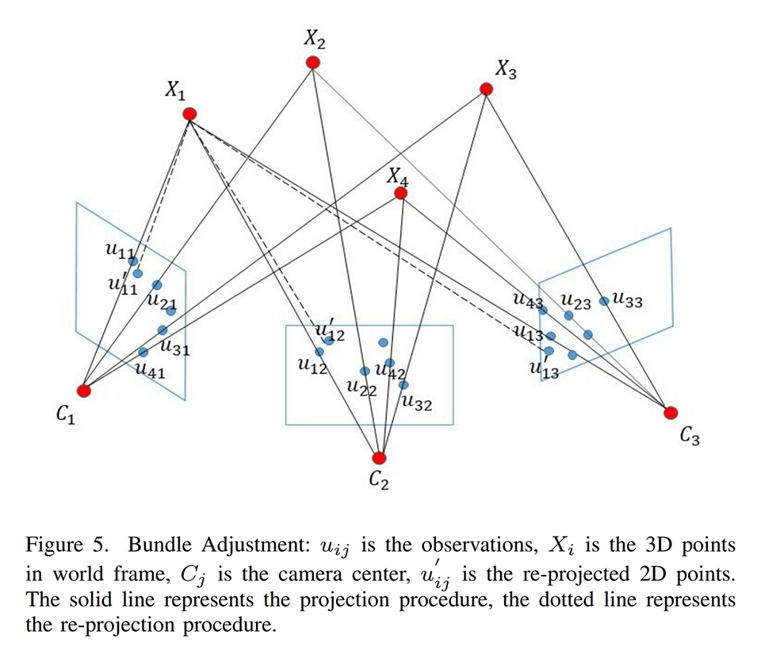
※ [\[arxiv\]](https://arxiv.org/abs/1912.03858) "Bundle Adjustment Revisited" より引用

## 先行研究と比べてどこがすごい？
- DRO は従来手法より精度が高い。
- DRO は従来手法よりも処理速度が数十倍速い（cost volume を作る凄く重い DeepV2D と比較した場合）。

## 技術や手法の肝は？
- コストマップ（feature BA における再投影された特徴量の差）を参照してカメラ姿勢と深度を改善する再帰ニューラルネット（Depth GRU Optimizer・Pose GUR Optimizer）を固定回数だけ適用する。
- DRO は通常の SfM と同様の損失を最小化するように学習される。その過程で BA の最適化を収束させる方向に圧力がかかる。BA の最適化を収束させるには、コストマップの値を最小化するような改善方法を学習することになる（一時的にコストマップの値が大きくなるような数手先まで読まないといけない複雑な改善方法も学習できている）。

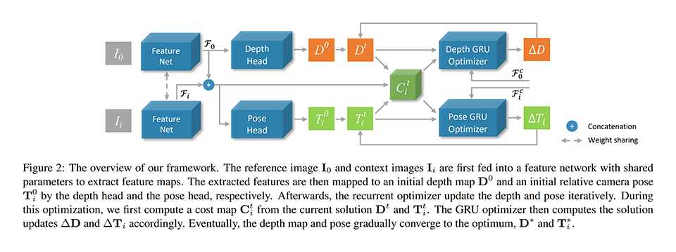
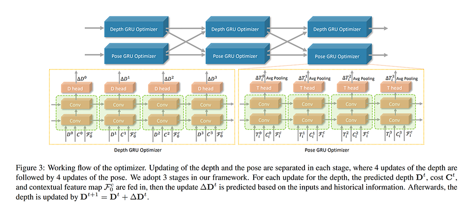
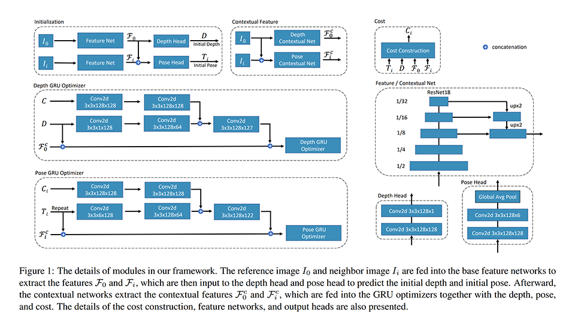
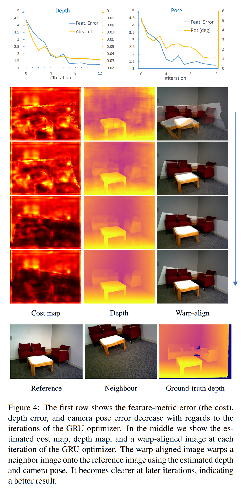

## どうやって有効だと検証した？
### 従来手法との比較 / KITTI dataset（屋外）
次のデータセットを用いて学習と評価を行い、従来手法と比較した。

- KIITI dataset：屋外を撮影したデータセット

教師あり・教師なしのどちらの設定においても、従来手法より精度がかなり改善されていることが分かる。

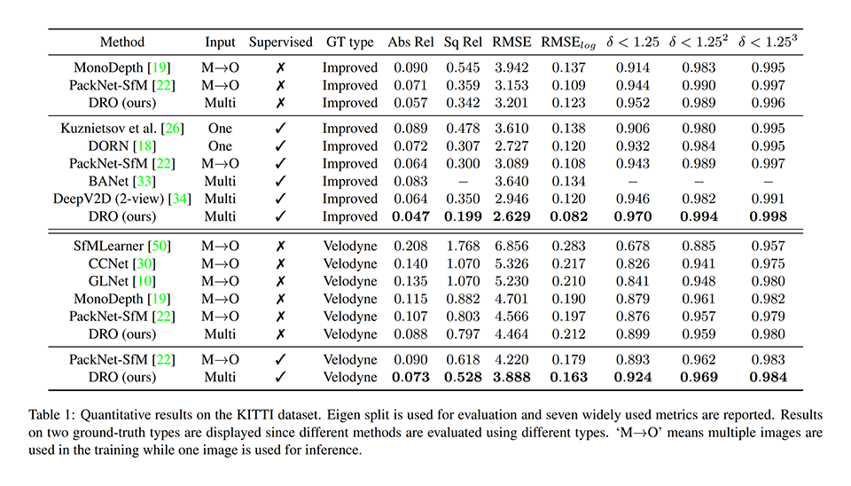
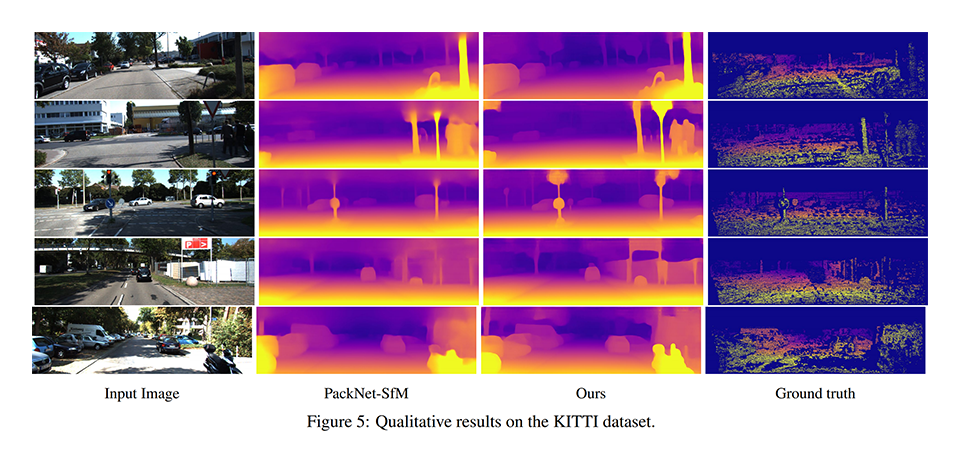

### 従来手法との比較 / ScanNet dataset
次のデータセットを用いて学習と評価を行い、従来手法と比較した。

- ScanNet dataset：屋内を撮影したデータセット

教師あり・教師なしのどちらの設定においても、従来手法より精度がかなり改善されていることが分かる。

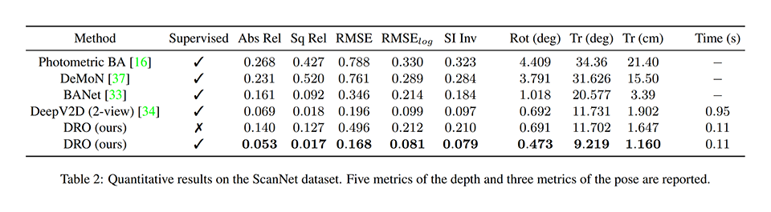

### カメラ画像間のオーバーラップが少ない状況における従来手法との比較 / SUN3D・RGB-D SLAM・Scenes11
次のデータセットを用いて学習と評価を行い、従来手法と比較した。

- ScanNet：SfM アルゴリズムで推定された非完璧なカメラ姿勢と深度が付与された屋内を撮影したデータセット
- RGB-D SLAM：外部のモーショントラッキングシステムで推定された高品質なカメラ姿勢とノイズが多い深度が付与されたデータセット
- Scenes11：完璧なカメラ姿勢と深度が付与されたデータセット（ShapeNet でシンセサイズされたもの）

オーバーラップが少ない状況でも良い精度が出せることが分かる。

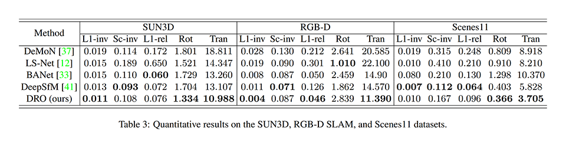

### 切除実験
各施策の効果を知るために、次の設定の手法を KITTI dataset を用いて学習と評価した。

- w/o GRU：Depth GRU Optimizer と Pose GRU Optimizer の GRU を 3x convolution へ置き換えた手法
- w/o Alter：カメラ姿勢と深度を交互に更新する方式から同時に更新する方式へ置き換えた手法
- w/o Cost：GRU Optimizer の入力からコストマップを取り除いた手法
- Cost volume：コストマップを cost volume に置き換えた手法
- Full-setting：基本手法
- Infer iterations：推論時に GRU Optimizer の再帰回数を変更した手法（基本手法の再帰回数は 12 回）

各施策を取り除くと精度が下がることから効果があることが分かる。
Cost volume と同等の精度を達成している。
再帰回数が 12 回（基本手法）あれば十分な精度が出せることが分かる。

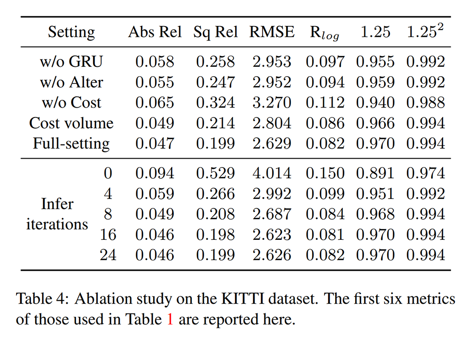

### 処理速度とメモリ使用量の比較
KITTI dataset を用いて学習と評価を行い、従来手法と比較した。

DRO は DeepV2D（Cost Volume を用いる重い手法）の 1/6 のメモリ使用量で 10 ～ 30倍の処理速度を達成している。

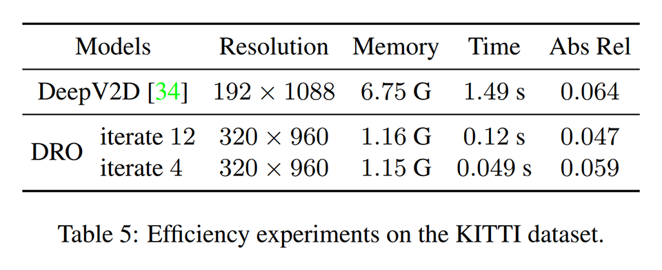

## 議論はある？
- なし

## 私見
- 勾配法では損失を微分して求めた勾配をくだるように最適化が行われるが、DRO の GRU Optimizer ではそれと同等の処理をニューラルネットで表現している点が面白い。再帰処理のたびに改善された損失を参照する帰納バイアスが、最適化アルゴリズムの獲得に凄く効いていることに驚いた。ハンドクラフトアルゴリズムを設計する際の知見がそのままニューラルネットの設計に応用できているので、理屈でもってニューラルネットを設計できる流れができつつあると感じた。

## 次に読むべきタイトルは？
### BA-Net
[\[arxiv\]](https://arxiv.org/abs/1806.04807v3) C. Tang, P. Tan, "BA-NET: DENSE BUNDLE ADJUSTMENT NETWORKS", ICLR, 2019.

### CRF as RNN
[\[arxiv\]](https://arxiv.org/abs/1502.03240v3) S. Zheng, S. Jayasumana, B. Romera-Paredes, V. Vineet, Z. Su, D. Du, C. Huang, P. H. S. Torr, "Conditional Random Fields as Recurrent Neural Networks", ICCV, 2015.

### Bundle Adjustment の解説図の引用元
[\[arxiv\]](https://arxiv.org/abs/1912.03858) Y. Chen, Y. Chen, G. Wang, "Bundle Adjustment Revisited", arxiv preprint, 2019.

### Struct2Depth の改良版　※今回の論文には関係ないが読みたい奴。移動物を真面目に扱う SfM。前作は移動物マスクが必要だったが、今作は不要になった。
[\[arxiv\]](https://arxiv.org/abs/2010.16404v2) H. Li, A. Gordon, H. Zhao, V. Casser, A. Angelova, "Unsupervised Monocular Depth Learning in Dynamic Scenes", CoRL, 2020.
