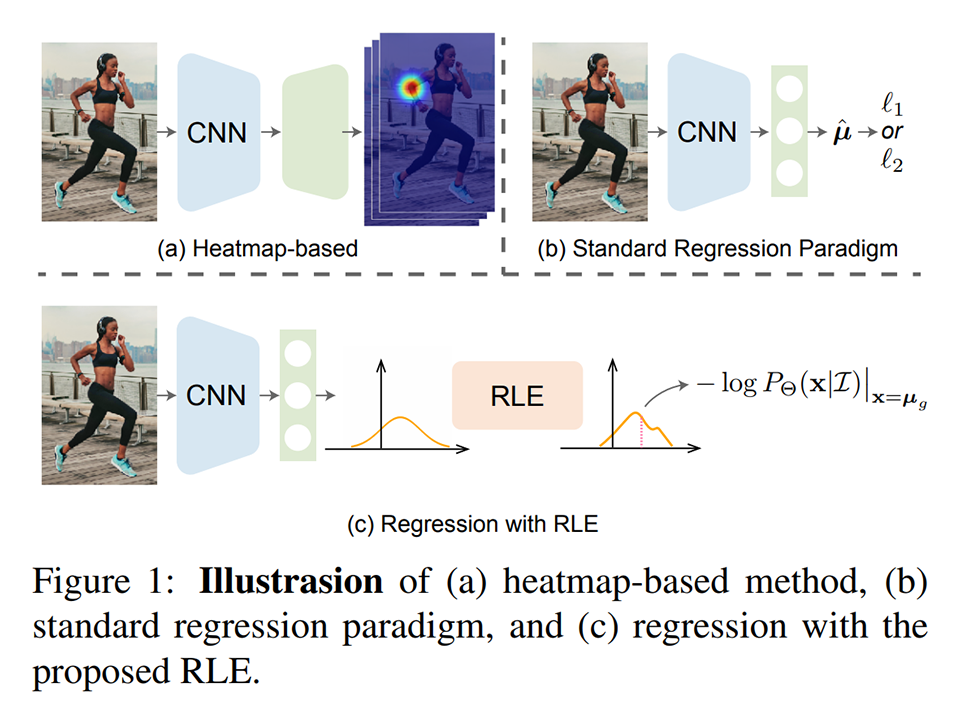
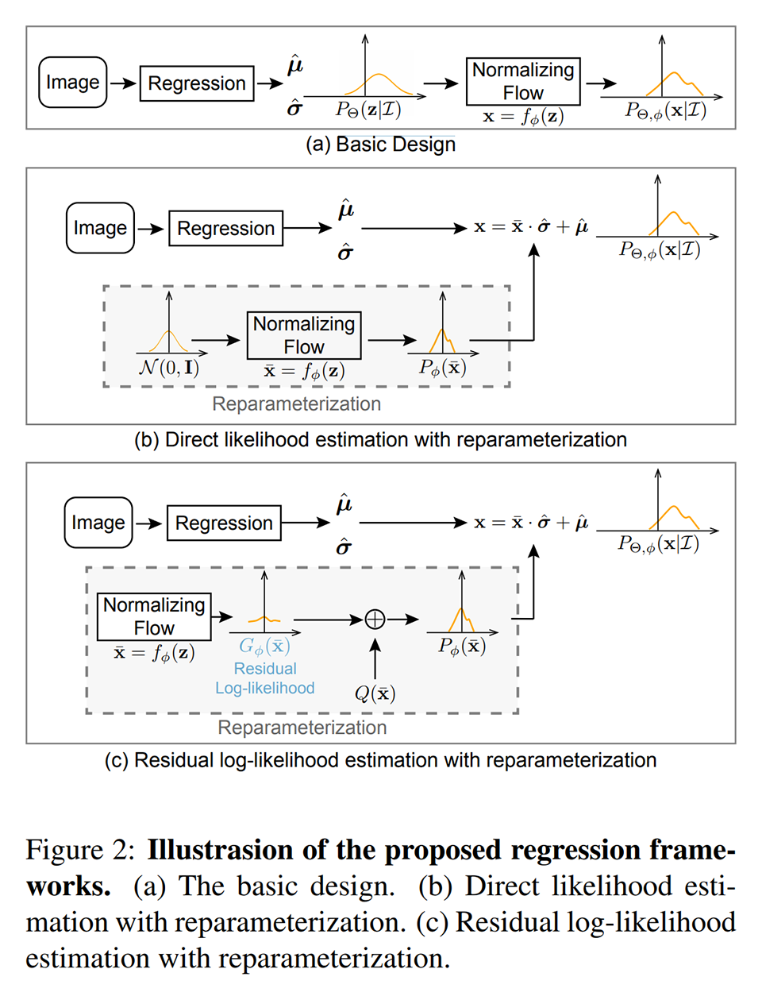
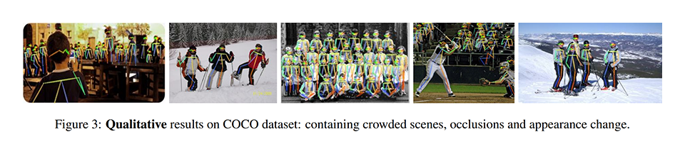
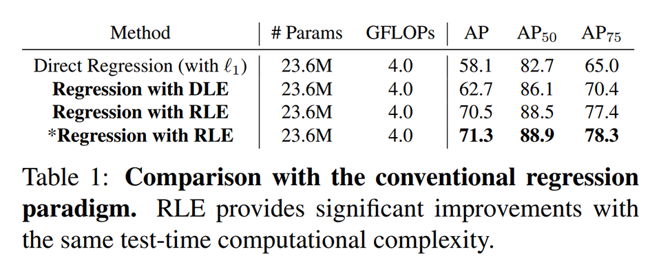
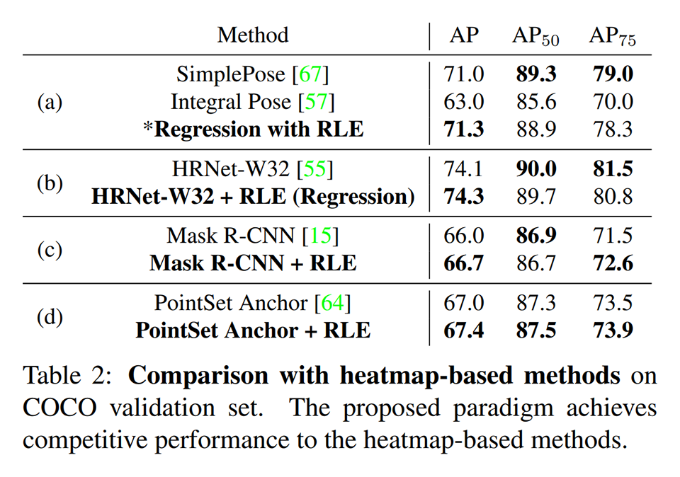
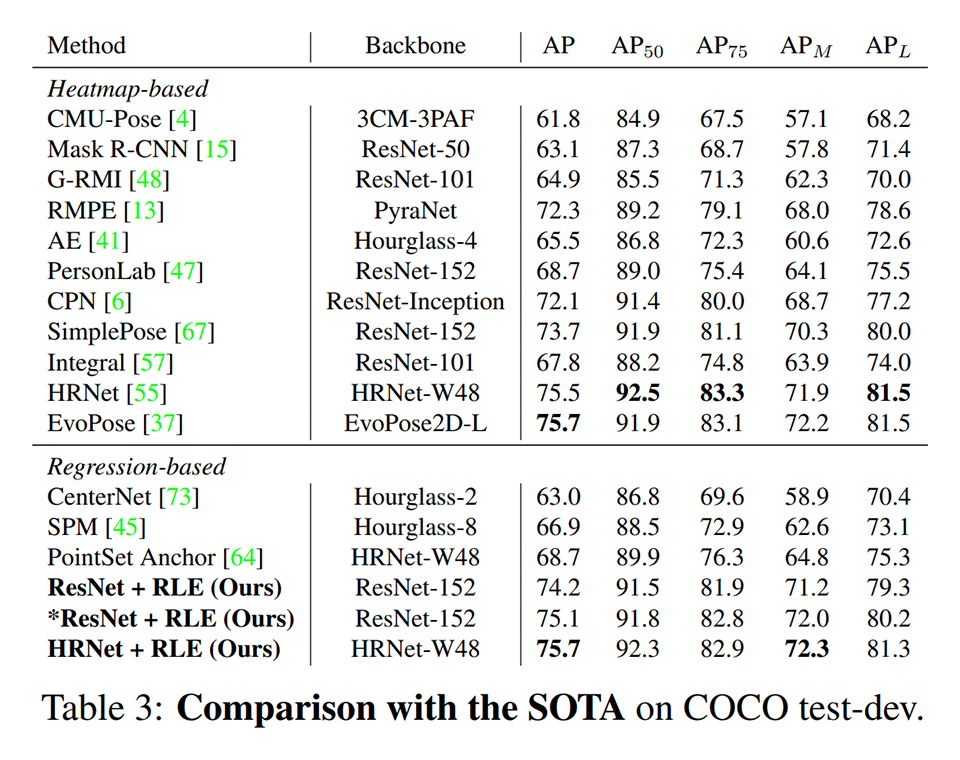
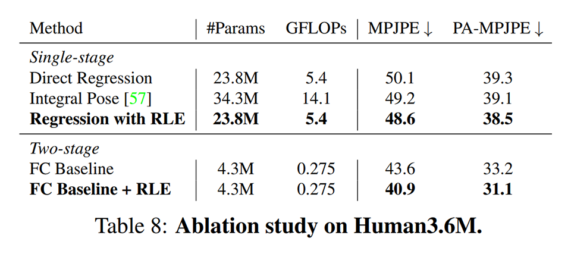
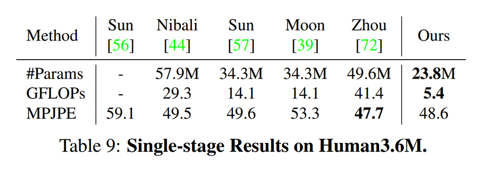
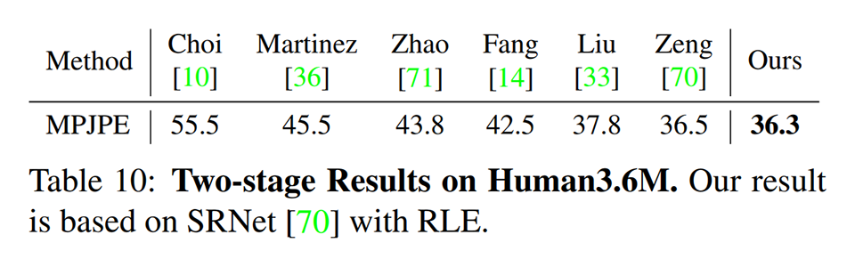

# [\[arxiv\]](https://arxiv.org/abs/2107.11291) Human Pose Regression with Residual Log-likelihood Estimation

- 著者
    - Jiefeng Li *1
    - Siyuan Bian *1
    - Ailing Zeng *2
    - Can Wang *3
    - Bo Pang *1
    - Wentao Liu *3
    - Cewu Lu *1
- 所属
    - 1: Shanghai Jiao Tong University
    - 2: The Chinese University of Hong Kong
    - 3: SenseTime Research

## どんなもの？
### Regression with RLE (Residual Log-likelihood Estimation)
- 学習可能な複雑なノイズ分布を仮定した回帰手法である。

## 先行研究と比べてどこがすごい？
### Regression with RLE (Residual Log-likelihood Estimation)
- 複雑な分布の上での回帰を最尤推定と捉えて学習しやすい形式へ再定式化した。
- 姿勢推定タスク（キーポイントの位置を推定するタスク）においてヒートマップベース手法（場所ごとの分類タスクへ還元する手法）に匹敵する精度を達成した。
- 推論時の計算量は、素朴な回帰手法と同じなので、ヒートマップベース手法よりも計算効率が良い。

## 技術や手法の肝は？
### Regression with RLE (Residual Log-likelihood Estimation)
- 最尤推定する際に仮定するノイズ分布が正規分布のように単純な分布だと精度が悪いことが分かっているので、学習可能な複雑な分布（標準正規分布を Normalizing Flow でこねくり回したもの）で置き換えた（※別の研究のアイデア）。
- Normalizing Flow でこねくり回した複雑な分布を学習するのは難しいため、単純な分布（正規分布やラプラス分布など）で大雑把に全体を近似し、近似しきれていない差分を複雑な分布で埋め合わせる方式（resnet 的スタイル）へ置き換えた。

## どうやって有効だと検証した？

### ２次元姿勢推定タスク（2D human pose benchmark COCO Keypoint）における性能比較

### ３次元推定推定タスク（Human3.6M）における性能比較

## 議論はある？
- なし

## 私見
- 深層学習では回帰の精度がいまいちだった。Regression with RLE はどんな回帰にも導入でき、推論時に追加のオーバーヘッドがいならない、ためインパクトが大きい。

## 次に読むべきタイトルは？
### Normalizing Flows
[\[arxiv\]](https://arxiv.org/abs/1505.05770v6) D. Rezende, S. Mohamed, "Variational inference with normalizing flows", ICML, 2015.
