Compositional Sketch Search
===

https://arxiv.org/pdf/2008.07783.pdf

まとめ @strshp

著者
- Alexander Black (CVSSP, University of Surrey)
- Tu Bui (CVSSP, University of Surrey)
- Long Mai (Adobe Research)
- Hailin Jin (Adobe Research)
- John Collomosse (CVSSP, Universiti of Surrey, Adobe Research)

---

# どんなもの？

- 手書きのスケッチを検索クエリとして、検索クエリと似たような構図を持つ画像を検索するための手法

---

# 先行研究と比べてどこがすごい？

## 先行研究
- これまでに提案されてきた手法では、複数の物体を含むスケッチで検索することが出来なかった
- 最近、[複数の物体を含むスケッチで検索可能な手法も提案された](https://www.ecva.net/papers/eccv_2020/papers_ECCV/papers/123640698.pdf)が、検索対象の画像に対して事前に物体検出を行う必要があり、あまりイケていなかった
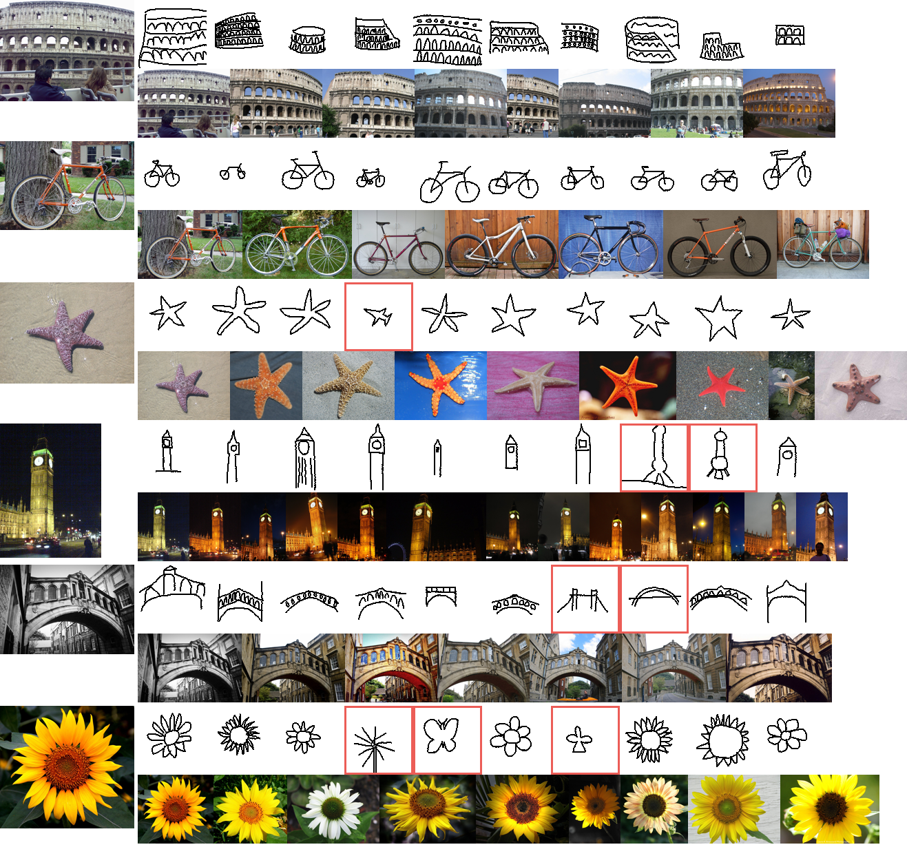

## 提案手法
- 複数の物体を含むスケッチで検索可能
- 検索対象の画像に対して、物体検出を行うステップが不要

---

# 技術や手法の肝は？

## 指針
クエリ画像 (手書きのスケッチ) を Q 、検索対象の画像を I としたとき、
クエリ画像の埋め込み E_Q(Q) → e_q と、 検索対象の画像の埋め込み E_I(I) → e_i の L2 距離 | e_q - e_i |_2 が小さい程、 Q と I の類似度が大きくなるような、ネットワーク E_Q と E_I を作る。

## モデル構造
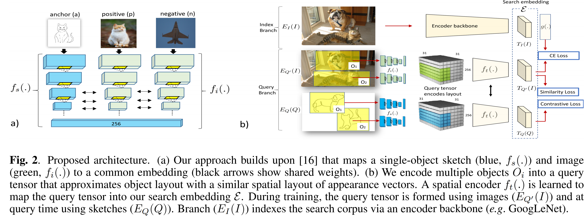

## f_s(.) f_i(.) の学習
- スケッチを入力するモデル (青) と 写真を入力するモデル (緑) の 2つを用意
- 青と緑のモデルに対し、同じ対象物については、中間層の出力が近くなるよう、「triplet loss」を利用して学習を行う
- 学習には TU-Berlin Dataset を使用
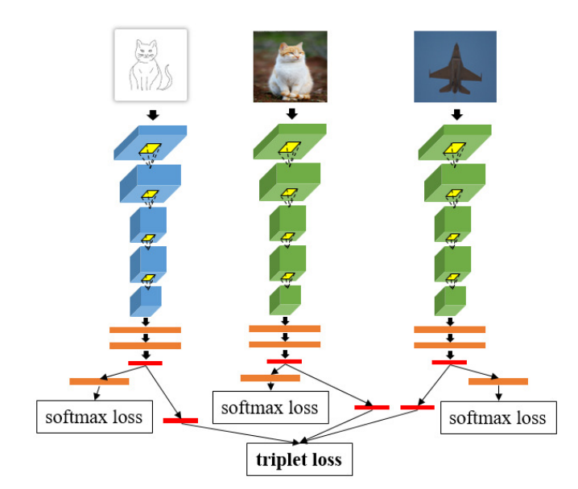
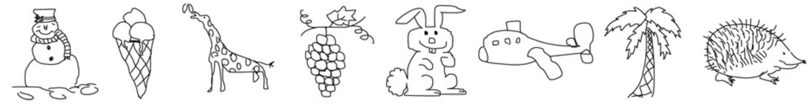

## Query Tensor の作り方
- 以下の式の出力は C × N × N 、 MP は Max Pooling
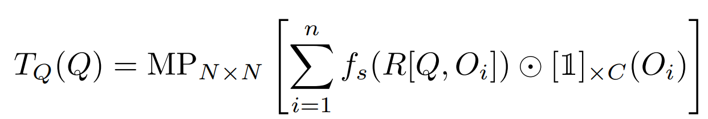

## f_t(.), Encoder backbone の学習
学習時は 「物体検出用のデータセット (画像中の各物体に対し、物体を囲う枠と物体のクラスが教師付けされたデータ)」を利用する。

- Encoder backbone は GoogLe Net
  - 中間層の特徴 T_I(I) を拾ってきて、Flatten したものを E_I(I) とする

- Similarlity Loss:
  - (意図) 同じ画像 I をネットワーク E_I 、E_Q' に通して得られたそれぞれの埋め込み e_I 、 e_Q は似通ったものになるはず

  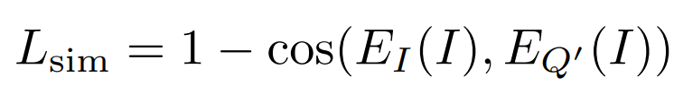

- Discriminative (CE) Loss:
  - c(I) は画像 I に写る物体のクラス情報
  - (意図) ネットワーク E_I の出力 T_I(I) (これを Flatten すると E_I(I) → e_I になる) から、写っている物体のクラス情報が復元できるようであれば、 T_I(I) は I の特徴を良い感じに保持したものになるはず
  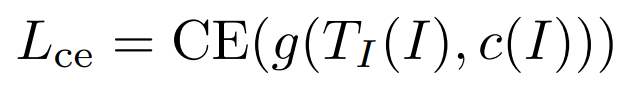

- Contrastive Loss:
  - この Loss のみ負例を使う
  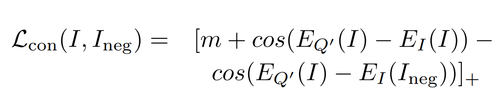

---

# どうやって有効だと検証した？

## 定性評価
- Amazon Mechanical Turk を使って人手で定性評価
  - クエリスケッチに対し、3つの手法で類似度トップ 20 の画像 (リザルト) を選出
  - クエリスケッチと各リザルトを比較し、それぞれのリザルトに 1 (全く違う) 〜 5 (正しく検索できている) の 5 段階でランク付けしてもらう
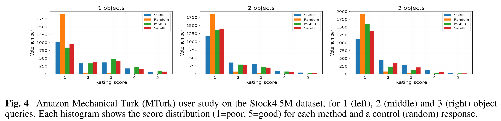

## 定量評価
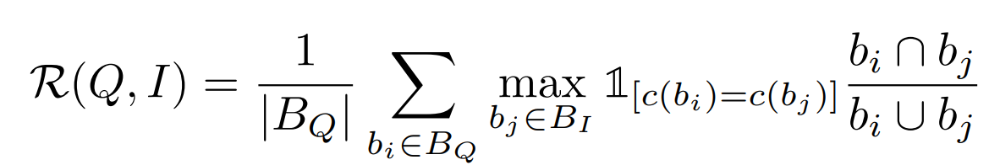
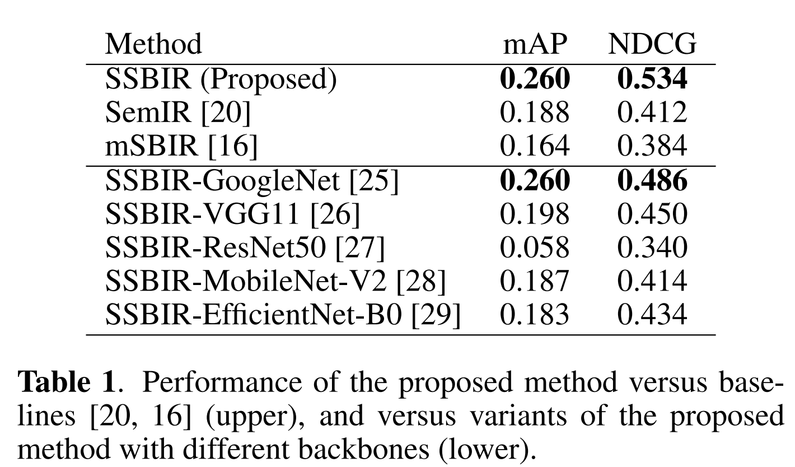

---

# 議論はある？

- 特になし

---

# 次に読むべき論文は？
- [Sketching out the Details: Sketch-based Image Retrieval using Convolutional Neural Networks with Multi-stage Regression](https://www.researchgate.net/publication/322250059_Sketching_out_the_Details_Sketch-based_Image_Retrieval_using_Convolutional_Neural_Networks_with_Multi-stage_Regression)
