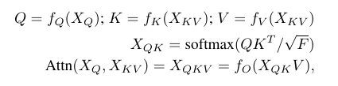
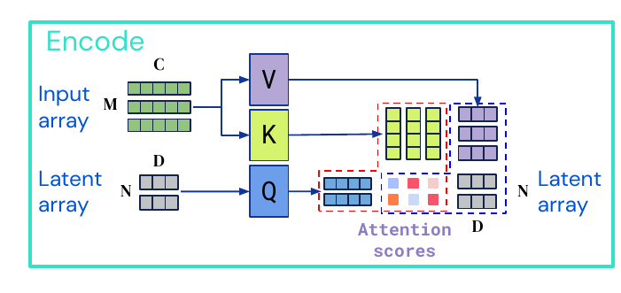
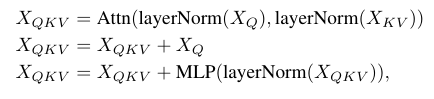
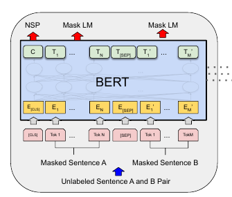
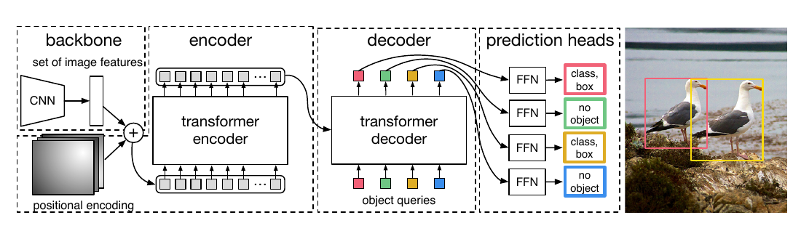
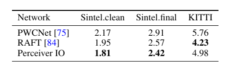
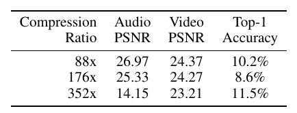

# Perceiver IO: A General Architecture for Structured Inputs & Outputs
[https://arxiv.org/abs/2107.14795](https://arxiv.org/abs/2107.14795)

（まとめ @n-kats）

著者
* **Andrew Jaegle**
* Sebastian Borgeaud
* Jean-Baptiste Alayrac
* Carl Doersch
* Catalin Ionescu
* David Ding
* Skanda Koppula
* Daniel Zoran
* **Andrew Brock**
* Evan Shelhamer
* Olivier Hénaff
* Matthew M. Botvinick
* **Andrew Zisserman**
* **Oriol Vinyals**
* **João Carreira**

DeepMindの人たち（色んなジャンルで検証していたので、手分けしたのかな？）。太文字の人たちは前作（Perceiver）の著者でもある。

# どんなもの？
マルチモーダル（複数種類の入力がある）な問題で入力ごとに特別なネットワークを用意することなく、複雑なタスク（optical flowとか音声あり動画のオートエンコーダーなど）を解く手法PerceiverIOを提案（計算量は入力や出力に対して線形）。

# 先行研究と比べてどこがすごい？
先行研究（Perceiver）では、分類などの簡単なタスクしか扱えなかった。
PerceiverIOでは複雑な問題（optical flowやオートエンコーダなど）が扱えるようになった。

optical flowについては、SOTAを達成する程度までの精度が出ている。

# 技術や手法の肝は？
## 復習
### transformer
もともとtransformerは自然言語処理の分野で生まれた。QueryとKeyとValueの三要素からなるattentionを使う手法。KeyとValueが辞書にようなものになっていて、Queryに関係の強いKeyを探して対応するValueをとってくるという仕組み。

本当は、QKVの話以外にも前後処理がある。この式の2つ目の部分（入力との和をとる部分）は無い場合もある。

### BERT
例えばBERTだと、単語等の単位でベクトル化してtransformerに入力する。

（図は[https://arxiv.org/abs/1810.04805](https://arxiv.org/abs/1810.04805)より）

### ViT
ViTでは、画像をパッチに切って単語に見立てて、位置情報（positional embedding）と合わせて、transformerに入力して分類問題を解く。

（図は[https://arxiv.org/abs/2010.11929](https://arxiv.org/abs/2010.11929)より）

**素朴な情報（パッチ）をトークン（単語のように）** として扱うのがポイント。

### DETR
DETRではまず画像をCNNとEncoder（位置情報を使う）を使って特徴マップを作成する。次に、オブジェクトクエリ+位置をQ、特徴マップの各特徴ベクトルからK（位置利用）とVを作るようなattentionを使うネットワーク（Decoder）でクエリに対応した物体を検出する。

（図は[https://arxiv.org/abs/2005.12872](https://arxiv.org/abs/2005.12872)より）

**問題をトークン**として扱って、KVで画像を参照するのがポイント。

## PerceiverIOのメタアーキテクチャ
PerceiverIOが扱いたい状況はマルチモーダル・マルチタスクな状況。入力を処理する部分と問題を解く部分で二つの系列の処理からなる。

入力を処理する部分は図の中段の部分。どの入力を使うかを意味するクエリ（Latent array）を使って入力から情報を取得する。
次に問題を解く部分（図の下段）が来る。問題のクエリに対して、入力側の情報を参照して認識を行う。

中段のような構造は前作（Perceiver）ですでに存在した。前作は、分類問題などのシンプルな問題しか扱わなかったが、下段の仕組みで複雑なタスクも解けるようにした。

素朴にViTのように最初から入力を分けてtransformerに入れるとattentionの部分でO(M^2)の計算量が必要になって困る。
Latent arrayを使って本質的に必要な場所のパターン数程度まで一度絞るのが一つのポイント。
また、前作からこういう仕組みがあったが、入力を差し込む部分（左のattention部分のようなもの）を複数個に分けて行っていた。
今作でシンプルに進化した。

## 入力・出力クエリ
入力（図の上段）と出力クエリ（下段のもの）は、問題によって程よいものを設定する。
これらは、データの値・位置を合わせたベクトルの列になる。

出力クエリの図

例えば、画像のパッチ、位置（単にx,yの値を与えるのではなくて三角関数を使ったりとかする）、どの入力か（画像？音声？）を示すベクトル等を結合する。

# どうやって有効だと検証した？
自然言語処理、optical flow、オートエンコーダ、StarCraft II、画像分類で検証した
（optical flowとオートエンコーダの部分を説明する）。

## optical flow
連続する2フレームの画像を与えて、それぞれのピクセルがどこに移動するかを推測する問題。

パッチとして3x3x2ピクセルの範囲（3x3を2つの画像で）を切り出す。
位置を追加して入力とする。

AutoFlowという手法の訓練を真似て訓練した結果、SOTAを達成（Sintelで）。

表の値は、EPE（end-point error）の平均（正解ベクトルとの差の絶対値の平均）。

## オートエンコーダ（映像＋音声＋ラベル）
Kinetics-700-2020（映像（3D）＋音声（1D）＋ラベル（0D））で研究。色んな次元が混ざる。

224x224の動画16フレームをエンコードする。4x4のパッチ（約50,000個）と1920次元で切り出した音声（約16,000個）と700次元のone-hotベクトルで表したラベルを入力とする。

3種類の圧縮率で評価（映像・音声のPSNRとラベルの分類）（PSNRは平均二乗誤差を変形した値、高いほどよい）。

[https://deepmind.com/blog/article/building-architectures-that-can-handle-the-worlds-data](https://deepmind.com/blog/article/building-architectures-that-can-handle-the-worlds-data)に動画の例がある。

# 議論はある？
次のことには取り組んでいない。
* 生成モデル
* Latent spaceの次元の自動調整
* 倫理的な問題（敵対的事例やデータのよくない偏りの影響）

## 私見
次のような研究が今後あるのかな？
* 訓練時間（DETRで訓練が遅い問題があった）
* 普通のタスク（セグメンテーション・検出）の最新手法との差
* 画像の相性の良さそうな入力の与え方（リサイズした画像から切り出してくるとか）
* トラッキングなどの時系列な問題（Trackformerみたいに認識途中のものを次の時刻のクエリに持ってくるなど）

# 次に読むべき論文は？
* [Perceiver](https://arxiv.org/abs/2103.03206)  
  前作
* [AutoFlow](https://arxiv.org/abs/2104.14544)
