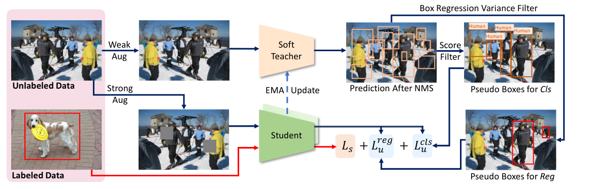
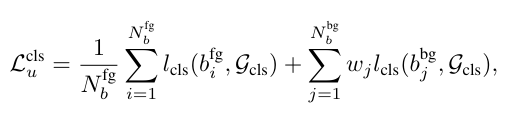
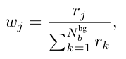
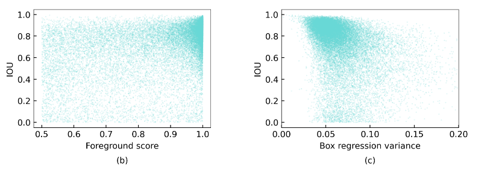
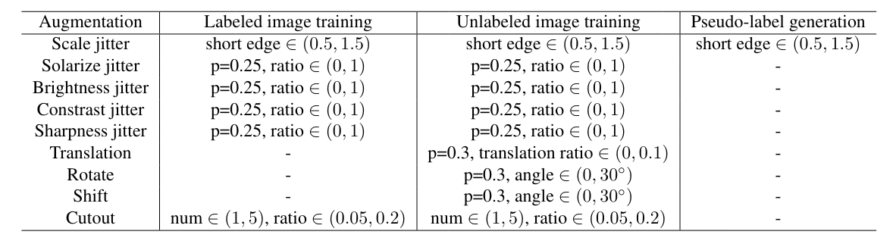
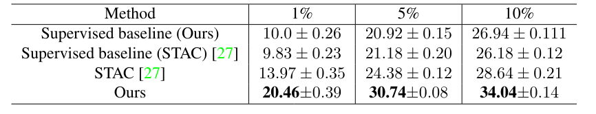
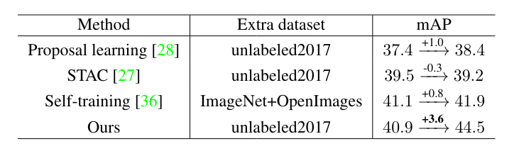
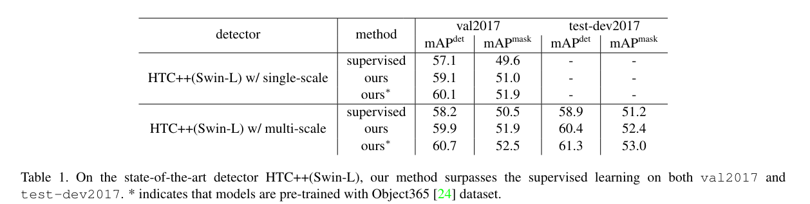
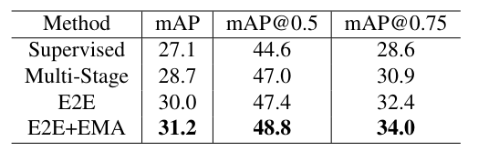

End-to-End Semi-Supervised Object Detection with Soft Teacher
===

Mengde Xu, Zheng Zhang, Han Hu, Jianfeng Wang, Lijuan Wang, Fangyun Wei, Xiang Bai, Zicheng Liu

https://arxiv.org/abs/2106.09018v3

Accepted by ICCV2021

まとめ @cohama

## どんなもの？

- 半教師ありの物体検出
- (おそらくラベル付きの) Extra training ありの条件で COCO-dev mAP 60.7% で現在第1位

## 先行研究と比べて何がすごい

- 画像分類においては Noisy Student など疑似ラベルを使う方法があるが物体検出においては前景・背景の割当や枠の回帰などもあり難しい。
- 半教師あり物体検出の重要な先行研究として STAC という手法がある。しかし、STAC を含む従来手法では教師モデルを事前に学習させて生徒モデルを学習させるなど学習が多段になり面倒だった。
- この手法は STAC をより洗練させたものという位置づけで、いくつかの改善を入れた上で End-to-End でできるようにしたもの

## 技術や手法の肝は？

### End-to-End な学習

1. 教師モデルと生徒モデルの3つのモデルを用いる。いずれもランダムな初期値から始める。
2. 教師モデルは弱くオーグメントしたラベルなしデータをものに対して検出結果を出力する。
3. 教師モデルが出力した枠の結果に対して2種類のフィルタリングを行う。
  - 1つは確信度が高い枠のみを集めたもの。これは分類のための学習に用いる。
  - もう1つは枠の分散が小さいもののみを集めたもの。これは回帰の学習のために使う。
4. 得られた疑似枠を教師として生徒モデルを学習させる。このとき、入力画像は強いオーグメントをかける。
5. 同時に (同一バッチ内で) 教師ありのデータでも訓練を行う。
6. 生徒モデルの重みの指数移動平均で教師モデルの重みを更新する。

### Soft Teacher

- 教師モデルは精度が高くないので間違った疑似ラベルを生成することがある。これに対処するため Soft Teacher という手法を提案した。
- 教師モデルの結果は確信度がかなり高めでフィルタリングを行う (Ablation Study によると 0.9以上が良い)。結果的に Precision が高く、Recall が低い疑似ラベルが生成される。
- 生徒モデルの出力が Foreground (物体である) のときと Background (物体はない) のときとで損失のとり方を変える。
  - 
  - 

  - Foreground のときは普通に分類の損失
  - Background のときは普通に分類の損失に信頼性を表す値で重み付けする。

- 信頼性 `r` をどう取るかは難しいが、本手法では教師モデルが出力した背景スコア (おそらく `1 - 物体らしさの確信度`) を用いる。

## Box Jittering

- 確信度が高いからと言って、枠の精度も高いわけではない。
- 
- つまり単純に教師モデルが確信度高めで出力した枠を生徒モデルの学習に使っても、生徒モデルの枠の学習は進まない
- そこで出力された枠の分散を考える。枠の分散が低いものは正解する確率もかなり高い
- 枠の分散は以下のように評価する。
  1. 教師モデルが出力した枠に対してランダムに摂動を加える。
  2. それをもう一度教師モデルに入力してリファインされた枠を作る。
  3. Nj 回繰り返して Nj 個の枠が得られる。
  4. それの標準偏差を取る

- さすがにすべての枠に対して refine を計算するのはコストが高すぎるので確信度0.5以上の枠のみに対してこれを適用する。

## データオーグメンテーション

- データオーグメンテーションは教師あり画像、教師なし画像、疑似ラベル生成で異なるオーグメントをかける。これは既存の手法 (FixMatch, STAC) に倣った形。

## どうやって有効だと検証した？

- 2つの問題設定で実験
  - Partially Labled: COCO の train2017 (118k images) データセットのうち、1%、5%、10%のラベルだけを利用
  - Fully Labled: COCO の train2017 データセットをすべて使い、unlabelled2017 (123k images) データセットをラベルなしデータとして利用

### Partially Labled

- いずれの条件でも既存手法を凌駕
- 1% のラベルだけを使って mAP 20% 越えはなかなかすごい

### Fully Labled

- 他手法は unlabelled2017 を追加してもほとんど精度が伸びない。提案手法は +3.6 とかなり優秀

### さらに強力なモデルを使った場合

- Object365 というデータセットで事前学習したものは mAP 60% 越え

### Ablation Study

#### End-to-End の効果

- Partially Labled 10% の条件での比較
- End-to-End の学習は仕組みとして簡単というだけでなく精度にも寄与する

#### その他

Soft Teacher、Box Jittering についてもそれぞれ効果を確かめている。

## 議論はある？

- 既存の物体検出の半教師ありに比べてかなり精度が高い。特に Extra data ありとはいえ mAP 60% はすごい
  - 少量データしかないのでなんとかするというよりは、大量のラベルなしデータも活用してより高い精度を目指せる手法

- 細かい実験条件の記載がなくソースもまだ公開されていない部分がある。(例えば分類とか回帰の損失関数に何を使ったかなど)

## 次に読むべき論文

- STAC: Google の先行研究
  - A Simple Semi-Supervised Learning Framework for Object Detection (https://arxiv.org/abs/2005.04757)
- FixMatch: 画像分類の SSL でおそらく最新
  - FixMatch: Simplifying Semi-Supervised Learning with Consistency and Confidence (https://arxiv.org/abs/2001.07685v2)
