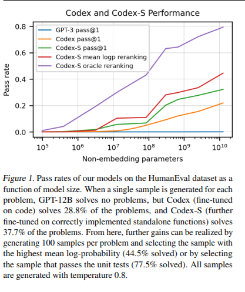
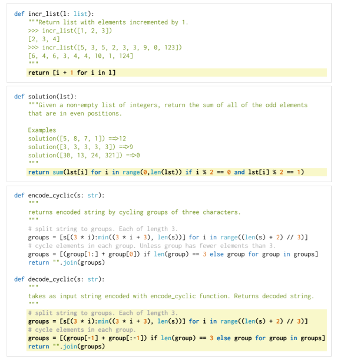
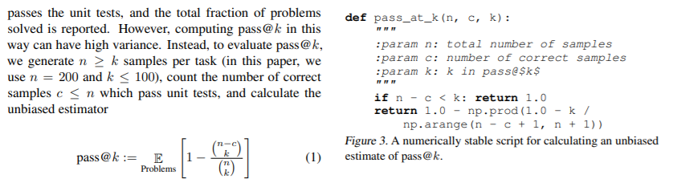
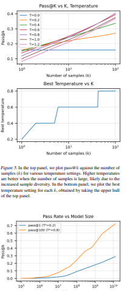
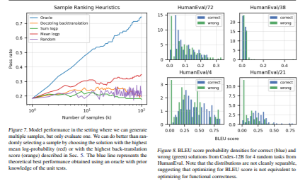
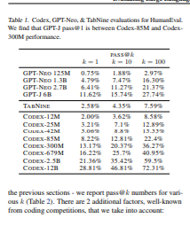
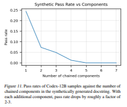
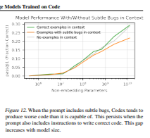

# TransReID: Evaluating Large Language Models Trained on Code

https://arxiv.org/abs/2107.03374

(まとめ Saito)

すいません、ところどころ理解できてない（間違い書いてるかも）

著者

- Mark Chen, 他たくさん　 OPEN AI
  github と Azure のサポート有

# どんなもの？

GPT ３元に、docstrings から python code を生成（成果率アップ） 
https://openai.com/blog/openai-codex/　ここで、API を試せる 
プログラム作れる＝ AI 作れるのも時間の問題？ 
OPENAI は総合的にそこ目指している気がする。 

以下のような点について記載 

評価方法も提案（BLUE ではだめ）、データセットも作成、問題(prompt)結構難しく見えるの解いてる  
繰り返しサンプリングで unit test 正解率高い(70.2%) 
デモで、アニメや PON みたいなゲームも作成していたよう 
sandbox で安全確保 
code fine turning 
supervised fine turning 
docstings generation 
limitation 
この技術のインパクトについて 
関連 work 
 

# 以下気になった図表について  

# モデルが大きいほうが Unit test 正解率高い x

codex-S（oracle としていいの選ぶと）８０％近い正解 
GPT のころからモデル大きければよくなるとの予測が今も続いている 
（ムーアの法則レベルか） 

#

# docstring から python 作っている例（結構難しいのもできてる） 

# 測定基準　 pass@k の式と def  

# 上から  

抜き出すサンプル数増やすと Pass@K よくなる + Temperature との兼ね合い示す 
抜き出すサンプル数増やすと Temperature 大きいほうがいい  
model 大きいほうが pass@k 良くなる  

# 左　サンプル数と Pass rate 関係（サンプル方法で系列別）  

# 右　 BLEU スコアは機能成否を表していない  

BLEU は、正解がいくつか用意されているなかで、modified precision と recall で評価しているが、recall とかは文字列長が短いとペナルティで、コードを簡潔にかくとペナルティに
なると思われる。 
precision の方でも、天才的に実装すると低くなる可能性があると思える。

# モデル、サンプル数、サイズ別　 pass@k  

# 関数の呼び出し階層が深いと難しい  

# 学習の？docstring にバグがあると pass@1 は悪くなる  

#

# 先行研究と比べてどこがすごい？

正解率高い（GPT ３はほぼ 0%) 
結構難しいのも作っている 

# 技術や手法の肝は？

1 GPT で、一つのモデル、事前学習＋少しの調整（もしくは調整なし）でもいろんなタスクで SoTa だした流れ 
GPT2 で、なんでもできるの作ろうの流れで、されにモデルを大きくした GPT3 がでてきた 
GPT3 でもコードは作れたみたいだが、やはりまだ精度が低い 
そこで、データ（コンペサイト、CI）を用意し、unit test 方式や細かい調整して劇的に精度上げた。 
文章理解、生成とコードの生成では、要求される創造性のレベルが違うのかなと思った。 

2 　 BLEU では機能評価低いので、新たな指標（unit test pass)作成 

3 モデルは大きいほうがいい（GPT からの歴史が継続中）RNN とかはそうとは言いきれないらしい 

4 AI が作成した不確かなコードを安全に動かす環境作成 

# 議論はある？ 

unit test でパフォーマンスやセキュリティ担保とか、ＡＩが作ったコードを安全に動かす 
環境が作れるか？でしょうか？ 

# 私見 

AI がプログラム作れる　＝　 AI 作れる　＝　進化止まらない　シンギュラリティ！！　ってことでわくわくする。怖がったほうがいいかもですが。

OpenAI が提供する GPT 調整済みモデルをいくつか見た。Instruct series が今のところ 
面白い、指示を細かく付け加えていくとそれに応じて、出力変えてくる。 

改めて transformer からの系譜の有名なところ確認したい 

GAFA などがなどが学習済みの小さななんでも強いモデルを提供してくれたらうれしい 

# 次に読むべき論文は？

Transformer 
BERT,XLNet,RoBERT,Distributed BERT 
GPT,GPT2,GPT3 
Vit,DETR 
