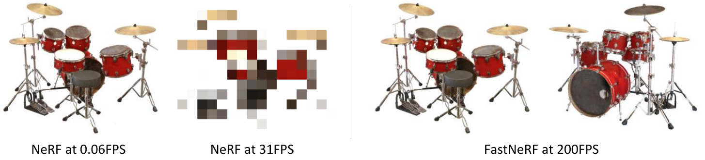
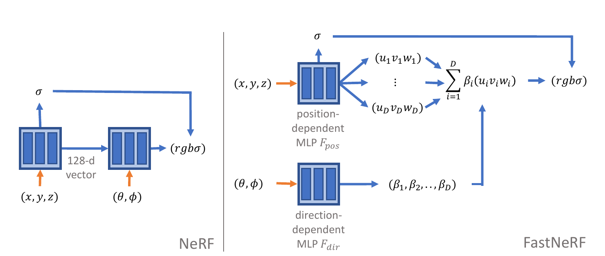
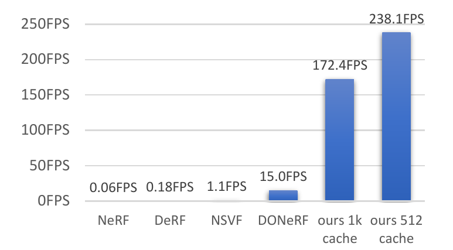
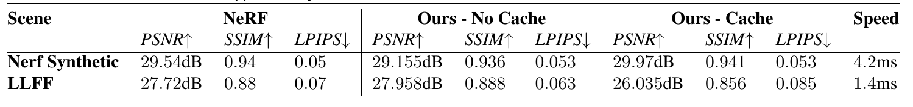

# FastNeRF: High-Fidelity Neural Rendering at 200FPS
[https://arxiv.org/abs/2103.10380](https://arxiv.org/abs/2103.10380)
（まとめ @n-kats）

著者
* Stephan J. Garbin
* Marek Kowalski
* Matthew Johnson
* Jamie Shotton
* Julien Valentin

Microsoftの人達。

# どんなもの？
NeRFを3000倍高速化したFastNeRFを提案。

NeRFとは、「ある地点からこの方向を見たら何色か」という意味の関数をニューラルネットで作って3次元形状を表現する手法。

実例・・・[https://www.matthewtancik.com/nerf](https://www.matthewtancik.com/nerf)

# 先行研究と比べてどこがすごい？
3000倍速い（0.06FPSから238.1FPS/172.4FPS）

リアルタイムにグリグリ角度を変えながら描画できる程の速さ

# 技術や手法の肝は？
## 復習
### NeRF（neural radiance fields）
[https://arxiv.org/abs/2003.08934](https://arxiv.org/abs/2003.08934)

* 座標（xyz）と視点に対して、密度と色の情報を出力するネットワークを用意する
* これを使って特定の視点からの映像を生成する

視点を変えて画像を生成できるのが特徴。

去年の3月に公開された手法。ものすごい勢いで研究が進んでいる分野。

## 高速化の方針
主な方針

* 再利用できる部分をキャッシュしておく
* 再利用する部分を作るためにネットワークを工夫する

## メタアーキテクチャ

座標から密度（σ）を出すのは同じ。

旧手法では、色を出すために角度（θ・φ）を追加して更にネットワークに入れていた。

本手法では、座標から色の候補（u, v, w）をD個出す。角度から算出した重み（β）をつけてそのD個を足して最終的な色を出す。

u,v,w,σ,βをキャッシュする。（最初に一気に計算しないといけない）

## キャッシュ
描画範囲（3次元bounding box）をそれぞれの軸をk等分、角度（θ・φ）をl等分して、対応する値をキャッシュする。

キャッシュされていない位置(`x_i<x<x_i+1`等)の値は最近傍点の値を用いる。

### 前手法（NeRF）の場合
一度に保存しないといけないため、O(k^3*l^2)（全ての座標・角度の組）のサイズのキャッシュが必要。

例えば、k=l=1024だと、数ペタバイトのキャッシュが必要。

### 本手法（FastNeRF）の場合
位置だけから計算できるu,v,w,σと角度だけから決まる値βに分けたことでキャッシュサイズが激減。
位置の方でO(k^3*D)、角度の方でO(l^2)のサイズに収まる。

例えば、k=l=1024, D=8, float16だと、54GBで収まる。一般的なGPUで収まるようにk=512,l=256等に設定する（これで十分に性能が出る）。

# どうやって有効だと検証した？

## 速度
800x800の画像を生成するのにかかった時間（geforce 3090?）

速い！

## 描画性能
NeRFとFastNeRFをPSNR・SSIM・LPIPSで評価。NeRFと品質が変わっていないことが分かる。

# 議論はある？
高速化でリアルタイムのアプリケーションが作れるようになった。

## 私見
広い範囲が扱えるようにするとかするとなるとキャッシュの使い方をもっと工夫する必要がありそう。

# 次に読むべき論文は？
* [SNeRG](https://arxiv.org/abs/2103.14645) 
  同時期のNeRF高速化系の話

