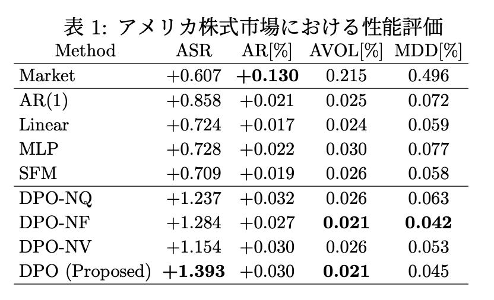
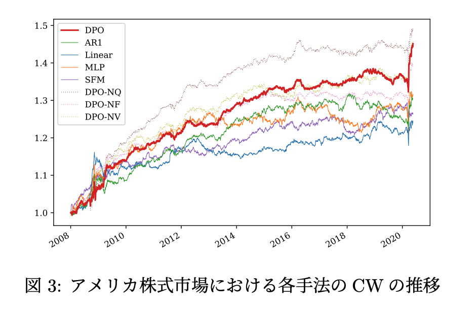
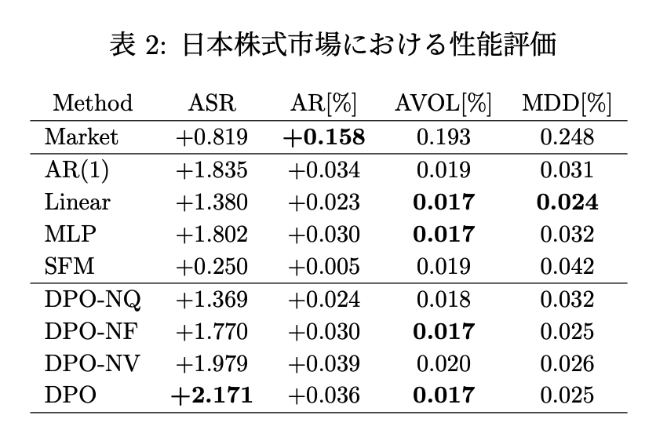
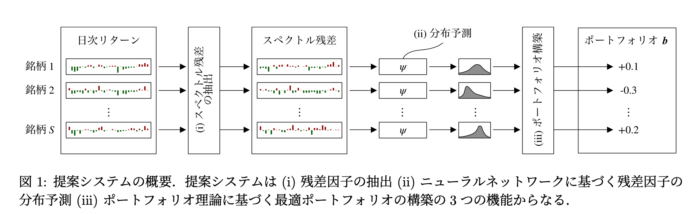
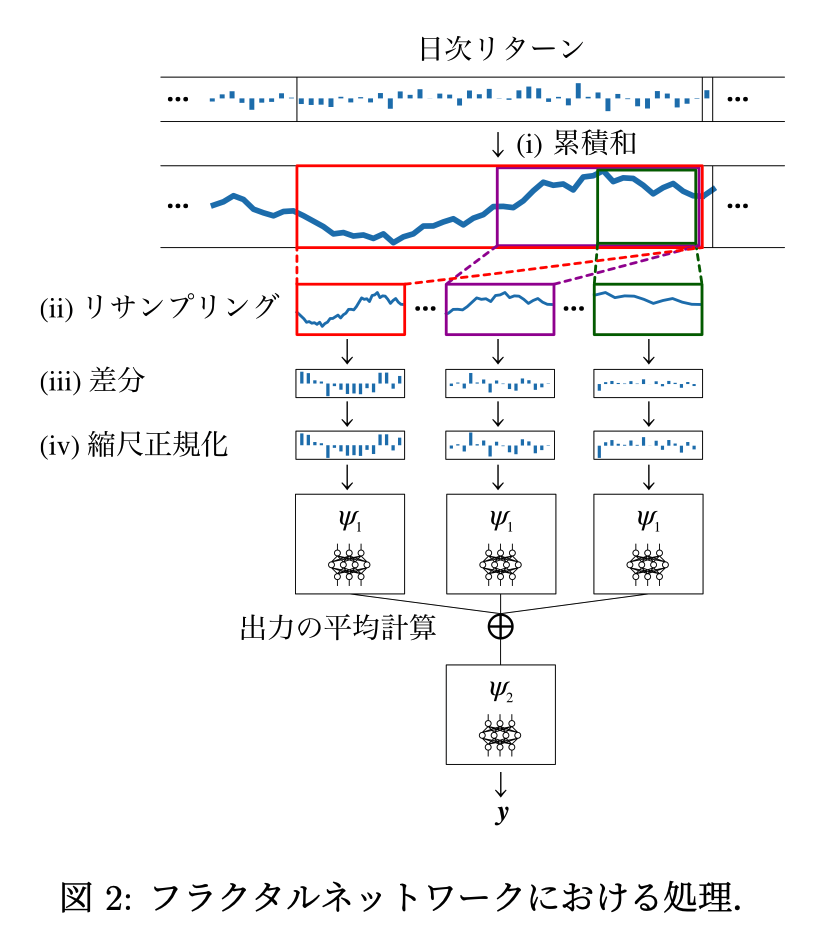

Deep Portfolio Optimization via Distributional Prediction of Residual Factors
===

2020/12/14

[https://arxiv.org/pdf/2012.07245.pd](https://arxiv.org/pdf/2012.07245.pdf)

（まとめ @kmdqcom）

著者
- Kentaro Imajo[1]
- Kentaro Minami[1]
- Katsuya Ito[1]
- Kei Nakagawa[2]

1. Preferred Networks, Inc.
2. Nomura Asset Management Co., Ltd.

---

## どんなもの？

本研究では、ニューラルネットワークによる残差要因と呼ばれる金融量の分布の予測に基づいてポートフォリオを構築する新しい手法を提案する。
残差要因は、一般的な市場要因に対するリスクエクスポージャーをヘッジするのに有用であることが知られている。

---

## どうやって有効だと検証した？ & 議論

本研究では、米国および日本の株式市場データを用いて、本手法の有効性を実証した。

ベースラインの手法として，単純バイアンドホールド (Market), AR(1) モデル, リッジ回帰 (Linear), ニュー ラルネットワーク (MLP), State Frequency Memory RNNs を元にした株価予測の最先端モデル (SFM) を用いた。

評価指標としては、各手法を用いて構築されたポートフォリオのトータルリターン (CW)、年率リターン(AR)、リスクを表す標準偏差 (AVOL)、リスク一単位あたりのリターンを表すSharpeレシオ (ASR:=AR/AVOL)、ポートフォリオの全期間での最大の下落幅を表す最大ドローダウン(MDD)を用いた。
表1が評価指標のサマリーである。提案手法がARを除くすべての評価指標においてベースラインを上回っている。図3がCWの推移を各手法で比較したものである。 CWもベースラインを安定的に上回り、かつ全期間を通じて右上がりの推移となっていることから、提案手法の有効性が確認できる。

また、日本株式市場のデータに対しても同様の実験を 行った.日本株式市場のデータとしては，TOPIX500指数構成銘柄を使用し実証分析を行った。
表2の通り、提案手法がARを除くすべての評価指標においてベースラインを上回る同様の結果が得られた。図4がCWの推移を各手法で比較したものであ る。CWもベースラインを安定的に上回り、かつ全期間を通じて右上がりの推移となっていることから、提案手法の有効性が確認できる。

---

## 技術や手法の肝は？

提案システムの概要は図１である。
1. スペクトラル残差によって残差因子の情報を抽出する。
2. ニューラルネットワークによる残差因子の分布予測を行う(金融時系列特有の構造を考慮したネットワーク構造を提案する)。
3. 分布情報に基づいた最適ポートフォリオの構築を行う.

- 2. 金融時系列を考慮したネットワーク構造
分位点の予測器$\psi: R^{H}→R^{Q−1}$として、ニューラルネットワークに基づくモデルを利用することを考える。本論文では、金融時系列について知られているボラティリティ・フラクタル不変性を考慮したネットワーク構造を導入する。

---

## 先行研究と比べて何がすごい？

技術的に重要な点は2つある。

- 計算機上で効率的に残差情報を抽出する方法を導入し、様々な予測アルゴリズムと容易に組合せることができるようにした。

- 振幅不変性や時間スケール不変性など、広く認められている金融の破壊的バイアスを取り入れることができる新しいニューラルネットワークアーキテクチャを提案する。

---

## 次に読むべき論文は？

本論文の引用元である以下の論文を読んでみるのはいかがでしょうか。

- [No-Transaction Band Network: A Neural Network Architecture for Efficient Deep Hedging](https://papers.ssrn.com/sol3/papers.cfm?abstract_id=3797564)
    - Abst: Deep hedging (Buehler et al. 2019) は、不完全な市場におけるデリバティブの最適なヘッジ戦略を計算するための汎用的なフレームワークである。しかし、この最適戦略は行動依存性、つまり次のステップでの適切なヘッジ行動が現在の行動に依存するため、訓練するのが難しい。この問題を解決するために、ヨーロピアン・オプションと指数効用の最適ヘッジ戦略を与える既存の手法である、無取引バンド戦略のアイデアを活用する。この戦略は、エキゾチックを含むより広範な効用やデリバティブに対しても最適であることを理論的に証明する。この結果に基づいて、我々は、最適なヘッジ戦略を高速で学習し、正確に評価することを容易にするニューラルネットワークアーキテクチャである無取引バンドネットワークを提案する。ヨーロピアン・オプションとルックバック・オプションについて、標準的なフィード・フォワード・ネットワークと比較して、本研究のアーキテクチャがより優れたヘッジ戦略を迅速に達成することを実験的に示した。
    - Keywords: hedging, derivatives, deep learning, transaction costs   
