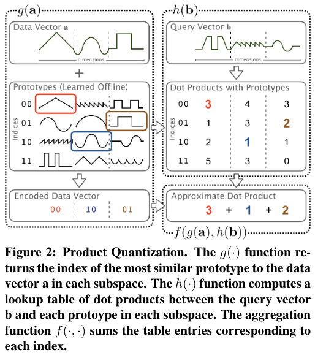
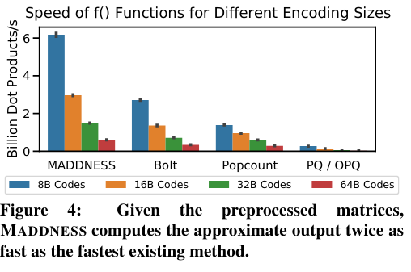
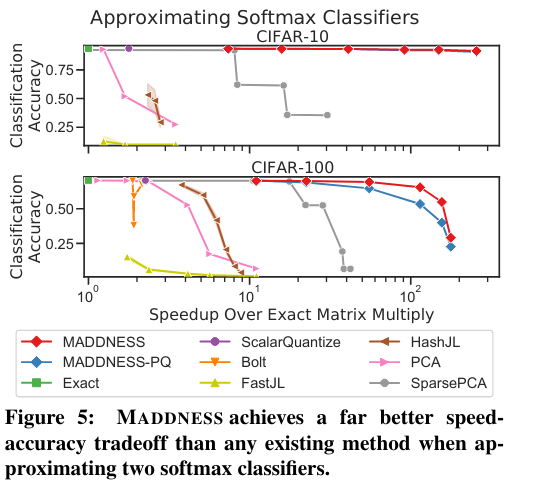

Multiplying Matrices Without Multiplying
======

Davis Blalock, John Guttag

https://arxiv.org/abs/2106.10860 (To appear at ICML 2021)

まとめ @cohama

## どんなもの？

- 行列積の計算を近似で高速に計算する手法 MADNESS を提案
- 数百列ある行列の積で通常の100倍、既存手法の10倍速い

## 先行研究と比べて何がすごい

- 速い

## 技術や手法の肝は？

### 前提知識 Product Quantization

ベクトルの内積を高速に近似計算する既存手法。

例えば、行列 A と行列 B の積は以下のような手順で計算する。a, b はそれぞれ A, B の列 (転置している場合もある)

1. プロトタイプ学習: 行列 A の行から K-mean でクラスタリングし、プロトタイプを作る。K 個のクラスタのセットが C 個できる。
2. エンコーディング関数: ベクトル a に似ているプロトタイプを探し、そのインデックスを保持しておく。
3. テーブル生成: 予め b とプロトタイプの積を計算しておく
4. 集約: テーブルからインデックスで値を参照する。それら (C個) を足すことで内積が得られる。

### 提案手法

PQ のうち、2のエンコーディング関数を高速化する。PQ では似ているプロトタイプかどうかはユークリッド距離が最も小さいプロトタイプを選ぶという手法だった。

ここを LSH (Locality Sensitive Hashing; 局所性鋭敏型ハッシュ) を使うことで似ているプロトタイプを高速に引いてくる。

以下の工夫も含んでいる。
- ハッシュ関数
- プロトタイプの最適化
- 8ビット整数の和の高速化 (加算の代わりに平均を取る命令を使う `vpavgb` on x86, `vrhadd` on ARM)

## どうやって有効だと検証した？

内積の計算時間の比較

訓練済みの VGG から得られた特徴に対して、最後に線形分類器を設ける。(いわゆる全結合層)
これは例えば CIFAR-10 の場合 N x 1000 と 1000 x 10 の行列の積になる。

## 議論はあるか？

- CPU でしか計測していないが
  - GPU で本手法のようなアルゴリズムを実装するのは大変
- 畳み込みニューラルネットは？
  - 今回は全結合層1層に相当する分しかやっていない。畳み込みは重みが共有される性質などがありそれに対して本手法の特別な拡張が必要になる。
- 本手法でニューラルネットすべてを最適化できる未来はある。(特に推論時)
