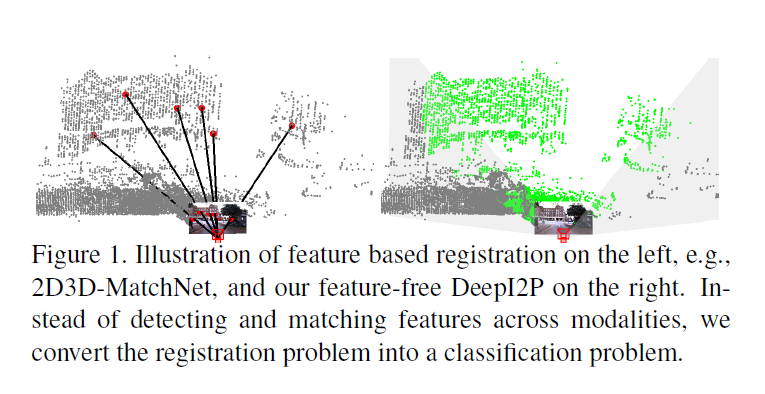
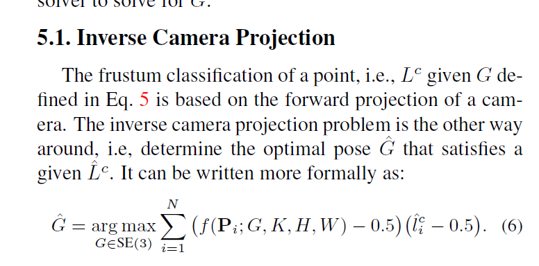
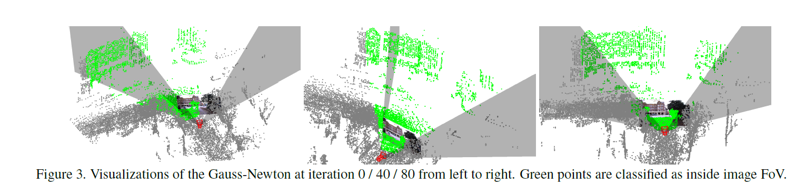

DeepI2P: Image-to-Point Cloud Registration via Deep Classification
===

2021/04/08 Jiaxin Li, Gim Hee Lee

https://arxiv.org/abs/2104.03501
https://github.com/lijx10/DeepI2P

（まとめ：yuji38kwmt）

---

## どんなもの？

* 「DeepI2P」という画像から点群に合わせ込むcross-modality registration を提案
* 2つの問題に分割して以下の手法で解決した
    * 点群の点がカメラの錐体（frustum）にあるかどうかの分類問題をニューラルネットワーク
    * inverse camera projection problem？を最小二乗法
* KittiデータセットとOxford Robotcarデータセットで評価した

---

## どうやって有効だと検証した？

* RTE(Relative Translation Error)とRRE(Relative Rotation Error)で比較した
* Direct Regressionと比較すると、かなりよい

---

## 技術や手法の肝は？

分かりませんでした。

---

## 議論はある？
なし

---

## 先行研究と比べて何がすごい？

* 画像から点群にcross-modality registrationする唯一の手法2D3D-MatchNetと比較
    * カメラとLidar間の回転はほとんど0で、これは簡単な問題を解いているだけ。それと比較してDeepI2Pはランダムに回転しているので、DeepI2Pの方がよいはず

---

## 次に読むべき論文は？

* 2D3D-MatchNet https://arxiv.org/abs/1904.09742
