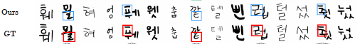
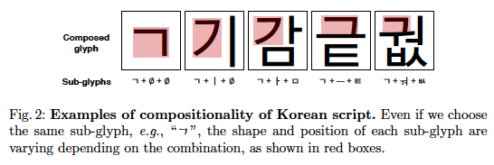
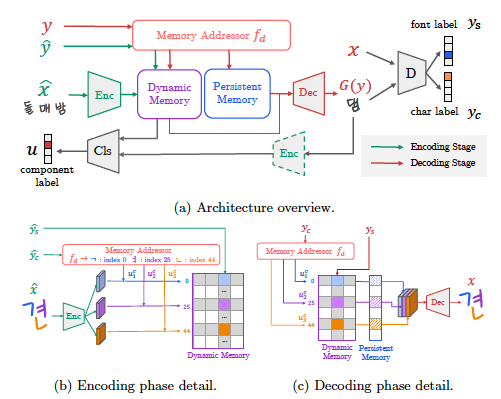
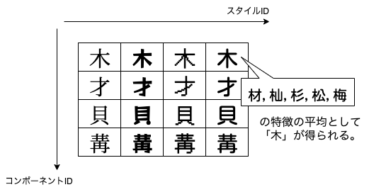
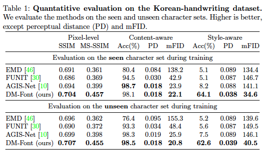
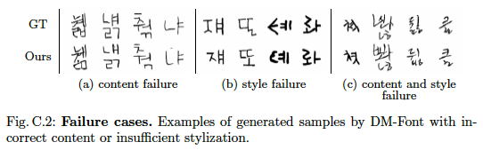
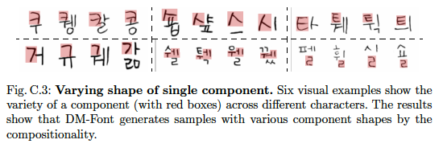
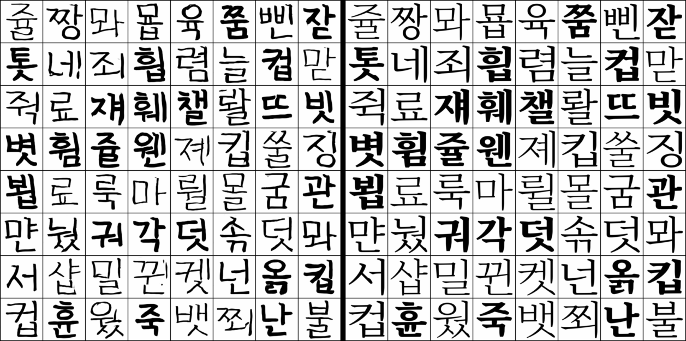

# Few-shot Compositional Font Generation with Dual Memory

[https://arxiv.org/abs/2005.10510](https://arxiv.org/abs/2005.10510)

（まとめ @derwind）

- 著者
    - Junbum Cha
    - Sanghyuk Chun
    - Gayoung Lee, Bado Lee
    - Seonghyeon Kim
    - Hwalsuk Lee
- 所属
    - Clova AI Research, NAVER Corp.

## どんなもの？

- 敵対的生成ネットワーク (GAN) による文字の生成である。
- 推論時には、スタイル（≒デザイン）のベースとなる数文字の「参照文字」を与えることで、「参照文字」のデザインに近い沢山の文字を生成できる。
- 基本的に韓国のハングルとタイのタイ文字に限定するものである。
    - 以下では簡単のため、ハングルに限定してまとめる。
- 以下は生成サンプル:

## 前置き

- 本研究は「構成的スクリプト」というものに特化した文字生成 GAN である。
- 構成的スクリプトとは文字が幾つかのコンポーネントの構成で成り立つものを指している。身近な例では漢字も該当する。
    - 例えば、「材」は「木」というコンポーネントと「才」からなる。本研究はその中でもすべての文字が複数のコンポーネントのカテゴリ A, B, C から得られる任意のコンポーネントの組み合わせで構成されるようなものを扱っている (`complete compositional scripts` と呼んでいる)。漢字の場合、非常に多様であったり、存在しない組み合わせもあり、complete ではないので本研究からは除外されている。
- 具体的にはハングルは以下の図のように幾つかのコンポーネントから構成される。
    - ハングルのコンポーネントは [Wikipdia](https://ja.wikipedia.org/wiki/%E3%83%8F%E3%83%B3%E3%82%B0%E3%83%AB) によると「子音」(19 種)、「母音」(21 種)、「パッチム」(28 種) の 3 種で計 68 個で、これらの組み合わせで全てのハングルが構成される。理論上は 19x21x28 = 11172 個の文字からなる (実際によく使われるのはそのうちの 2350 個らしい)。

## 先行研究と比べてどこがすごい？

- 推論時の用いるスタイル用の参照文字が少なくて済む。(5.1 Datasets によると例えば 30 文字。当時の他の研究では 775 個くらいの参照文字を用いる研究が多かった。)
- 見たことのない初見のデザインのフォントで推論されても対応できる。

## 技術や手法の肝は？

- 文字をコンポーネントごとに“切り出して”別々に管理する。
    - “切り出し” は GitHub の実装をみる限り、マスクをかけてビットマップを切り出すようなものではない。漢字で例えると「`["材", "杣", "杉", "松", "梅", ...]` の特徴ベクトルを集めて平均をとれば、そこには木へんの特徴が色濃く入っているはず」という実装に見える。(※ 以降も、簡単のため漢字を用いた例え話を幾らか持ち出す)
- 新しい文字を作る場合に、切り出したコンポーネントを寄せ集めて作成する。
    - (漢字でのたとえ)「材」から「才」の情報を、購から「貝」の情報を得て、これらを組み合わせたら「財」ができるようなもの。
- そのために 2 つの「メモリ」を導入している。
    - 「ダイナミックメモリ」と呼ばれるものは以下のような構造になっている (漢字でのたとえ):  
    
    - 「パーシステントメモリ」を呼ばれるものは「各コンポーネント固有の形状や、構成性などのグローバルな情報を表すコンポーネント単位の学習済み埋め込み」を格納するとある。実装上はバイアス項のようなものをコンポーネントごとに管理している (漢字でのたとえ):  
    

## どうやって有効だと検証した？

他の研究との比較を行なっている。具体的には以下によって評価している。

- 定量的評価
    - ピクセルレベルでの評価指標による評価
        - SSIM, MS-SSIM (画像の類似度判定に使う指標)
    - 知覚レベルでの評価指標による評価
        - 知覚的距離 (PD; 特徴量の L2 距離), 平均 FID (mFID)

- 定性的評価
    - 著者らが目視で出来栄えを比較している。
- ユーザー調査
    - 生成文字をシャッフルして 38 人の被験者に見てもらい、好ましいものを選んでもらう。(回答数は 3420 件)

また、個々のモジュールの機能的な貢献度についてアブレーションを行なって検証している。

---

## 議論はある？

以下のようにうまくいかないケースもある:

具体的には:

- 手書き文字を使う場合、参照文字の中に筆者が書き間違えた “誤字” が混入すると対応できない。
    - 障害検出器などを開発すれば解決策になるのでは？とのこと。
- マルチモダリティの問題。また漢字を例に持ち出すと「木」というコンポーネントが「森」の上側に出てくるやつと「材」の左に出てくるものではデザインが異なるので、単一のコンポーネントが複数のモダリティを持ってしまうという問題。
    - 通常はユーザーが介入して補正をかけるとのこと。

- 参照文字の破損。走り書きしたものやくずし字の場合、コンポーネントの切り離しがうまくいかない問題がある。

そして、明確には論文には書いていないが、この論文が `complete compositional scripts` に特化していることから以下の問題を抱えている。

- complete ではない「構成的スクリプト」に対応できない。
    - 次回以降の研究のモチベーションはここにある。

## 次に読むべき論文は？

- [Few-shot Font Generation with Localized Style Representations and Factorization](https://arxiv.org/abs/2009.11042)
    - 既存研究のうち「参照文字を構成する部品ごとに部品ラベルも一緒に与えて細部情報を保持する方法」に相当するもの。著者らの次の研究。2 段階で訓練する手法であるので実施にはちょっと手間がかかるが内容は興味深い。
- [DeepVecFont: Synthesizing High-quality Vector Fonts via Dual-modality Learning](https://arxiv.org/abs/2110.06688)
    - arXiv で公開されたばかりの論文。文字生成系の多くの研究ではラスター画像を扱うが、この論文ではベクター画像として扱っている。正確にはラスター画像としての情報とベクター画像としての情報を融合させて、出力としてベクターフォントを出せるらしい。基本的にはベクターフォント系の論文は多くはないが、最近の 2〜3 の論文ではベクター画像としてのグローバルな情報（ここは直線、ここはカーブ）にラスター画像によるローカルな情報（ここは白いピクセル、ここは黒いピクセル）を掛け合わせてアプローチしているものが見られる。読解中だがなかなか興味深いと思う。

## おまけ

オフィシャル側で訓練済みモデルを公開していたので、[源ノ明朝のハングルフォント](https://github.com/adobe-fonts/source-han-serif/tree/release/OTF/Korean)の ExtraLight, Regular, Heavy を用いて推論を実行してみた。

### 200000 ステップ時のモデルでの推論

訓練済みモデルが手書き風のフォントで訓練されているので、明朝体のようなデザインを全く学習していない。このため、デザイン的にはあまり似ていないが、文字の太さとか文字の内容はそこそこ妥当なように見える。

左: 生成画像 | 右: GT

