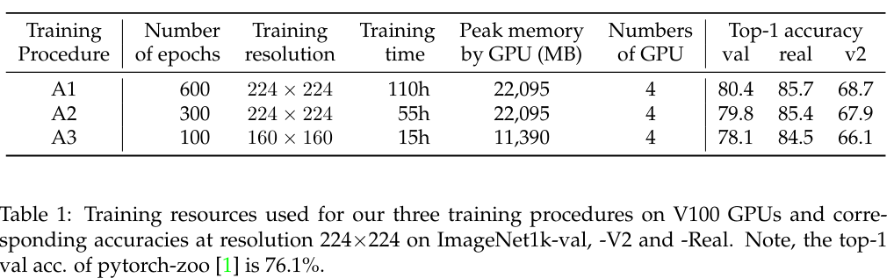
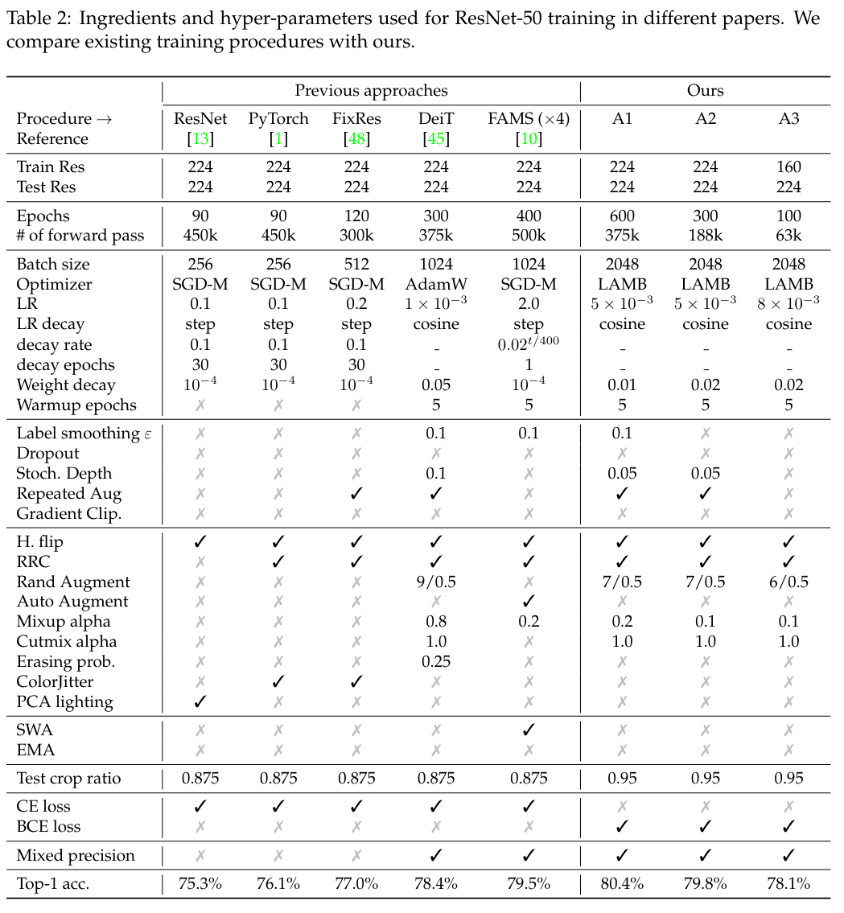
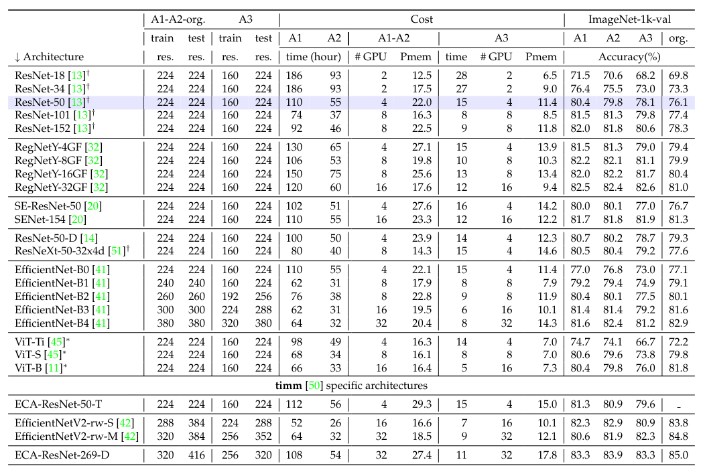
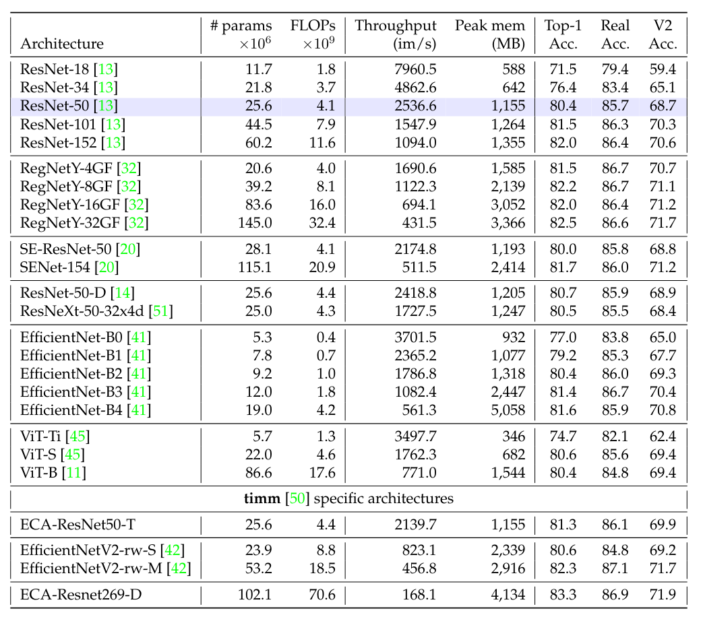
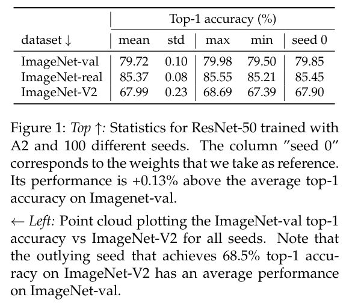
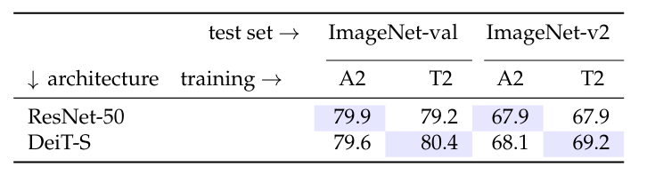

ResNet strikes back: An improved training procedure in timm
======

Ross Wightman, Hugo Touvron, Hervé Jégou

https://arxiv.org/abs/2110.00476v1

まとめ @cohama

## どんなもの？

- 2015年に発表されたそのままの ResNet-50 に対して最新の学習手法を適用した場合にどれくらいの精度になるのかを調べた。
- ResNet-50 で ImageNet 80.4%
- 追加データや蒸留、その他 SE ブロックなどのモデルに対する改善は一切行っていない。
- モデルアーキテクチャと学習のテクニックは表裏一体で、あるモデルにとって最適な設定が他のモデルにとっては必ずしもそうではないことを明らかにした。

## 先行研究と比べて何がすごい

- ResNet-50 のベースラインを更新する試みは今までもあったがそれよりも高い精度を実現した

## 技術や手法の肝は？

まず、計算コスト別に大きく3つの実験設定を用意。

* A1: V100 4つで110時間くらい
* A2: V100 4つで55時間くらい
* A3: V100 4つで15時間くらい

バッチサイズは全て 2048 (!)

### オーグメント

- Horizontal Flip: 左右に反転
- Random Crop: ランダムに切り抜く
- Rand Augment: 複数のオーグメントを同時に復数適用する
- Mix up: 異なる2つの画像をアルファブレンディングする
- Cut Mix: ある画像に別の異なる画像の一部を張り合わせる

### 損失関数

- 通常画像分類では softmax - cross entropy を使ったマルチクラス学習を行うが、MixUp と CutMix を使用する際には sigmoid と binary cross entropy を使ったマルチラベル学習を行う

### 正則化

- Stochastic Depth: モデルの深さをランダムに変える
- Repeated Augmentation: バッチ内で同じ画像に対する異なるオーグメントさせた事例を含める?
- Label Smoothing: 正解に対する値を 1 じゃなくて 1 - ε にする

Label Smoothing は A1 のみ、Stochastic Depth と Repeated Augmentation は A1 と A2 に適用する。 
A3 のように学習時間が少ない場合は効果が薄いか逆効果なため。

### 最適化

いろいろ試した結果 LAMB という手法が良かった。
学習率は Cosine で減衰させる。

### その他

## どうやって有効だと検証した？

とにかくハイパーパラメータを変えて大量に実験。

過学習なのでは？という疑念を払拭するために100回実験して平均と分散を出している。

ResNet-50 の最適な設定と ViT の最適な設定は一致しない

## 議論はあるか？

- 今回発見した最適な学習手法は ResNet-50 のためのものであって、他のモデルに適用しても精度向上はするが最適ではない。特により深い/複雑なモデルには強い正則化が必要なのではないか

## 次に読むべき論文

- [Pervasive Label Errors in Test Sets Destabilize Machine Learning Benchmarks](https://arxiv.org/abs/2103.14749): ノイズがないきれいなデータだと ResNet18 で十分らしい
