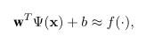
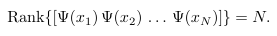
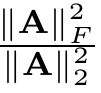
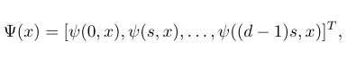
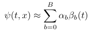
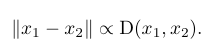
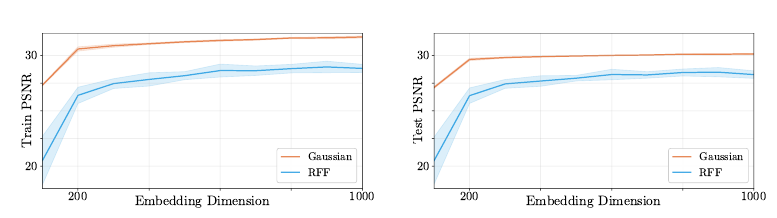
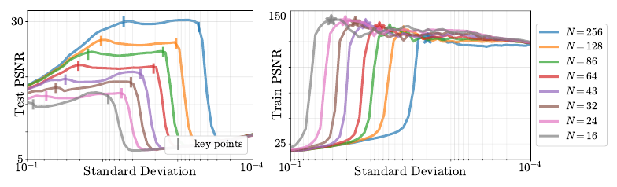

# Rethinking Positional Encoding
[https://arxiv.org/abs/2107.02561](https://arxiv.org/abs/2107.02561)
（まとめ @n-kats）

著者
* Jianqiao Zheng
* Sameera Ramasinghe
* Simon Lucey

アデレード大学（オーストラリアで3番目に古い大学）の人達。

# どんなもの？
昨今、言語も画像もトランスフォーマー。そのなかで、位置情報をどう扱うかが問題になる（positional encoding）。

雑に座標（x, y）をネットワークにいれてもうまくいかなくて、(sin(x), sin(2x), ..., cos(x),..., sin(y), ...)のようにフーリエ変換風にすることが多い（Fourier frequency mapping）。

positional encoding をいい感じにしたいが、どういうのがいいのか、理論とプリミティブな実験で分析した論文。

最終的に、ガウス関数（exp(-x^2)など）を使った方法がよい性質を持つと結論づけている。

# 先行研究と比べてどこがすごい？
* フーリエ変換風の方法を一般化して解釈しやすく制限の緩い形にした。
* positional encoding の品質を approximate rank というもので評価できることを示した。
* ガウス関数を使うのがいいとわかった。

# 技術や手法の肝は？
## 埋め込み表現とランク
* x_i: 座標(i=1,..., N)
* Ψ(x): x に対する positional encoding
* f(x): 扱いたい関数
* y_i: y_i = f(x_i)

関数fがΨを使って線形モデルで表現できるかという問題を考える。

いろんなfでうまく近似できるとうれしい。

そのためには、Ψ(x_1),Ψ(x_2), ..., Ψ(x_N)が一次独立であってほしい（変な拘束条件がつくと困る）。こういうのは行列のランクを使って条件がかける。

複数の座標のpositional encodingが作る行列のランクが重要。

小さい値を無視したいので、stable rankを代わりに使う。

||A||_FはFrobenius norm（行列をベクトルと思ってユークリッドノルムをとる）、||A||_2は行列ノルム（固有値の絶対値の最大値）

## 2変数関数を使った埋め込み
* ψ(t, x): 実数値の2変数関数。embedderと呼ぶ

ψを使ってΨを次のように作る（s = C/d ずつ、tの値を変えていく）。

## bandwidth
どんなψがいいのか。次の形に分解できるψを考える。

ただし、αはxに依存してよい。B個のtの関数の和で近似できるとする（このBをbandwidthという）。

各βが結果のテンプレートのようなものと考えると、

* Bが小さいと、memorization（どれだけ暗記するか）が小さく、表現できる関数の幅が小さい。
* Bが大きすぎると、学習途中で完全に暗記できるようになって、汎化しない。

## 類似度
x_1とx_2をpositional encodingしたときのx_1とx_2の類似度を

もともとの距離と似た性質がほしいので、おおよそ次の式が成り立ってほしい

## 例
shifted basis function（ψ(t,x) = φ(t-x)の形）が扱いやすい。

* impulse embedder: δ(t-x)  # クロネッカーのデルタ関数
* sine embedder: sin(k(t-x))
* square embedder: sgn(sin(t-x))  # 1と-1が交互に出現する関数
* gaussian embedder: exp(-(t-x)^2/2σ^2)  # 正規分布とかでよく見るやつ

gaussian embedderの場合、stable rankがmin(N, 1/(2σ√π))でD(x_1, x_2)=exp(-|x_1-x_2|^2/(4σ^2))のように計算できる。

stable rankは、Nが十分に大きいとき、標準偏差σの逆数に比例する（コントロール可能）。

### RFF（Random Fourier Features）
* b_i: 正規分布に従うランダムな値
* γ(x): [..., cos(2πb_ix), sin(2πb_ix), ...] の形のpositional encoding

RFFのstable rank = min(N, σ√(2π)), D(x_1, x_2) = Σ_j cos(2πb_j(x_1, x_2))

# どうやって有効だと検証した？
positional encodingを使ったオートエンコーダの品質で評価。

つまり、positional encodingから対応するデータの値（画素など）を推論する関数を学習して、その品質（PSNR（高い方がいい））をみる

（データは画像から一部を切り出したもの）

## Gaussian embedder vs RFF
stable rankをそろえて実験した結果は以下の通り。gaussianの方がPSNRがよい。また、実験毎の分散も小さく、安定している。

## Gaussian embedder（分散を変化した場合）
gaussianの標準偏差を変化させたときの挙動は以下の通り。

標準偏差が大きいところでは（stable rankが低い場合）、訓練のPSNRでさえ低く、表現力が乏しいことがわかる。
標準偏差を小さくしていくと、ちょうどよい塩梅の部分が来るが、さらに小さくしていくと、一気に汎化性能（テストデータの評価）が落ちる。stable rankが高すぎてmemorizationが強く効いている。

# 議論はある？
* stable rankはいいぞ
* gaussian embedderはいいぞ

## 私見
gaussian embedderがいいことが伝わってきたが、実際に画像認識のタスクなどで使うとどうなるのかが気になる。続報に期待。

# 次に読むべき論文は？
* [Fourier Features Let Networks Learn High Frequency Functions in Low Dimensional Domains](https://arxiv.org/abs/2006.10739)  
  NTK理論を使ってpositional encodingを研究した論文
