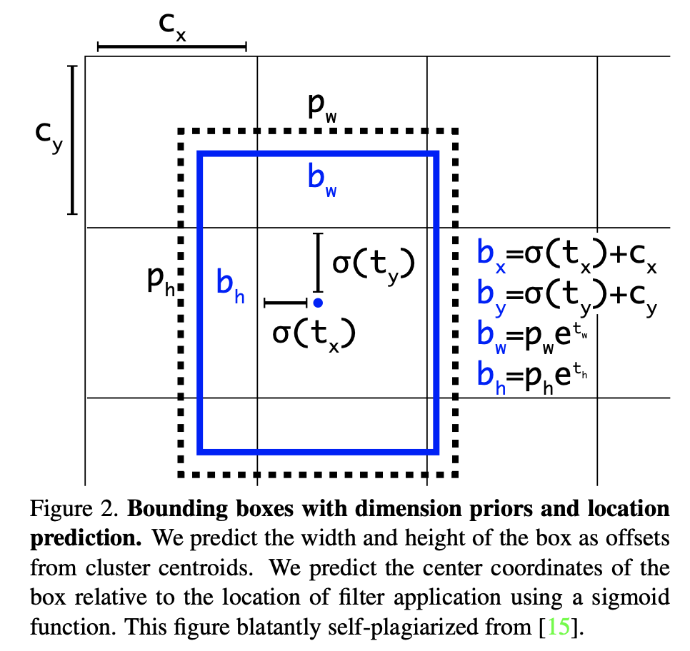
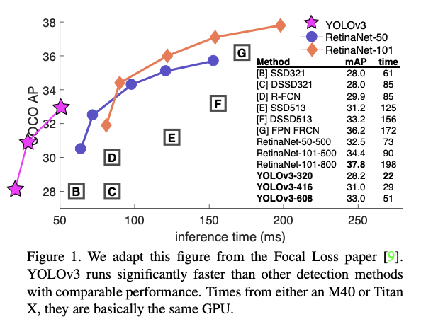
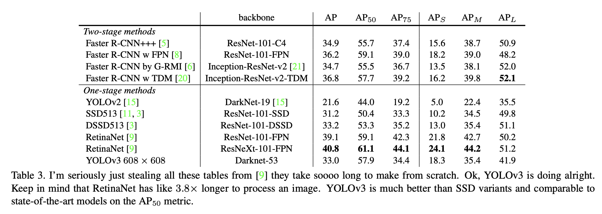

YOLOv3: An Incremental Improvement
===

2018/4/8

https://arxiv.org/pdf/1804.02767.pdf

著者
* Joseph Redmon
* Ali Farhadi

（まとめ：@masahiro6510）

---

## どんなもの？
+ 物体検出をする。
+ YOLOは「You Only Look Once」の頭文字。YOLO以前は二段階（検出と識別）で行われていた物体検出を一度の作業（全体を検出）にすることで高速化に成功した。
+ YOLOv3はYOLOのバージョン3

---

## 先行研究と比べて何がすごい？

+ 既往研究と同等以上のパフォーマンスを維持しつつ、より高速になった。
+ 1つの物体が複数の教師ラベルを持つ場合により良くモデル化出来る。

---

## 技術や手法の肝は？

+ YOLOv2ではsoftmax関数を使っていたのに対し、v3ではクラス分類にロジスティック回帰を使った。
    + 1つの物体が2つのクラスに属するような複雑なケースに対応するため（例えば、女性の画像の教師ラベルは人であり女性でもある）。
+ バウンディングボックスを用いた予測 
+ ResNetの考え方を取り入れて、層数をYolov2の19から53に増やした。これをDarknet-53と呼称。 
+ 3つの異なるスケールを使って予測した。

---
## どうやって有効だと検証した？

+ 他の手法との性能比較  
+ 

---

## 議論はある？

+ まだ調べきれていません。

---

## 次に読むべき論文は？
+ YOLOv4: Optimal Speed and Accuracy of Object Detection (https://arxiv.org/pdf/2004.10934.pdf)
    + YOLOのv4。同じ著者が提案しているのはv4までだけど、他の著者が提案しているものも含めるとv5以降もある。
+ ResNet関連の論文。具体的なタイトルはまだ調べていない。
