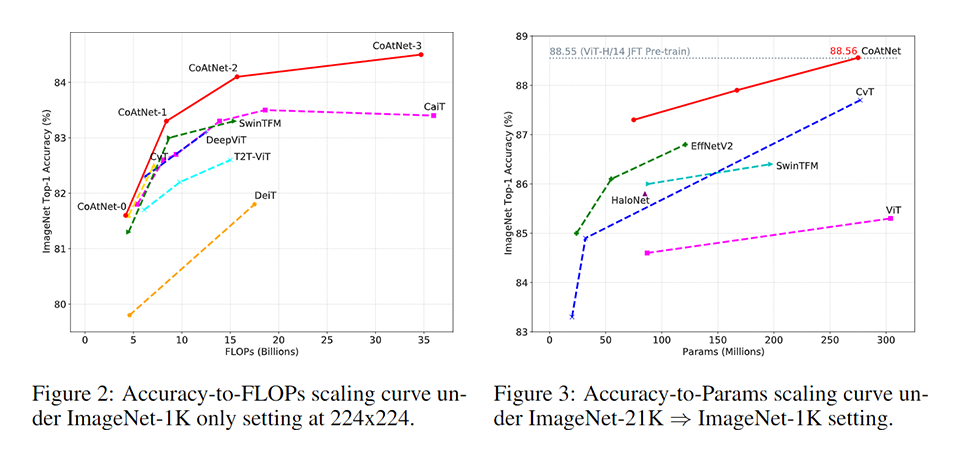
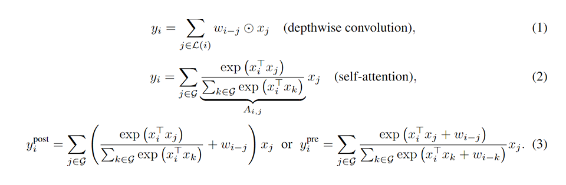
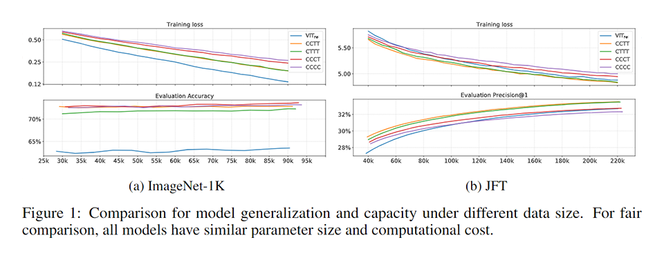
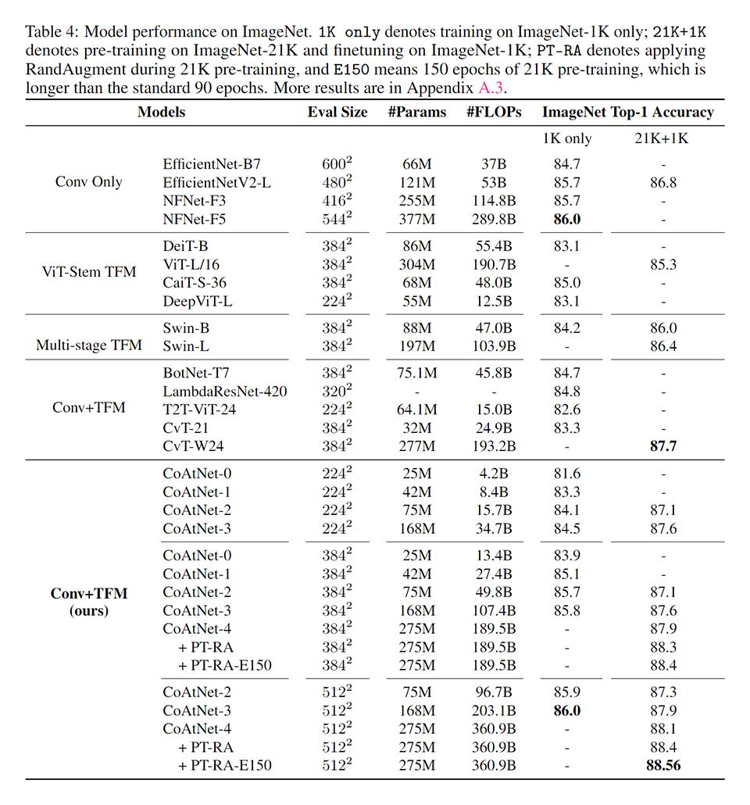
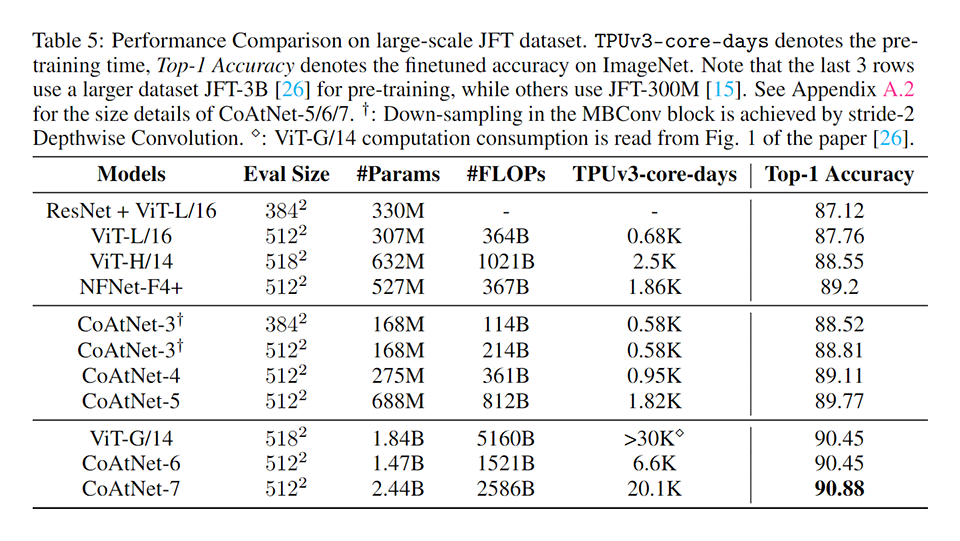

# [\[arxiv\]](https://arxiv.org/abs/2106.04803v2) CoAtNet: Marrying Convolution and Attention for All Data Sizes

- 著者
    - Zihang Dai *1
    - Hanxiao Liu *1
    - Quoc V. Le *1
    - Mingxing Tan *1
- 所属
    - 1: Google Research, Brain Team

## どんなもの？
### CoAtNet
- CoAtNet は "coat net" と発音する。
- convolution の強みと transformer (self-attention) の強みをいいとこどりしたコンポーネントとアーキテクチャである。
  - convolution は帰納バイアスがあるため汎化性能が高いが、性能が飽和する（キャパシティが小さい）。
  - transformer は性能が飽和しない（キャパシティが大きい）が、帰納バイアスがないため汎化性能が低い（可能性がある）。
- 2021年9月16日(火) の Google AI Blog 記事「[Toward Fast and Accurate Neural Networks for Image Recognition](https://ai.googleblog.com/2021/09/toward-fast-and-accurate-neural.html)」によると近日中にソースコードと学習済みモデルを公開するらしい。

## 先行研究と比べてどこがすごい？
### CoAtNet
- convolution の特性 (Translation Equivariance) と transformer (self-attention) の特性 (Input-adaptive Weighting & Global Receptive Field) をシンプルなアイデアで自然に統合できることを示した。
- convolution と transformer の両方を積み重ねることで、汎化性能・キャパシティ・効率性が劇的に改善することを示した。SOTA を更新した。

## 技術や手法の肝は？
### CoAtNet
- transformer (self-attention) の attention をバイアスする移動窓を導入した。これにより transformer に不足していた convolution の特徴 (Translation Equivariance) を追加できた。

- C-C-T-T（ステージ０・１: convolution，ステージ２・３：MBConv，ステージ４・５：上記の改良がされた transformer）がいいことを実験により求めた。

## どうやって有効だと検証した？
### ImageNet 1K only と ImageNet 21K+1K における画像分類タスクの性能比較

- ImageNet 1K only
  - 1K 種類のカテゴリが付与された 14M 枚の画像で学習した。
- ImageNet 21K+1K
  - 22K 種類のカテゴリが付与された 14M 枚の画像で事前学習した後で、1K 種類のカテゴリでファインチューニングした。

### JFT-300M と JFT-3B における画像分類タスクの性能比較

## 議論はある？
- convolution と transformer (self-attention) の特性をシンプルなアイデアで自然に統合できることを示した。
- 大規模な実験により、CoAtNet は convolution の優れた汎化能力と transformer 8self-attention) の優れたキャパシティを兼ね備えていることを示した。
- 物体検出・セマンティックセグメンテーションなどにも適用できると考えているが、これらは今後の課題とする。

## 次に読むべきタイトルは？
### convolution (高周波と捉える) と transformer（低周波を捉える）を組み合わせた方がいいことを示した論文 ※CoAtNet の参考文献ではないが関係してそう。
[\[openreview\]](https://openreview.net/forum?id=D78Go4hVcxO) Anonymous, "How Do Vision Transformers Work?", ICLR, 2022.
