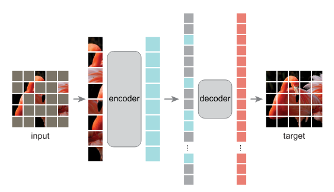
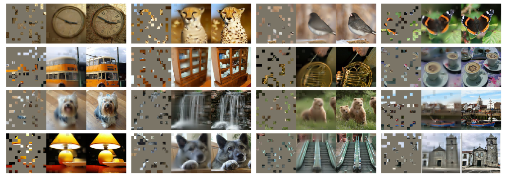
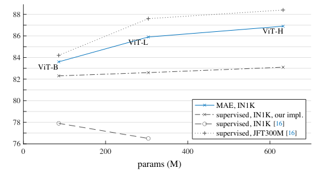
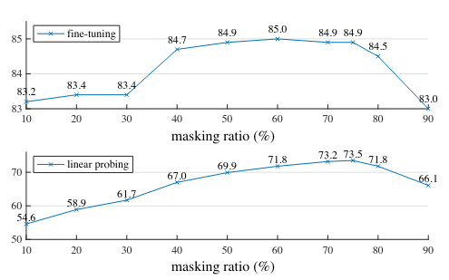
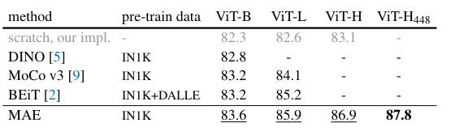

Masked Autoencoders Are Scalable Vision Learners
======

Kaiming He, Xinlei Chen, Saining Xie, Yanghao Li, Piotr Dollár, Ross Girshick

Facebook AI Research

https://arxiv.org/abs/2111.06377v1

まとめ @cohama

## どんなもの？

- ViT のような巨大な Transformer の事前学習に使える自己教師あり学習手法
- 入力画像のランダムなパッチを削除したパッチ列から元の画像を復元するような Auto Encoder を構成する Masked Auto Encoder (MAE) という手法を提案
- 教師なし ImageNet1K で MAE を訓練し、その後教師ありで ImageNet1K に Fine Tune で 87.8% 達成。これは Extra Training Set を使わない設定では最高値

## 先行研究と比べて何がすごい

- 自己教師ありの設定で既存のものを上回る Fine Tune 性能
  - Auto Encoder を使った事前学習はすでにあるが、本手法はそれらを上回る
- シンプルな手法
- 学習が軽量、高速
  - 128個の TPU で 30時間程度で訓練できる (従来手法は 120時間程度)

## 技術や手法の肝は？

### アーキテクチャ

1. まず入力画像をパッチに分割 (ここは ViT と同じ)
2. パッチのうち m% をランダムに消す (m=75% がいいらしい)
3. Transformer に食わせる
4. Transformer の出力も歯抜けなので mask token を付与して出力したい画像のサイズに合わせる
5. Decoder に食わせて元の画像を復元する

このように訓練された Transformer を他のタスク (画像分類、物体検出など) に転移学習

## どうやって有効だと検証した？

### ImageNet1K のみを使った画像分類 (vs. ViT)

### 他の自己教師あり学習との比較 (vs. MoCov 3)

### その他 Ablation Study

## 議論はあるか？

今後の事前学習のトレンドはこれになるかもしれない？

## 次に読むべき論文

- Deepak Pathak, Philipp Krahenbuhl, Jeff Donahue, Trevor Darrell, and Alexei A Efros. Context encoders: Feature learning by inpainting. In CVPR, 2016
- Pascal Vincent, Hugo Larochelle, Isabelle Lajoie, Yoshua Bengio, Pierre-Antoine Manzagol, and L ́eon Bottou. Stacked denoising autoencoders: Learning useful representations in a deep network with a local denoising criterion. JMLR, 2010
