# Unsupervised Part Discovery from Contrastive Reconstruction
[https://arxiv.org/abs/2111.06349](https://arxiv.org/abs/2111.06349)

(まとめ @n-kats)

著者
* Subhabrata Choudhury
* Iro Laina
* Christian Rupprecht
* Andrea Vedaldi

VGG（オックスフォード大学のVisual Geometry Group）の人達

# どんなもの？
教師なしでパーツに分解するセグメンテーションを行う手法。（パーツの教師は無いが、前景・背景の教師は使う）

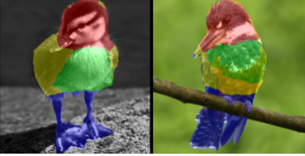

例えば、画像のように鳥のデータセットで訓練すると、鳥の頭・胴・足のパーツに分かれるセグメンテーションをしてくれる。

# 先行研究と比べてどこがすごい？
同じテーマの先行研究として SCOPS という手法があるが、これよりもとてもよい結果が得られる。

分かりやすいところで、DeepFashion の場合、服の境界にフィットしていたり、はみ出しが少なくなった。

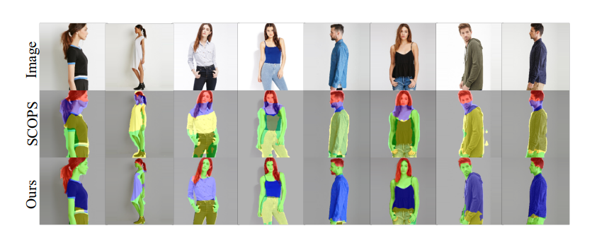

# 技術や手法の肝は？
* パーツの数（K）だけのマスクを出力するネットワークを訓練する
* Imagenet 等で訓練したネットワークを用意し、画像の特徴マップに使う（訓練時のみ利用）
* 4 つの損失関数の重み付き和を使って学習する
  * L_f(feature loss): 同じマスクでは似た特徴
  * L_c(contrastive loss): 異なる画像でも、同じパーツでは近い特徴、異なるパーツでは異なる特徴
  * L_v(visual consistency): 同じパーツでは色も近い
  * L_e(equivariance loss): 変形してもマスクが保たれる

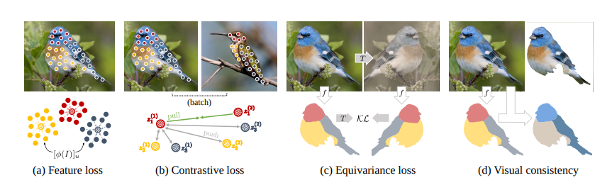

## ネットワーク
お好きなセグメンテーションのネットワーク（クラス数 = パーツ数 の分類を各ピクセルで行う）。

損失関数を作るために訓練済みのモデルを使うが、これはセグメンテーションとは別。

## 訓練済みモデル
Imagenet で訓練した VGG とか Resnet とかを適当に用意する。これはあくまで学習のために使う。

（雑にいうと）この訓練済みモデルが出力する特徴が似ているものを同じパーツだと思うように学習させたい。

雑に特徴量でクラスタリング（k-means）するだけだと期待したものにならない。

直接クラスタリングするのではなく、ネットワークの出すマスクが、クラスタリングに近いこともしつつ、他の制約も満たすようにするのがこの手法のやっていること。

## 記号の準備
* I: 画像（[H, W, 3] のテンソル）
* I_v: 点 v の I の値（画素）
* K: パーツの数
* M: マスク（[H, W, K] のテンソル）
* M_u: 点 u の M の値（K次元のベクトル）
* f: セグメンテーションのネットワーク
* φ: 訓練済みモデルを使った特徴抽出関数
* [φ(I)]_u: 点 u の特徴ベクトル
* Ω: 画像の前景全体
* z_k(I): k 個目のパーツの特徴ベクトルの重みつき平均（平均特徴量と略す）
* |M_k|: k 個目のパーツのマスクの重みつき面積

下2つを式にするとこう

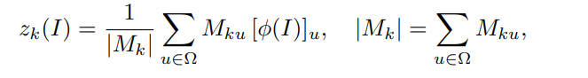

## 損失関数
### featrue loss

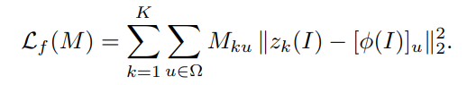

マスクの範囲の特徴ベクトルは、そのマスクの平均特徴量に近い（同じマスク内では特徴が近い）

### contrastive loss

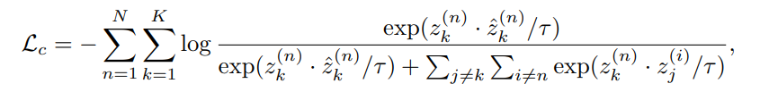

hat つきの z は異なる画像の同じパーツの平均特徴量（どの画像かはランダムに選ぶ）

複雑そうに見えるが、cross entropy（内積で logits を作っているだけ）。

分子の部分は、異なる画像の同じパーツの平均特徴量の類似度、分母の2項目は異なる画像の異なるパーツの平均特徴量の類似度を意味する。
前者が大きく、後者が小さくなるように学習する。

### visual consistency

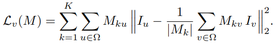

式としては feature loss とほぼ同じ。特徴ベクトルの代わりに画素を用いる。

ノルムを取っている部分の2項目は難しそうに書かれているが、単に画素の重み付きの平均。

マスクの境界が色の境界に沿うのはこの損失関数の効果と考えられる。

### equivariance loss

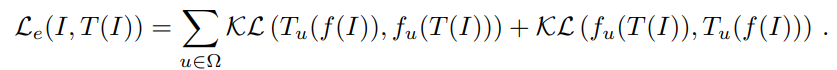

変形 T （アファイン変換や色合いの変更）を行ったときに、同じようなマスクになるようにする損失関数。

変形後のマスクともとのマスクを変形させたものが一致するように学習（KL divergenceを使う）。

# どうやって有効だと検証した？
## データ
* Caltech-UCSD Birds-200（CUB-200-2011）
* DeepFashion
* PASCAL Part

## 評価値
* Normalized Mutual Information(NMI)
* Adjusted Rand Index(ARI)
を使った（教師が不正確なのでIoUよりアドバンテージがあるとの考え）

前景部分のみでも評価（FG-NMI, FG-ARI）

## CUB-200-2011
軒並み改善している。SCOPSの場合、ノイズが入ったような結果があるが、これが無くなっている。

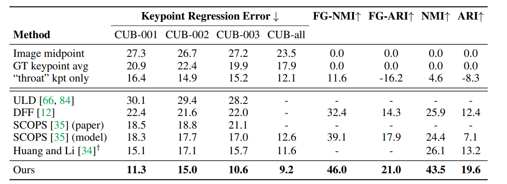

## DeepFashion
改善している。SCOPSの場合、体や服からはみ出ているが、本手法ではそのようなものが減っている

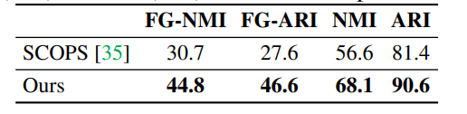

## PASCAL-Part
殆ど全てのクラスで改善している。しかし、このデータは人が見てもどう分けたらいいのか分からない。
バスの窓とか猫・犬の顔の結果を見ると改善しているように見える？

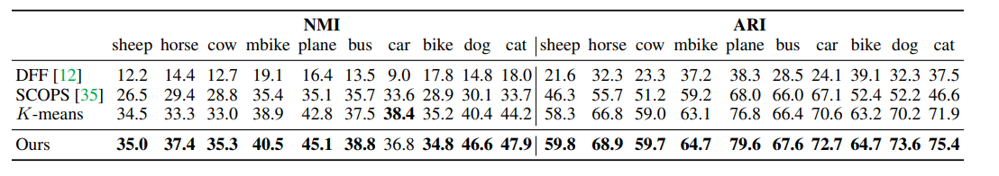

# 議論はある？
* 特徴ベクトルが解釈しづらい（画素と比べて）。なぜそれを使うといいかについて十分な理由ない
* 同じパーツは似た形状という仮定をしているが、常に正しいわけではない。
* 推論したパーツが必ずしも人間が思ったものとは一致しない
* パーツ数が固定
* 前景・背景の教師を訓練に使っている

などの課題がある

# 次に読むべき論文は？
* [SCOPS](https://arxiv.org/abs/1905.01298)
