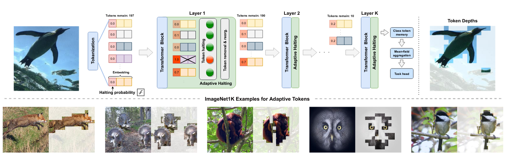
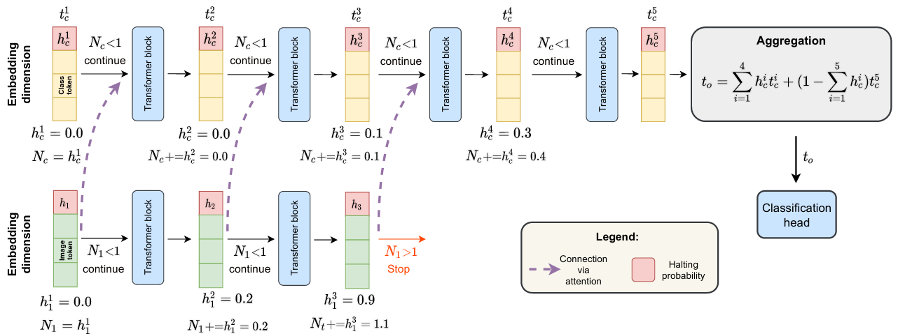
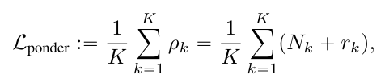
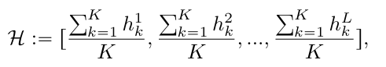
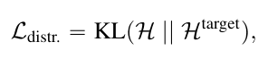
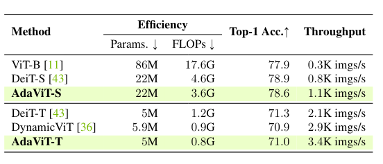
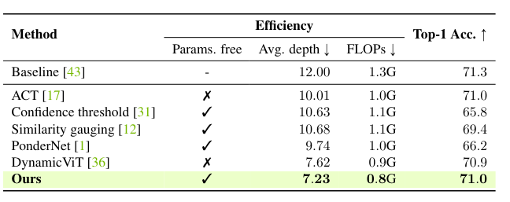
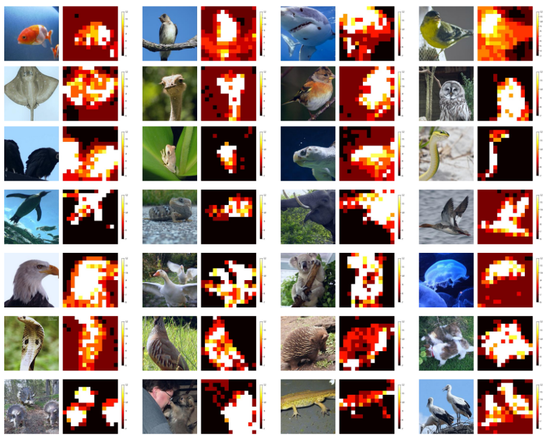

AdaViT: Adaptive Tokens for Efficient Vision Transformer
======

Hongxu Yin, Arash Vahdat, Jose Alvarez, Arun Mallya, Jan Kautz, Pavlo Molchanov

https://arxiv.org/abs/2112.07658v1

まとめ @cohama

## どんなもの？

- 入力に応じて適応的 (Adaptive) に計算量が変わる Vision Transformer
- パッチに分割した画像について重要さを計算し、重要でないと判断されたパッチは取り除くことで計算量を削減
- ある程度の深さで積極的にパッチが取り除かれるようにするための正則化を追加する工夫もあり

## 先行研究と比べて何がすごい

- ニューラルネットで適応的に計算量を削減する手法はこれまでにもあったが、ネットワークアーキテクチャやハードウェアに制限があるなど簡単でなかった。
- AdaViT は Transformer のトークンとして処理する機構を活用して、アーキテクチャやハードウェアの変更なしにより直接的に計算量を削減する
- DeiT-Tiny に対して 62% の高速化を達成、一方で精度の低下は 0.3% にとどまる

## 技術や手法の肝は？

### アーキテクチャ

1. まず入力画像をパッチに分割しトークン列とする (ここは ViT と同じ)
2. 各パッチについて捨ててよいかどうかの評価値を計算し、層を経るたびに加算していく
  - 評価値は各パッチの0番目のチャネルの値の分散と平均をハイパーパラメータで制御したのちに Sigmoid かけるだけ
3. 捨ててよいかの評価値ガしきい値 (1) をこえら、その層以降はパッチを捨てる。
  - 推論時は単純にパッチを捨てる
  - 学習時はマスクする

### Ponder Loss

なるべく早くパッチが取り除かれるようにするための損失

`K`: パッチの数
`Nk`: パッチが取り除かれる時点の層の深さ
`rk`: パッチの重要度

### Distribution Loss

パッチが取り除かれる確率が層の深さに応じてある分布になるように制御するための損失

`h`: 各層でのパッチを捨てていいかどうかの指標
`H`: h を層ごとに並べて分布っぽく表現したもの
`Htarget`: この手法ではガウス分布

## どうやって有効だと検証した？

### 精度と速度の比較

### 類似手法との比較

### パッチの生存の可視化

## 議論はあるか？

- 今回は分類しかしていないが、動画認識にも応用できるかもしれない。その場合空間だけでなく時間的な方向にも冗長なパッチの除去ができそう。
- パッチを取り除く確率を訓練後にも制御できないか？

## 次に読むべき論文

- ACT: Alex Graves. Adaptive computation time for recurrent neural networks. arXiv preprint arXiv:1603.08983, 2016.
- DynamicViT: Yongming Rao, Wenliang Zhao, Benlin Liu, Jiwen Lu, Jie Zhou, and Cho-Jui Hsieh. DynamicViT: Efficient vision transformers with dynamic token sparsification. In NeurIPS, 2021
- Deepak Pathak, Philipp Krahenbuhl, Jeff Donahue, Trevor Darrell, and Alexei A Efros. Context encoders: Feature learning by inpainting. In CVPR, 2016
- Pascal Vincent, Hugo Larochelle, Isabelle Lajoie, Yoshua Bengio, Pierre-Antoine Manzagol, and L ́eon Bottou. Stacked denoising autoencoders: Learning useful representations in a deep network with a local denoising criterion. JMLR, 2010
