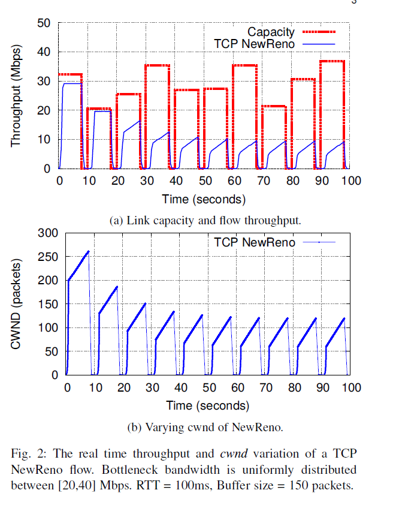
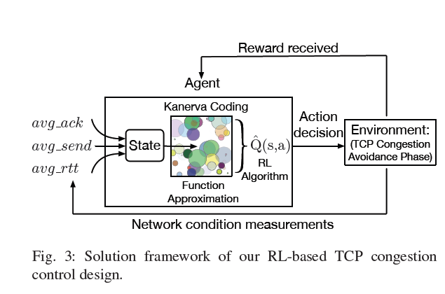
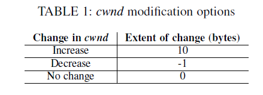
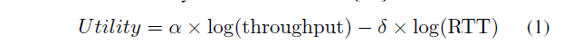
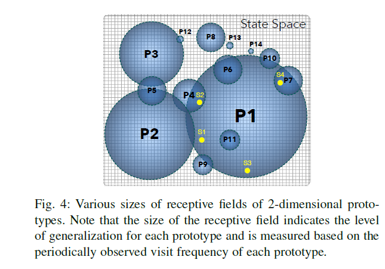
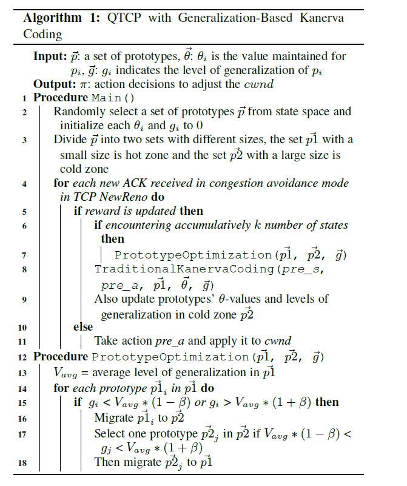
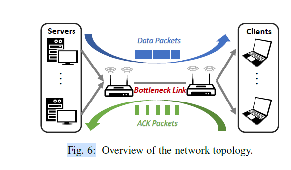
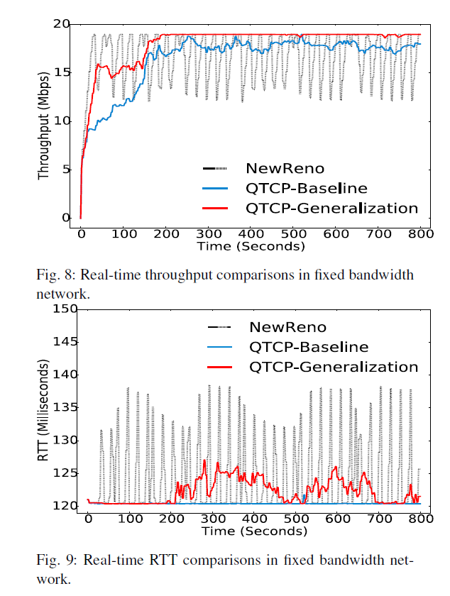
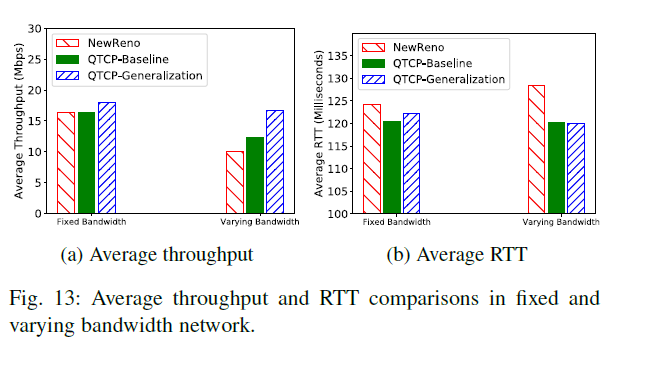

QTCP: Adaptive Congestion Control with Reinforcement Learning
===

2018/05/11 Wei Li, Fan Zhou, Kaushik Chowdhury, and Waleed Meleis
https://ieeexplore.ieee.org/document/8357943

（まとめ：yuji38kwmt ）

---

## どんなもの？

* 強化学習(Q学習）で、TPCの輻輳制御をコントロールするQTCPを考えた
    * 学習の近似する手法として「generalization-based Kanerva coding」を使い、学習時間と探索対象の状態を削減した。
* QTCPは、従来のルールベースの輻輳制御（NewReno）よりも、幅広いネットワーク環境に対応できる。

---

## TCPの前提知識
* cwnd（輻輳ウィンドウサイズ）を調整して、輻輳しない範囲でできるだけたくさんのパケットを送っている
* 輻輳を検知（重複ACC, タイムアウト）したら、cwndを下げる
* cwndの調整はルールベースなので、ネットワーク環境(帯域の変化や混雑状況など）に対応できず、cwndはいつも同じような増減になる。
    * NewRenoはcwndを慎重に増加するので、帯域を効率よく利用できない

Kanerva Coding (SDMs):
---
## 技術や手法の肝は？
* Q学習を使った

### states
stateの種類は3つだけど、ステート空間の数は膨大
* av_send
* avg_ack
* avg_rtt

avg_send < avg_ackなら輻輳状態

### actions
* actionは3つ
* cwndを素早く増加させるため、decreseが-1に対して、increaseは10にした

### utility function 
* スループットを最大化して、RTTを最小化する
* log関数を使ったのは、ネットワーク帯域を公平に使うため
* 

### function approximation
* "Kanerva Coding"という手法を使って、学習時のstate数を減らした。
* さらに"Adaptive Kanerva Coding"という手法を使った。

※ よく分かりませんでした。

---

## どうやって有効だと検証した？
* 固定された帯域20Mbpsと動的な帯域（30Mbpsが10秒,60Mbspが40秒）で比較した
* 従来の輻輳アルゴリズムNewRenoと比較した。
* QTCP-GeneralizationのスループットはNewRenoよりも良い結果。動的な帯域だと59.5%改善した
* QTCP-GeneralizationのRTTは他と同程度

---

## 議論はある？
なし

---

## 先行研究と比べて何がすごい？
* ルールベースでないところがすごい

---

## 次に読むべき論文は？
TODO

---------------------------
## 感想
* CUBICやBBRと比較した場合はどうなる？
* スマホとかに実装できる？
* 他の輻輳制御アルゴリズムとの親和性は大丈夫？  https://gihyo.jp/admin/serial/01/tcp-cc/0003

## この論文を読んだきっかけ
[TCP技術入門 ](https://gihyo.jp/book/2019/978-4-297-10623-2) に紹介されていました。
