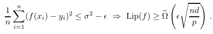
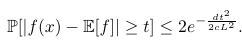
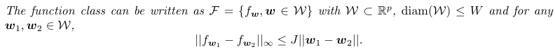
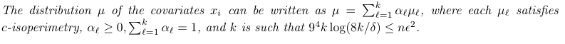
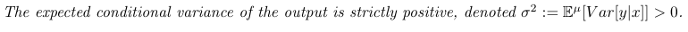
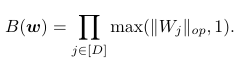
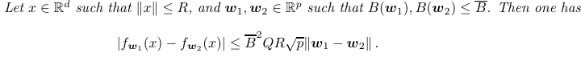
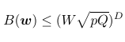
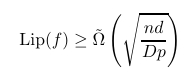
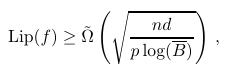

# A Universal Law of Robustness via Isoperimetry
[https://arxiv.org/abs/2105.12806v3](https://arxiv.org/abs/2105.12806v3)

(まとめ @n-kats)

著者
* Sébastien Bubeck
* Mark Sellke

Bubeckさんはマイクロソフトリサーチ、Sellkeさんはスタンフォート大学の人。

# どんなもの？
古典的な機械学習の主張「パラメータが多すぎると汎化性能が出ない」と深層学習の現象「パラメータを増やしまくっても汎化性能がどんどん上がる」とのミスマッチを埋める研究が長年行われている。
この研究は、NeurIPS2021の [outstanding paper awards](https://blog.neurips.cc/2021/11/30/announcing-the-neurips-2021-award-recipients/) に選ばれた研究。

主な主張は、
* オーバーパラメータは必須
* 具体的には d: データの実質的な次元, n: データ量, として、nd 個のパラメータが必要

# 先行研究と比べてどこがすごい？
パラメータがたくさんいることを理論的に主張する研究はすでにあるが、どれくらい必要かとなると、nd 個という大きい数が必要という強い主張をしている。

["A law of robustness for two-layers neural networks"](https://arxiv.org/abs/2009.14444) で同様の主張が予想されていた（2層のネットワークの場合で）。これをより詳しい形で示している（実践的には許容できる別の条件が少し入る）。

# 技術や手法の肝は？
## 簡単な流れ
* robustness はリプシッツ定数を見ればいい
* 適当な条件のもとリプシッツ定数を下から抑えられる不等式が成り立つ  

* 意味は、（f が十分に認識するモデルである） => リプシッツ定数が√(nd/p)の式以上になる ということ
* p（パラメータ数）が足らないとリプシッツ定数がでかくなってしまう（つまりrobustでない）

## 数学
### リプシッツ定数・連続
リプシッツ定数はこの式で決まる値。

Lip(f) = sup |f(x) - f(y)| / |x - y|

雑に説明すると、「その関数で一番傾いているところの傾き」。

リプシッツ定数が大きいと関数が激しく変化するからロバストでないって見方をしている模様。
リプシッツ定数が有限の場合、関数fがリプシッツ連続であるという（Lip(f)以上のLでL-リプシッツ連続ともいう）。

### isoperimetry
高次元の空間での確率を扱うのに isoperimetry というのが用いられる。
これは、正規分布のように確率密度が集中している様子を測るもの（高次元の空間のリプシッツ連続な関数はどこかに集中していることが多いらしい）

R^d の確率測度 μ が c-isoperimetry とは、任意のL-リプシッツな有界関数（ある有限の範囲に値が収まる関数）に対して全ての非負実数tで、以下の不等式が成り立つときをいう。

意味としては、リプシッツ関数を適用して分布をみると、正規分布みたいになっている場合を指す。
等周不等式(isoperimetric inequality)って不等式があってその研究から見つかった性質らしい。

c の値が実質的な次元と思える（多様体仮説的なことをいうと、そのままのデータは高い次元の表現を持っているが、実質的な次元はそれより低いであろうと言われていてこれに対応するもの）。

## 主定理
* F: R^d→ R の関数の集合
* (x_i, y_i): 入力と出力のペアのデータ（iは1からn）in R^d x [-1, 1]
* ε, δ in (0, 1)
として、次をみたすとする。
* パラメータに変化が関数に与える影響はJでコントロールされる（パラメータを関数に変換する関数が J リプシッツ）  

* データはisoperimetryで測ると c 次元  

* ノイズがある  

このとき、データをサンプリングしたとき1-δ以上の確率で、全てのf∈F で以下をみたす。

### 簡単説明との対応
最初の式

と見比べると、不等号の右辺以外は同じ。主定理の方は、複雑になっているけど、√(nd/p)の片鱗がある。

## 深層学習に適用
層がL1,L2,...,LDとする。skip connectionを更に一般化して（DenseNet風にして）

L_j = Σ σ_i,j(Linear(c_j)(L_i))（和はi&lt;jで取る、σは活性化関数）

の形になっているものを考える（よくあるresnetみたいなものも、本来結合しない部分は重みがゼロだと思う）。

### J の計算
パラメータを関数に変換するときのリプシッツ定数を計算する（1つめの条件）。

パラメータwに対する関数f_wのリプシッツ定数が次のB(w)で抑えられる。

これを使うと J が計算できる。

重みは有限（[-W, W]の範囲, W≧1）とすると、\bar{B}も計算できる

### 主定理に適用
重みは有限（[-W, W]の範囲, W≧1）として上の式を主定理に適用すると、

depthが少ないと分母が減って、リプシッツ定数が大きくならないといけなくなってロバストでなくなることがわかる。

width（\bar{B}）で同様の計算をすると、

で、幅よりも深さを上げる方が効果的ということが示唆される（あくまで下から抑えている値なので必ずそうだというわけでもない）

# どうやって有効だと検証した？
不等号の評価をいくつかやって証明していく（追いかけきれていない・・・）。実験とかはない。

# 議論はある？
## このまとめで紹介しきれなかったこと
主定理では二乗誤差を損失関数として想定して議論したが、一般化できる。

## 私見
次元を何らかの解析的な性質で表すのは、フラクタルのハウスドルフ次元等で見られる。多様体仮説関係者はここらへんのアプローチをすると良さそう（次元論とか）。
（多様体仮説を口にした人に多様体の定義を唱えさせたいお気持ちも）

# 次に読むべき論文は？
* [Towards Deep Learning Models Resistant to Adversarial Attacks](https://arxiv.org/abs/1706.06083)
* [A law of robustness for two-layers neural networks](https://arxiv.org/abs/2009.14444)
* High-dimensional probability: An introduction with applications in data sci-ambridge university press, 2018.
