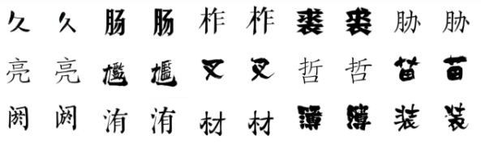
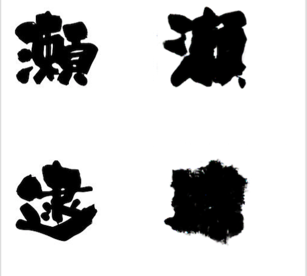
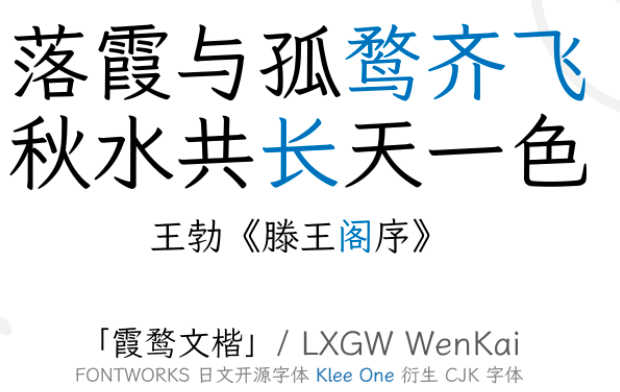
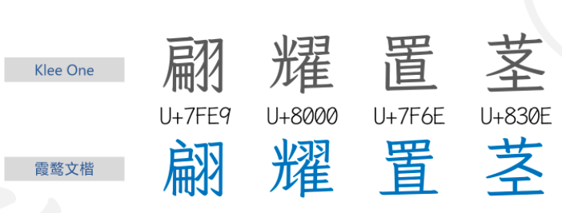
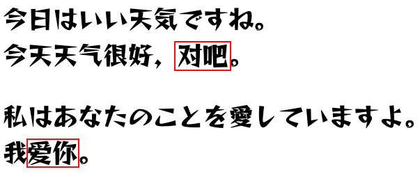

# zi2zi: Master Chinese Calligraphy with Conditional Adversarial Networks

[https://github.com/kaonashi-tyc/zi2zi](https://github.com/kaonashi-tyc/zi2zi) (個人研究なので論文は存在しない)

（まとめ @derwind）

- 著者
    - Yuchen Tian
- 所属
    - AWS Deep Learning (開発当時: Flipboard)

## どんなもの？

- 敵対的生成ネットワーク (GAN) による文字の生成である。
- 本作品はこれ以降の文字生成 GAN が意識し、参考文献にあげる、最も基本的かつ影響力のある文字生成 GAN である。
- 2016 年 11 月に発表された Pix2pix を 2017 年 2 月時点で文字生成に早くも適用した作品である。
- 以下は生成サンプル (左:GT / 右:生成画像):

## 先行研究と比べてどこがすごい？

- 生成画像のぼやけが少ない
- スタイル化されたフォントを扱うことができる
- 一度に複数のスタイルを学習・出力できる

## 技術や手法の肝は？

- 以下の 3 つの研究を組み合わせた条件付き敵対的生成ネットワークである
    - Pix2pix: I2I 変換
    - AC-GAN (Auxiliary Classifier GAN): カテゴリ埋め込みと，カテゴリ損失を導入した
        - カテゴリ埋め込みは Google 翻訳の実装である GNMT (Google's Neural Machine Translation) にヒントを得ている
        - カテゴリ損失がスタイルのズレにペナルティを与える 
    - DTN: コンスタント損失を導入した
        - コンスタント損失が主にコンテンツのズレにペナルティを与える

## どうやって有効だと検証した？

- GT と生成画像との目視比較
- 著者の前研究である「Rewrite」との目視比較

※ そもそも本研究以前に GAN ベースの有力な文字生成が存在していない。

## 議論はある？

以下のようにうまくいかないケースもある:

## 次に読むべき論文は？

- [Rewrite: Neural Style Transfer For Chinese Fonts](https://github.com/kaonashi-tyc/Rewrite)
    - 画像のスタイル変換としては、GAN 以外ではニューラルスタイル転送が有名で、Rewrite はニューラルスタイル転送を用いた文字生成の実験であった。
- その他、2017 年以降の任意の文字生成 GAN の論文。外から与えていた教師データを減らし、多くの情報をネットワークが自動で導く方向に進化していく様子が窺える。エンコーダも進化し、コンテンツとスタイルが混在していた本研究とは異なり、コンテンツを担当するエンコーダとスタイルを担当するエンコーダへと分かれていく。

## 応用

2021 年 1 月に [LXGW WenKai / 霞鹜文楷](https://github.com/lxgw/LxgwWenKai) という Google Fonts で提供されている日本語フォント「クレー One」を中国語フォントへと拡張するという個人プロジェクトが立ち上げられた。このプロジェクトの中国語文字生成に上記 zi2zi が用いられた。同じ文字でも中国語の文字と日本の漢字では字形が異なることがあるので、単純に zi2zi を適用しただけというわけではないが、たたき台として活用されているのが面白い。

生成サンプル (見慣れない漢字が zi2zi で生成されたもの):

日本の漢字と中国の漢字で字形が異なるサンプル:

追試として、他のデザインのフォントとして「レゲエ One」を使った場合のサンプル。赤枠部分が生成して追加した漢字 (T4 で 3 日間くらい訓練):

