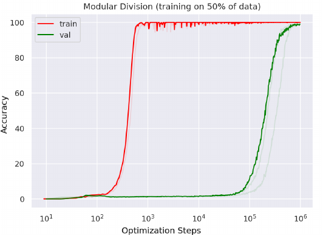
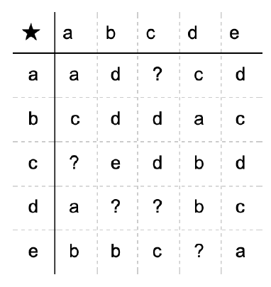
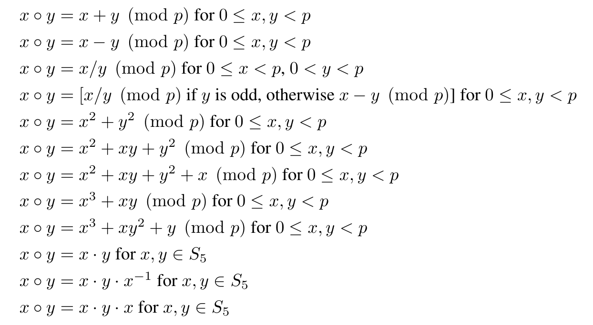
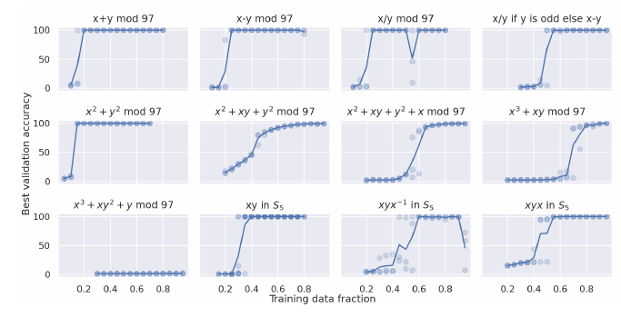
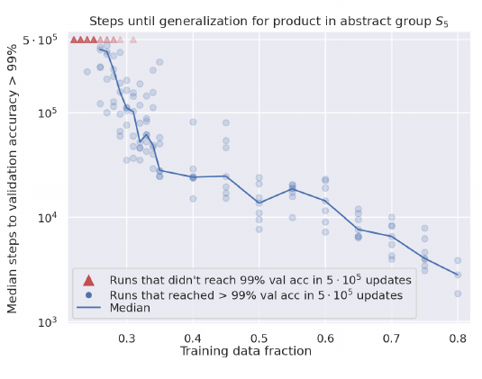
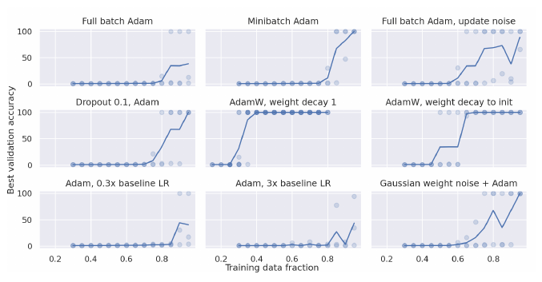
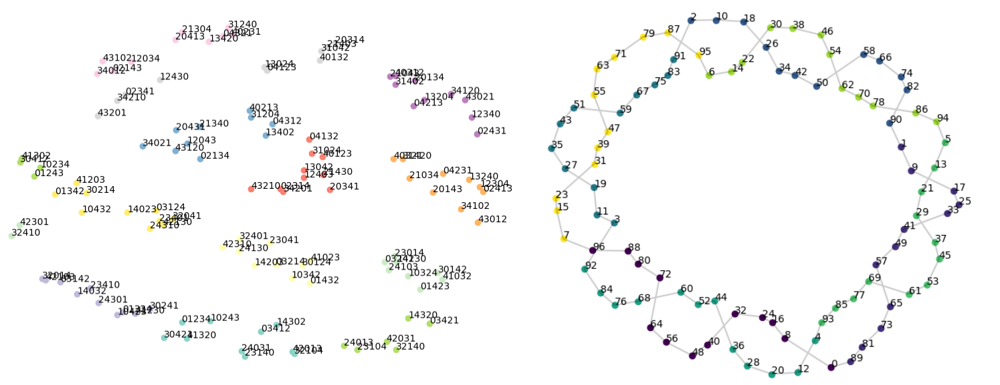

# Grokking: Generalization Beyond Overfitting on Small Algorithmic Datasets
[https://arxiv.org/abs/2201.02177](https://arxiv.org/abs/2201.02177)

(まとめ @n-kats)

著者
* Alethea Power
* Yuri Burda
* Harri Edwards
* Igor Babuschkin
* Vedant Misra

Misraさんだけgoogle。他はOpenAI

# どんなもの？
前回に続いて、深層学習の学習の理論の話。

ロスの値が十分に小さくなっても、更に訓練を回し続けると汎化性能が上がる現象（grokking）が発生する。

この論文では、それを計算で作った小さなデータセットで再現し、色んな実験設定で変化を観察している。

# 先行研究と比べてどこがすごい？
他の研究でもgrokking（似た現象のdouble descent）の報告はあったが、この論文では人工的なデータで短時間に実験ができる。

# 技術や手法の肝は？
二項演算（a ⚪ b = c）の計算結果の組（a,b,c）教師データとす。
そうして、a,bを与えたらcを出力するモデルを学習する。
それだけ。

## 用語
### 二項演算
集合X上の二項演算 ⚪とは、X×XからXへの関数のこと。

例: 足し算・掛け算・関数の合成・・・

## 問題設定
二項演算の一部の計算結果を与えて、未知の組の計算をできるようにする（例えば次の二項演算の表の?を埋める）。

## モデル
["a", "⚪","b", "=", "c ]
とういうトークンの列と思ってトランスフォーマーに入力する。

# どうやって有効だと検証した？
## 色んな二項演算を考える

### 演算のリスト
* mod p（有限体Z/pZ）（要素数p）
  * 足し算・引き算・割り算（1,2,3つ目）
  * 条件分岐（4つ目）
  * 対称多項式（5,6つ目）
  * 非対称な多項式（7,8,9つ目）
* 対称群（S5）（要素数120）
  * 掛け算
  * 共役（x\*y\*x^{-1}）
  * x\*y\*x

（だいたい要素が100くらいの集合上の演算を考える。二項演算の表を考えると約10000マスある。）
（Z/pZの演算は、{0, 1, 2, ..., p-1}の集合で普通の整数の足し算・掛け算・引き算をしてpで割った余りを出す。（割り算は気合で行う））
（対称群Snの要素は、n個の要素の並び替え。並び替えは関数（写像）で、その合成を二項演算として考える。）

### 結果

巡回群（Z/pZ)の性質として、pが素数のとき乗法群(Z/pZ)^✕が Z/(p-1)Z と同型（要素の順番を変えただけ）というのがある。
つまり、pが素数のとき、足し算の構造だけでなく、掛け算の構造も巡回群になる。そのため、mod pの足し算と掛け算は似ている。同様に引き算とわり算が似ている。
実際に、訓練結果はどれも同じくらい速く学習が進んでいる。

条件分岐の例は、訓練が遅く進んでいる。

対称多項式の場合は、非対称な多項式の場合と比べ、学習が速い。とはいえ、トランスフォーマーの性質かもしれない。

対称群の演算はそれなりに複雑だが、いずれも学習ができている

## 教師の量を減らした場合
学習に必要なステップ数がデータを減らす毎に指数関数的に増えている。データセットが少ないと急激に訓練が遅くなることを示している。この小さいデータセットでもそれが確認できた。

（評価の精度が99%になるまで訓練を回し続けたときのステップの表）

## 学習方法を変えた場合
Full batchにしたり、weight decayをいれたり、ノイズを入れたりした。

次のことが観測された。
* weight decayを入れると汎化性能が上がりやすい(特に有効)
* noiseを入れると汎化性能が上がりやすい
* 学習率でシビアに性能が変わる

# 議論はある？
本題とずれるけど、二項演算がある集合を可視化するのに使える。
トークンをベクトル化するので、そを使って集合の各要素をベクトル化できる。

実際に S5 と Z/97Z をt-SNEで可視化するとこうなる。Z/97Z（右）は帯状に規則正しく数が並んでいる（線はxとx+8 mod 97 を結んでいる）S5は何個かの要素が塊を作っているように見える。その塊が部分群になっている。

群や環の演算のような数学でよく研究されている演算は、学習がしやすいのかもしれない。

## 私見
機械学習の論文と思って読んでいたら、群の可視化みたいな数学的な話題になっていて面白い。

# 次に読むべき論文は？
* double descent関係
  * Deep double descent: Where bigger models and more data hurt.
  * Reconciling modern machine learning practice and the bias-variance trade-off.
