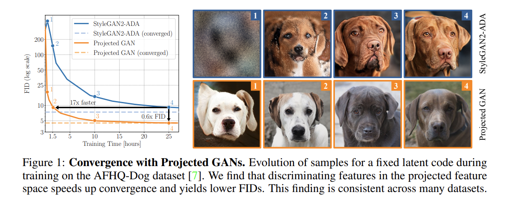
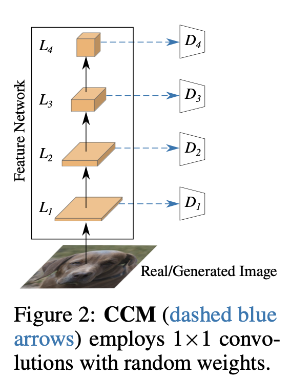
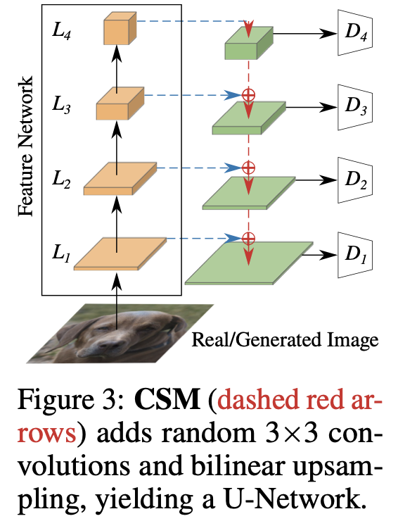

# Projected GANs Converge Faster

Axel Sauer1,2&emsp;Kashyap Chitta1,2&ensp;  Jens Müller3&ensp;  Andreas Geiger1,2 

1University of Tübingen&ensp;2Max Planck Institute for Intelligent Systems, Tübingen  

3Computer Vision and Learning Lab, University Heidelberg

https://arxiv.org/pdf/2111.01007.pdf

## どんなもの？

- 事前学習した特徴抽出器を GAN での画像生成にも有効活用したもの

- 事前学習モデルが出力する特徴量を最大限に活用するため、Discriminator の入力に feature pyramid と、入力空間へのランダムな射影を用いた

## 先行研究と比べて何がすごい？

- ランダムなノイズから画像を生成する GAN の枠組みの中では、初めて事前学習モデルの有効活用に成功した

- 縦横1024ピクセルの解像度に対応し、21のデータセットにおいてSOTAを更新するか、従来のSOTAに匹敵する

- 従来のSOTAに比べて40倍高速で、5日訓練して到達できるFIDに3時間以下で到達できる

## おさらい

- GAN は Generator と Discriminator の2つのネットワークを訓練する

- Generator は低次元のノイズ（正規分布から生成）を入力として受けとり、画像を生成する

- Discriminator は画像を入力として受けとり、その画像が実在する画像か、Generator によって生成された偽の画像かを予測する

- Generator と Discriminator を交互に学習させて、両方賢くなれば、いずれ Generator は実在する画像と見分けがつかない画像を生成するようになるはず

- 以下の目的関数を最小化する

## 技術や手法の肝は？

- 事前学習モデルの特徴量を最大限活用するために：
  
  - 事前学習モデルの各レイヤーの特徴量を、それぞれ異なる独立した Discriminator に入力した

- Discriminator が特徴空間の部分集合にのみ注目しないように:
  
  - Discriminator に

### Multi-Scale Discriminators

- Discriminator の入力に画像を与えるのではなく、学習済みの特徴抽出器が出力した特徴量を与える

- 特徴抽出器の各レイヤーが出力する特徴量のうち、642、322、162、82の解像度のものを、それぞれ D1、D2、D3、D4の入力とする

### Random Projections

- Discriminator はより意味的な特徴を捉えておらず、分かりやすい特徴のみに注目することが実験で観察された

- 分かりやすい特徴を弱めるために、微分可能なランダム射影を用いて特徴量をミックスするモジュールを導入した

- 「微分可能なランダム射影」の関数には畳み込みを用いるが、ランダム性を保持するために重みは更新されない

#### Cross-Channel Mixing (CCM)

- ランダムな射影によって、特徴の情報が射影前から失われることなく、かつ自明な変換でない一番簡単な方法は 1x1 Conv である

- 畳み込みの重みは He の手法で初期化し、訓練中にこの重みは一切更新されない

- 活性化関数も用いない

#### Cross-Scale Mixing (CSM)

- 空間方向の特徴をミックスするモジュールとして、U-Net と同様のアーキテクチャを用いた

- これも重みは He の初期化を用いる
  
  
