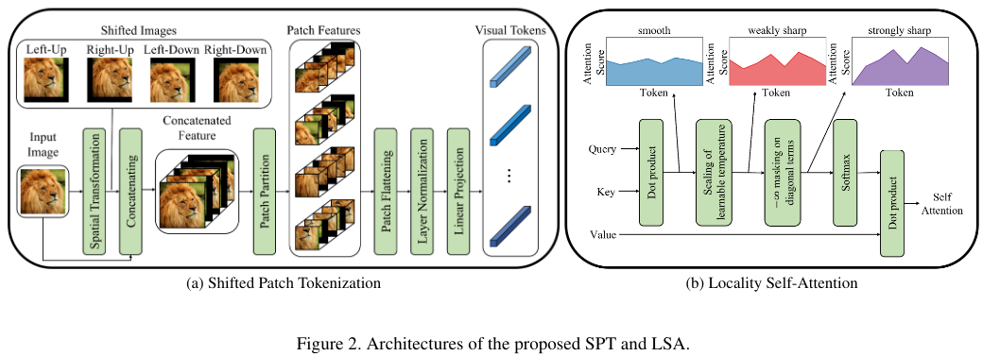
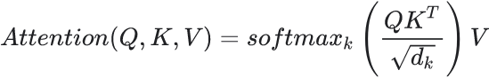
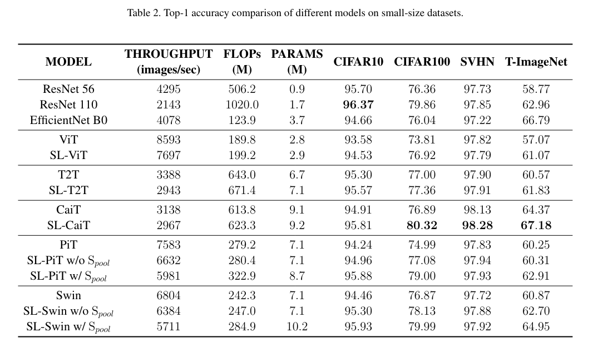
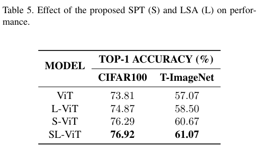

Vision Transformer for Small-Size Datasets
======

Seung Hoon Lee, Seunghyun Lee, Byung Cheol Song

https://arxiv.org/abs/2112.13492v1

まとめ @cohama

## どんなもの？

- Vision Transformer (ViT) の亜種で、Tiny-ImageNet (100k 枚) や CIFAR-10 (50k 枚) などの少量データセットをフルスクラッチで学習できるようにしたもの。
- ViT の訓練は JFT300M などの巨大なデータセットでの事前学習なのは局所性の帰納バイアスが欠如しているから、としてそれを改善する Shifted Patch Tokenization (SPT) と Locality Self-Attention (LSA) という2つのモジュールを考案
- 小さいデータセットに対して 1% から 4% の精度向上を達成

## 先行研究と比べて何がすごい

- ViT により局所的な特徴を混ぜ込むような工夫は種々あるが、小さいデータセットに対する研究は報告されていない (本当！？)

## 技術や手法の肝は？

ベースは ViT。それに対して以下2つのモジュールを組み込む

### Shifted Patch Tokenization (SPT)

1つのパッチが持つ Receptive Field が小さい、という問題を解消するために SPT とう機構を導入する。より空間的な特徴を織り込めるようになる。

1. 入力画像と、それを上下左右にずらした版の画像、計5枚をチャネル方向に concat する。ずらす幅はパッチの半分
2. その状態でパッチ化する

SPT は最初だけでなく、途中に入れてプーリング層のようにも使う。その場合はトークンを元の2次元に戻してから再度 SPT に入力する

### Locality Self-Attention (LSA)

Transformer の中にある Scaled Dot-Product Attention は実際には温度 `√d` のソフトマックス。結果として Softmax の分布が滑らかになりすぎる。これを改善する。

具体的には `√d` で割る代わりに学習可能なパラメータ `τ` で割る。

また、Self Attention では自分自身との関係が最も大きな値となるが、それを抑制して異なるトークン同士の関係をより強調する機構、Diagonal Masking も導入する。これは単に `Q @ K.T` の対角成分を `-∞` にするだけ。

## どうやって有効だと検証した？

小さいデータセットをフルスクラッチで訓練。CutMix、MixUp、AutoAugment、Repeated Augment、Label Smoothing、Stochastic Depth、Random Erasing をなどのテクニックを使っている。

パッチサイズは CIFAR などでは 8。

### 各データセットで訓練した場合の比較

`SL`: `SPT` + `LSA`
`Spool`: `SPT` を Pooling として利用

### Ablation (SPT と LSA の効果)

## 議論はあるか？

- やはり ResNet 強い。ViT 単体で見ると CIFAR などのデータセットにおける精度向上は確かに出来ているが CNN に全然勝てていない。
- SPT は Swin Transformer だと不要な気がするが。。。

## 次に読むべき論文

- Efficient Training of Visual Transformers with Small Datasets https://arxiv.org/abs/2106.03746
  - Small dataset ViT でググったら出てきた。こっちのほうがちゃんとしてそう。NIPS2021 accepted
