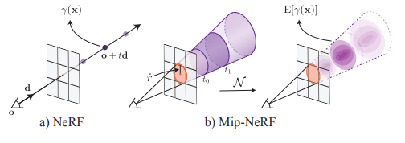
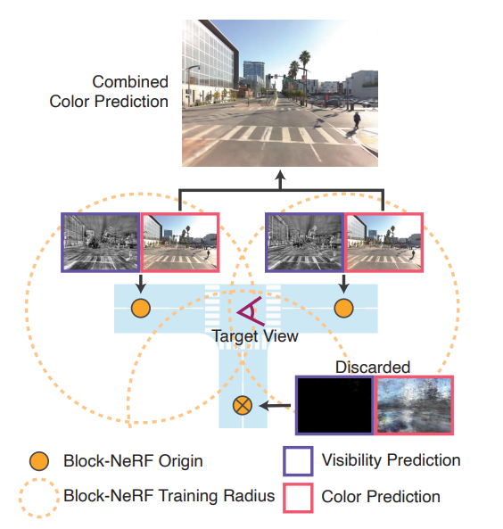
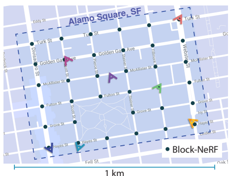
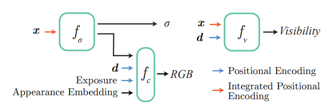
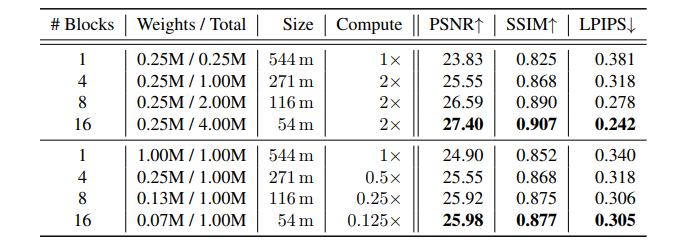

# Block-NeRF: Scalable Large Scene Neural View Synthesis
[https://arxiv.org/abs/2202.05263](https://arxiv.org/abs/2202.05263)

(まとめ @n-kats)

著者
* Matthew Tancik
* Vincent Casser
* Xinchen Yan
* Sabeek Pradhan
* Ben Mildenhall
* Pratul P. Srinivasan
* Jonathan T. Barron
* Henrik Kretzschmar

Waymo,Google,Berkley大学の人(インターン)たち

# どんなもの？
NeRF で広い範囲を生成きるようにした論文。

具体的には、サンフランシスコの960m×570mの範囲を生成する仕組みを作った。

動画はこちら [https://waymo.com/research/block-nerf/](https://waymo.com/research/block-nerf/)

# 先行研究と比べてどこがすごい？
まず、NeRFと対比すると、通常は狭い範囲を対象とすることが多かったが、広い範囲をカバーしている（データさえとればもっと広げれる）。

リアルなシミュレーターのためこのような道路を生成する手法が研究されているが、それ関係だと、これまではSurfelGANなどの手法があった（これもWaymoとGoogleの研究者による）。
SurfelGANはLiDARもつかってやっていて、そのせいで、LiDARの当たらない部分（遠くと上）が弱くなった。
この手法はカメラ（とその露出）を使うだけで、その制約が入らない。

# 技術や手法の肝は？
## おさらい+ベース手法
### NeRF
NeRF は「この位置からこの角度でみるとどんな色になるか？」などを推論できるようにしたネットワークで3D構造を表現する手法（それぞれのシーンを表現するのに一組のパラメータを使う）。

### mip-NeRF
NeRF の亜種の一つ。mip-NeRFはアンチエイリアスをするために改良された方法。

通常のNeRFは一つのピクセルに対して半直線を考えて、その半直線上の情報を推論して色を決める。
mip-NeRFはその半直線の周りの情報を使って色を決める（integrated positional encodingと呼ばれる方法を使う）。

## Block-NeRF の基本的な考え方
* 広い範囲を狭い範囲に分ける
* 狭い範囲で NeRF を訓練する
* 狭い範囲の NeRF の結果をよしなに重ね合わせる

## ブロックのサイズと配置
サンフランシスコ Alamo Square の場合、次のような配置に（交差点の位置に配置）

## NeRF の訓練
通常のNeRF（mip-NeRF）から少し改造している。
色を推論するために、露出や見た目の特徴量も入力する。これとは別に可視性も推論する。
また、訓練の中で画像間の位置関係を補正すると精度があがるのでそれも行う。
移動物はマスクする（panoptic-deeplab）。

この二つの計算が独立しているため、可視性の計算は荒い粒度でやって、色は密にするようなことができる。

見た目の特徴量は、NeRF-W(wildな環境でNeRFするもの)でも使われていた手法で、カメラや天候・明るさを補正するための項。

## 重ね合わせ
### ブロックの選択
可視化する位置・角度に対して、次の条件を満たすブロックを選ぶ
* 一定距離内のNeRFの中心点がある
* visibility を対象の方向（複数）で計算して、その平均が一定値以上である

### 色の重ね合わせ
複数のNeRFで算出した色を重みをつけて平均する。その重みはブロックの中心と視点の位置の距離の -p 乗とする

### 位置補正
単純にすると、二つのNeRFで位置が少しずれてしまう問題がある。
これを補正するために、ブロックの中心位置・向きを補正する（得られる画像が似たものになるように最適化）

# どうやって有効だと検証した？
この研究のためにデータを作成（よくあるデータだと、いろんな地点を撮影するが、それと比べると狭い範囲を繰り返し撮影したい）

* 1本あたり100秒以上の動画
* 10FPSで画像化
* 12個のカメラ（8つで360度をカバー、残りを前方と左右に）
* カメラのキャリブレーション・位置関係は既知
* サンフランシスコのAlamo Square と Mission Bayの2か所でデータを作成
  * Alamo Square
    * 範囲960m×570m
    * 2021年6～8月
    * 総画像数 2,818,745
    * 総走行回数 1,330
    * 撮影時間13.4時間
    * ブロック数35
    * ブロックあたりの走行回数38～48
    * ブロックあたりの走行時間18～28分
    * ブロックあたり画像数64,575～108,216
  * Mission Bay
    * 2020年11月
    * 100秒間
    * 1.08km
    * 総画像数12,000
    * 総走行回数 1回

結果は動画を

## 評価値
PSNR,SSIM,LPIPSで評価

## 比較

# 議論はある？
次の課題がある
* セグメンテーションモデルで物体をマスクする必要がある（この精度が悪いと困る）
* 陰がそのまま描画されてしまう（車がよく通る所など）
* 植物（動く・複雑な形）
* 時間経過での変化があるとそれを手動で把握して再学習などをしないといけない
* 移動物がある状況をレンダリングできないため、シミュレータとしては不十分

# 次に読むべき論文は？
* mip-NeRF
* SurfelGAN
