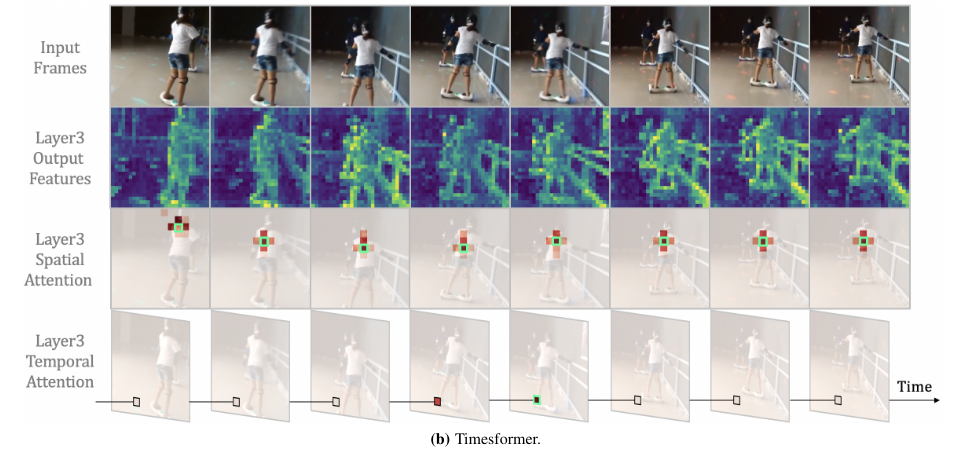
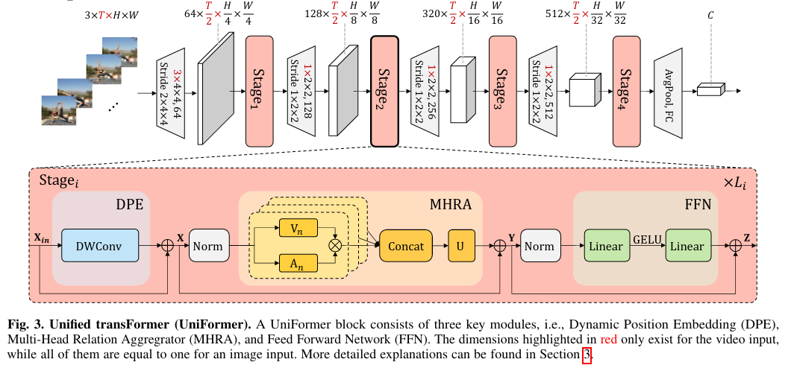
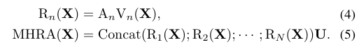
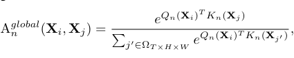
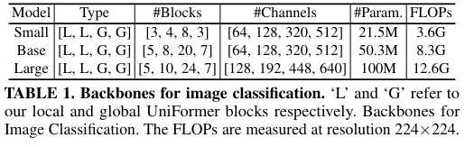
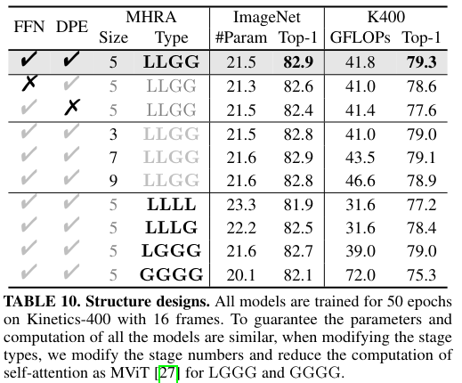

UniFormer: Unifying Convolution and Self-attention for Visual Recognition
======

Kunchang Li, Yali Wang, Junhao Zhang, Peng Gao, Guanglu Song, Yu Liu, Hongsheng Li, Yu Qiao

https://arxiv.org/abs/2201.09450

accepted by ICLR2022

まとめ @cohama

## どんなもの？

- Vision Transformer (ViT) の亜種で、畳み込みと自己注意をシームレスに結合したアーキテクチャを持つ
- 既存手法 (ViT, CoaATNet, PVTv2, Swin) よりも速度と精度のトレードオフを改善
- Video Classification にもそのまま使える

## 先行研究と比べて何がすごい

- 既存研究でも畳み込みと自己注意を混ぜたアーキテクチャは存在したが、畳み込みと自己注意の特性や能力を詳細に分析したものはなかった
- 浅い層での自己注意は冗長であるという主張

上図はあるピクセルにおける Attention を可視化したもの。浅いそうでは結局隣のピクセルとの関係性が最も強い。

## 技術や手法の肝は？

### Multi-Head Relation Attention (MHRA)

(どうもMHSA を一般化しました的なことが書いてある？)

#### Local MHRA

局所的な関係性を学習する

結局 Local MHRA は Pointwise Conv -> Depthwise Conv -> Pointwise Conv の普通のボトルネック構造になるらしい。
V と U が Pointwise Conv
A が Depthwise Conv

#### Global MHRA

大域的な関係性を学習する。ただの Self-Attention に見える

浅い層では Local MHRA を、深い層では Global MHRA を使う。

### Dynamic Position Embedding

畳み込みが位置の情報を暗黙的に扱えるとする先行研究があるらしい。

DPE という名前が付いているが単なる Depthwise Conv

## どうやって有効だと検証した？

### ImageNet

### Ablation

## 議論はあるか

- 当たり前のようにビデオにも使えるあたり Transformer もモダリティへの柔軟性の強さが垣間見える
- 速度のトレードオフが改善と主張しているが実際にかかった時間の記述がない

## 次に読むべき論文

- Conditional Positional Encodings for Vision Transformers
  - Position Embedding は畳み込みで良いとする研究
- Swin Transformer V2: Scaling Up Capacity and Resolution
  - 強そうな ViT 亜種
