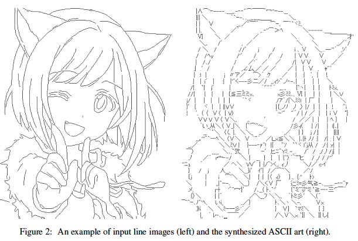
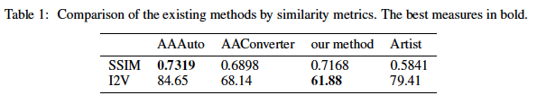
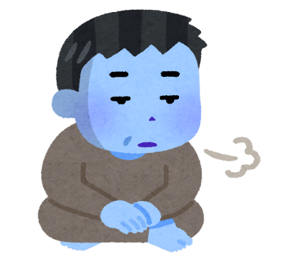
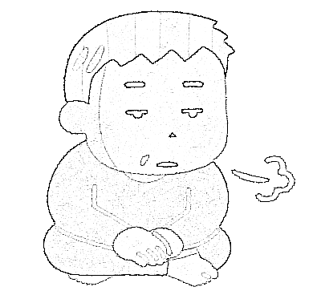
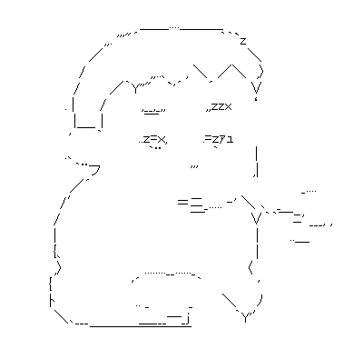

# ASCII Art Synthesis with Convolutional Networks

[ASCII_Art_Synthesis.pdf](https://nips2017creativity.github.io/doc/ASCII_Art_Synthesis.pdf) 或いは [ディープラーニングでアスキーアートを作る](https://qiita.com/OsciiArt/items/325714d8ab3f2b482ced)

（まとめ @derwind）

- 著者
    - Osamu Akiyama
- 所属
    - Faculty of Medicine, Osaka University

## どんなもの？

- アスキーアートをニューラルネットワークを用いて生成するものである。
- 入力画像上の 64x64 のウィンドウにおいて、中央の関心領域に対応するビットマップグリフを推論し、これを配置してアスキーアートを生成する
- 利用するビットマップグリフとしては MS Pゴシックの 12-pt (16 dot) を前提としている。
- 時期的には、Pix2pix や CycleGAN が出てきたホットな時期だが GAN ベースではなく、10 層の畳み込みニューラルネットワークを用いる。(CPU ベースで 2 日間くらいの訓練で良いらしい)
- 素材は「2ちゃんねる」等で収集とのこと。
- 以下は生成サンプル (左:線画入力画像 / 右:生成アスキーアート):

## 先行研究と比べてどこがすごい？

- 画像処理ベースではなく、ディープラーニングベース。
- アスキーアートアーティストのものと遜色のないものを生成できる。

## 技術や手法の肝は？

- 線画画像において、64x64 のウィンドウを覗いて見る領域について中央部分のパーツを 411 個の候補の中から推論できるように訓練する。上記のケースでは「7」が推論できれば良い。
- アスキーアート自体は 2 ちゃんねるから収集できても対応する元画像が収集できない。これについては “シモセラ・エドガーらの研究”「[ラフスケッチの自動線画化](https://esslab.jp/~ess/ja/research/sketch/)」を参考に擬似的に対応する線画画像を生成したとのこと。（直接は関係ないが、訓練データの作成で「アスキーアート→線画」変換を行い、訓練・推論で逆の「線画→アスキーアート」変換をするところは、同時代の Pix2pix による画像対画像のドメイン変換を彷彿とさせる）

## どうやって有効だと検証した？

- SSIM（構造的類似度）による類似度の比較
- 2 次元イラストの特徴を抽出する [Illustration2Vec](https://github.com/rezoo/illustration2vec) による特徴量の比較

および、明確には書いていないが

- 著者自身による目視比較

## 議論はある？

- 実際のアスキーアートアーティストは印象を良くするために元画像との定量的な類似度を下げてでもテコ入れを行なっていて、それが DeepAA では再現できていない。

## 次に読むべき論文は？

- 直接の後継となる論文は不明。

## 実験

### 入力画像

[いらすとや](https://www.irasutoya.com/) から画像を拝借して、半分にリサイズ。

### 線画データ

エッジ検出をして、エディタでシャープフィルタやコントラスト調整を適用して線画データを作成。

### アスキーアート化

DeepAA 適用。(`weight_light.hdf5` という軽量版と思われる pretrained パラメータを使用)

素材を選んでいないので、「2ちゃんねる」ベースの訓練データではあまり見慣れないものかもしれないが、黒味が強かった箇所はそこそこアスキーアート化された。

