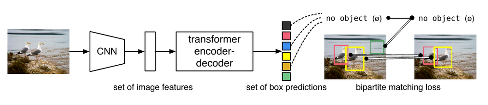
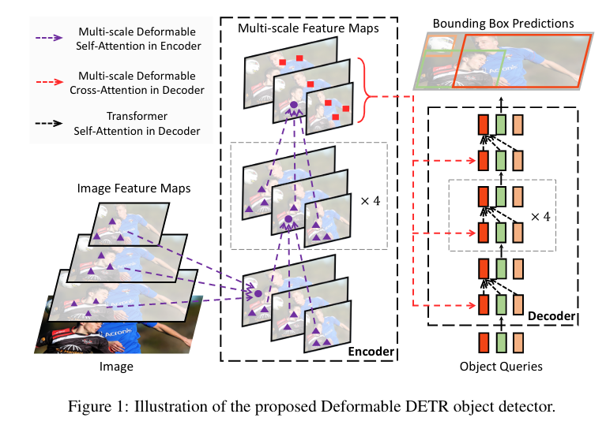
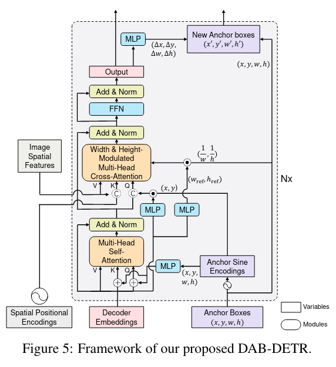
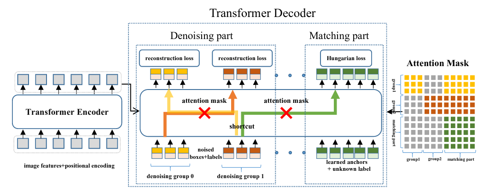
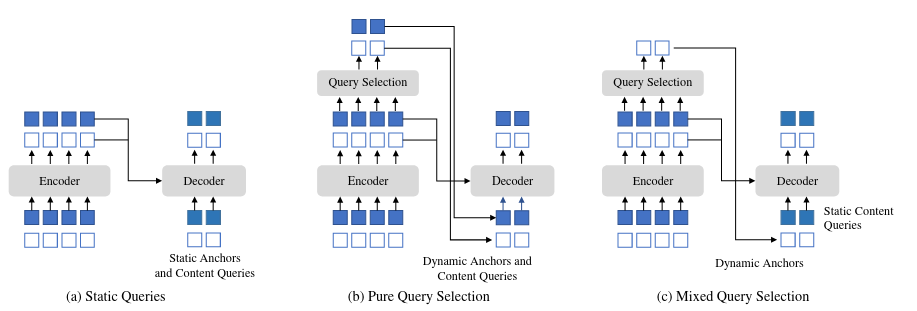
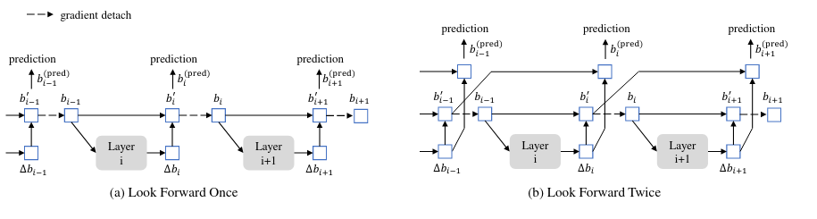
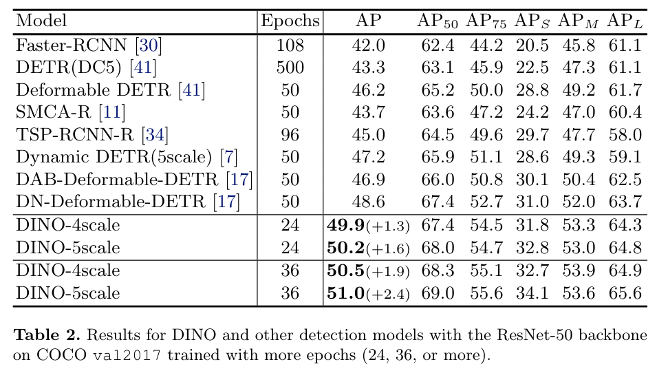
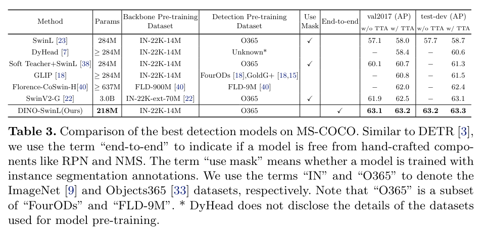
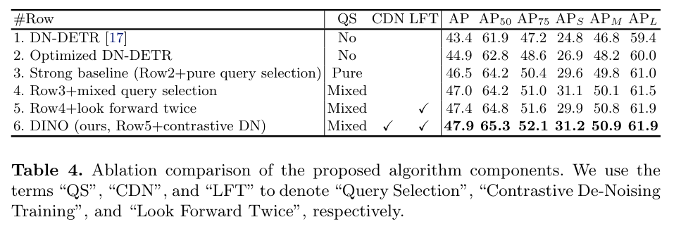

DINO: DETR with Improved DeNoising Anchor Boxes for End-to-End Object Detection
===
Hao Zhang, Feng Li, Shilong Liu, Lei Zhang, Hang Su, Jun Zhu, Lionel M. Ni, Heung-Yeung Shum

https://arxiv.org/abs/2203.03605v1

@cohama

# どんなもの?

- Transformer を使った物体検出 DETR の改良
  - 以前この研究会でも関連するものが読まれている
    - [DETR](../20200618_reports/detr_2005.12872.md)
    - [Deformable DETR](../20201217_reports/deformable_detr.md)
    - [Efficient DETR](../20210520_reports/efficient_detr_2104.01319.md)
- COCO mAP 63.3% で SOTA 達成。収束も早くモデルサイズと精度のトレードオフも良好

# 先行研究と比べて何がすごい？

- オリジナルの DETR は学習が遅く精度もすごく良いわけではなかった
- その後の DETR-like な改良はいくつかあったが Transformer を使わない (SwinV2 w/ HTC++) 物体検出手法に精度で劣っていた。
- 以下の DETR 改良版のエッセンスを混ぜた上で他にも色々改良し SOTA 達成。
  - Deformable Attention を使う Deformable DETR
  - Decoder の入力にアンカーのようなものを使って層ごとにリファインしていく DAB-DETR
  - GT Box にノイズを与えることで収束を早める DN-DETR

# 技術や手法の肝は？

## 予備知識

### DETR

物体の検出部分に Transformer を初めて適用した手法。物体の集合そのものを扱う。

### Deformable-DETR

Attension を取る際に画像全体ではなく Deformable Conv のように学習されたオフセットを加えた地点の Attension を取る

### DAB-DETR

object query の代わりに x, y, w, h の4次元の実数値にする (アンカー)。
Decoder では Δx とかを予測してアンカーをリファインしていく

### DN-DETR

収束が遅いのはマッチングロスの不安定さによるものとして、学習時にノイズを与えた GT Box のリファインさせるタスクを同時に解く。

## Contrastive DeNoising Training

DN-DETR の手法の改善。

GT Box ににノイズを与えそれをリファインするタスクを解くのは同じ。さらに、大きめのノイズを与えたものは Negative だとして学習させる。
これにより2つの枠が物体に近いところにあった場合により質の高い方を選択できるようにモデルが学習される。

## Mixed Query Selection

オリジナルの DETR や DAB-DETR/DN-DETR は図(a)のように Decoder のクエリとして単なる埋め込みを使っていた。
Deformable DETR (の 2-stage) や Efficient DETR では図(b)のように Encoder の出力のうち、objectness の確信度の高い K 個を Decoder の入力として使っていた。
DINO では位置の情報は Encoder の出力のうち位置の情報のみを Decoder の入力とし、画像の特徴はオリジナルと同様静的な埋め込みにする。画像の特徴は物体ごとに重複していたり物体の一部分のみの情報しかないなど十分な品質ではないため。

## Look Forward Twice

Deformable DETR でも使われていた、Decoder を経るごとに枠をリファインする手法。Deformable DETR では学習の安定性のために Decoder ごとに勾配の伝達がブロックされていた。
これを改良し、2層前まで勾配が伝わるようにする。

# どうやって有効だと検証した？

バックボーンを ResNet50 にした場合。ResNet50 は ImageNet で pre-train している。

SOTA との比較。バックボーンは Swin-L で ImageNet pre-train したのち、DINO 全体を Object365 データセットで pre-train。

Ablation。だいたいどの手法も寄与している。

# 次に読むべき論文は？

- DETR: https://arxiv.org/abs/2005.12872
- Deformable DETR: https://arxiv.org/abs/2010.04159
- DAB-DETR: https://arxiv.org/abs/2201.12329
- DN-DETR: https://arxiv.org/abs/2203.01305
