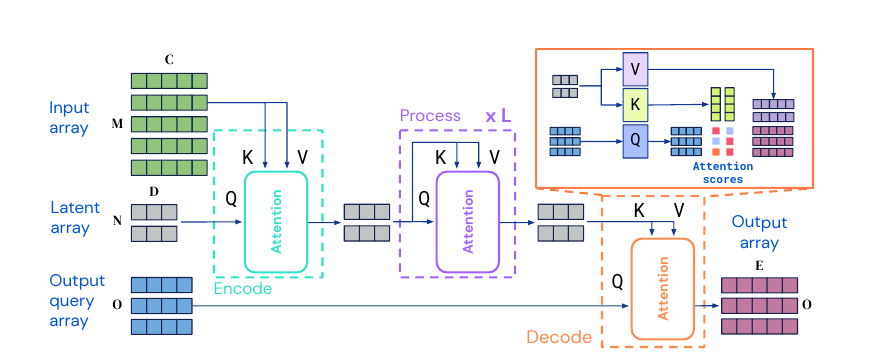
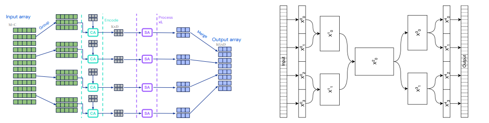
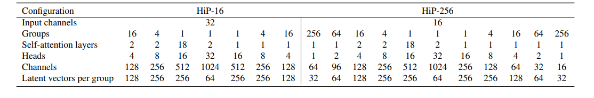
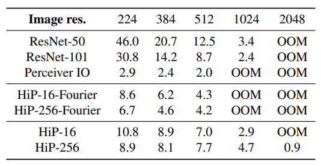
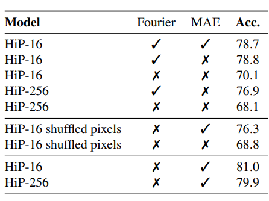
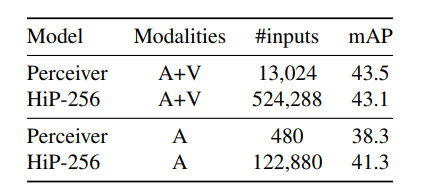
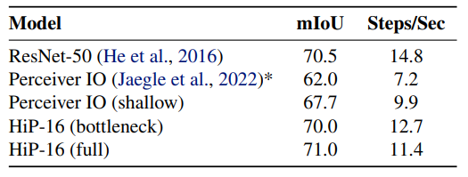
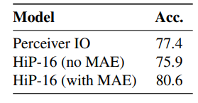

# Hierarchical Perceiver 
[https://arxiv.org/abs/2202.10890](https://arxiv.org/abs/2202.10890)

(まとめ @n-kats)

著者
* **Joao Carreira**
* _Skanda Koppula_
* _Daniel Zoran_
* Adria Recasens
* _Catalin Ionescu_
* Olivier Henaff
* _Evan Shelhamer_
* Relja Arandjelovic
* _Matt Botvinick_
* **Oriol Vinyals**
* Karen Simonyan
* **Andrew Zisserman**
* **Andrew Jaegle**

DeepMind の人達。太文字はPerceiver（前々作）からの著者、斜体はPerceiver IO（前作）からの著者。

# どんなもの？
前作に引き続き、マルチモーダル（複数の入力があるモデル）な設定で、入力の性質（inductive bias）を人力で作らずに認識できるようにする研究。

前作同様、入力を全てパッチ化してトランスフォーマーに入れる方式で認識。

# 先行研究と比べてどこがすごい？

前作の以下の課題をクリアするのを目指した
* 高解像度（データ量が多い）場合にメモリを使いすぎる
* positional embedding でフーリエ変換風のことをしているのは「人力で作っている」

この課題を対策した Hierarchical Perceiver （HiP）を提案。

* positional embedding を訓練で作るようにして、低次元（32次元とか16次元）化
* 解像度2048x2048でもOOMしない
* 単純な軽量化だと精度が落ちたが、対策をして元の精度以上に

# 技術や手法の肝は？
## おさらい
### Perceiver IO のアーキテクチャ
[../20210819_reports/perceiverIO_2107.14795.md](../20210819_reports/perceiverIO_2107.14795.md) のおさらい。

PerceiverIO は入力を処理する部分と問題を解く部分で二つの系列の処理からなる。

* 入力を処理する部分・・・図の中段。どの入力を使うかを意味するクエリ（Latent array）を使って入力から情報を取得する。
* 問題を解く部分・・・図の下段。問題のクエリに対して、入力側の情報を参照して認識を行う。

## 概要
軽量化のポイント
* 階層構造の導入
* 自己教師で作成する positional embedding
* skip connection

## 階層構造
Perceiver IO では M 個の入力と K 個の Latent array を用意して一律に入力との cross attention を行う。

HiP では M 個の入力と K 個の Latent array を G 個のグループに分ける。次元が同じなら、計算量が 1/G^2 倍になる。

更に、encoder（左図前半） と decoder（左図後半） の間でスキップコネクションを追加することで学習を安定した。

## positional embedding
フーリエ埋め込みの問題
* それぞれの入力でフーリエ埋め込みのパラメータ（最大振幅数・次元）
* 次元が大きい（258次元等）

そこで、学習で獲得するようにした。しかし、素朴にやる（入力毎に訓練可能なパラメータを用意する）と、精度が出なかった。

MAE(masked auto-encoding) を使って事前学習する。MAEについてはこはまさんが以前紹介（[../20211118_reports/mased_auto_encoder.md](../20211118_reports/mased_auto_encoder.md)）。

MAEは入力をランダムにマスキングして、それを再現するというタスク。

HiP では、ちょっと工夫をして、groupwise-maskingという方法を取った。入力を G 個のグループに分けたが、この G 個で同じマスクを使うというのがこの手法。

結果、positional embedding を 32 次元等の小さいものにできた。

## 具体的な設定
HiP-16 と HiP-256 の2種類の設定を用意した。

# どうやって有効だと検証した？
* ImageNet（画像分類）
* AudioSet（音声+画像の分類）
* PASCAL VOC（セグメンテーション）
* ModelNet40（点群分類）

で検証した。

## ImageNet
単純な精度だけでなく、メモリ使用量や positional embedding の検証をしている。

### 精度

### メモリ使用量
TPUv3でバッチサイズ8で訓練したときの1step分の訓練時間の表。Perceiver IO より速いしメモリ使用量も小さくなっている。

### positional embedding
MAE 無しだと、フーリエ埋め込みの場合からかなり悪くなる。MAE をするとフーリエ埋め込み以上の結果になる。

## AudioSet
2.56秒のシーンから、224x224の画像8フレームと音声（48kHz）を取得（位置は、画像で401k点・音声で123k点ある）。

位置や時刻の情報は与えない。

画像と音声両方の場合は若干悪くなっているが、音声のみは大きく良くなっている。

## PASCAL VOC
imagenet で pretrain。512x512の解像度で実施。CNNベースと同程度。前作より改善。

## ModelNet40
2048点の点群から分類する。

点の順番をシャッフルしない・特定の形式に変換しない、という制約で訓練。

何故かMAEの有無で精度が大きく違う（著者も分からないと書いている。座標でソートされていたりするんでは？）。

SOTAは94.5%（PointMLP）なので、結構ギャップがある。

# 議論はある？
目指しているところは完全な自動化（人手の制約が要らない世界）。

データ内の関係性（connectivity）を学習で獲得できた。
しかし、まだ検討の余地は大きい。

この研究で、自己教師あり学習でデータ内の関係性を学習するのが必要と分かったが、MAE 以外にも contrastive learning の学習も有効かもしれない（オーグメントどうするの？）。

この研究のパターンは、位置がたくさんあって、値が低次元の場合に適用した。逆に、位置は少ない（解像度が低い）が値が高次元というパターンはやっていない。単純に高次元の値を分割すれば良さそうだが、他の方法があるかもしれない。

オーグメントがこの研究テーマの難関。画像のオーグメント等は、画像の性質を強烈に採用している。これを自動でするにはどうすればいいのか・・・

## 私見
点群（ModelNet40）のところが気になる。データに入っていた位置の性質（(x,y,z)の値で辞書順にソートされているとか）が入っているように見える。多分、データがシャッフルされていたら認識できない。

点群のように（座標+値）の表現のデータは上手く行かなそう。座標を positional embedding に変換したいけど、やっているのは、座標が何番目かの情報に対して positional embedding をしている。

# 次に読むべき論文は？
* PointMLP（ModelNet40のSOTA）
* AudioSet関係
