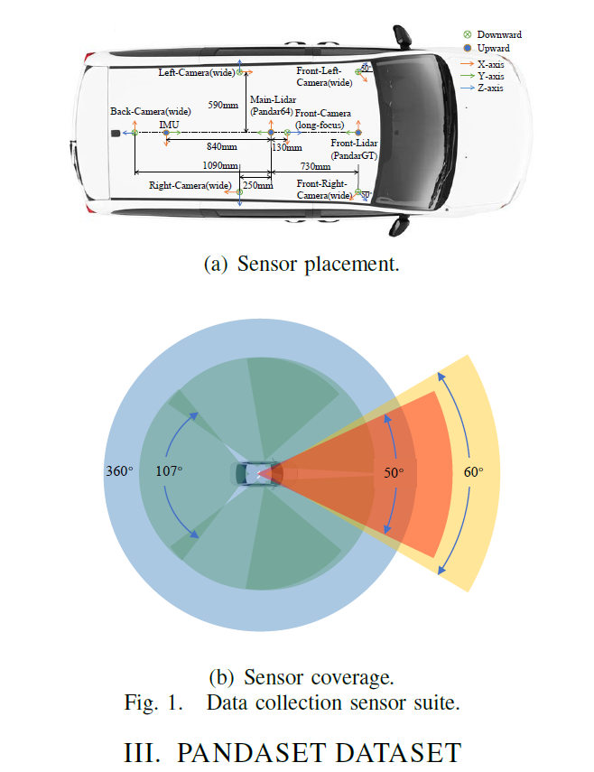
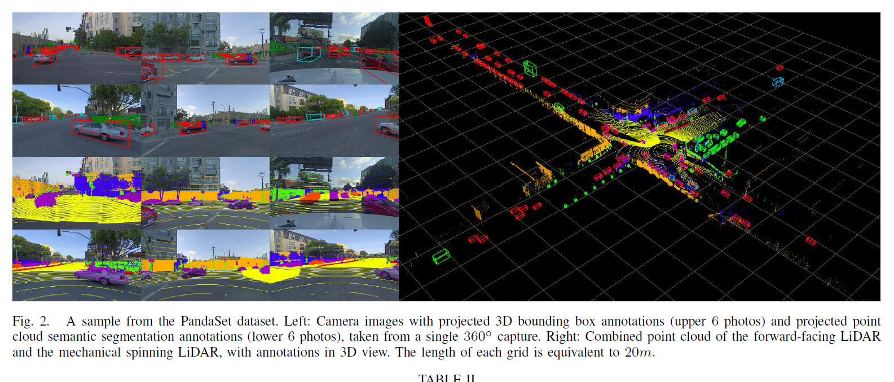
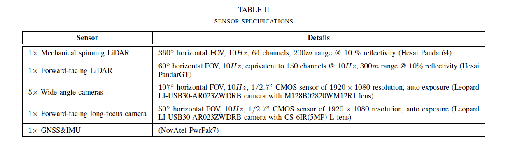
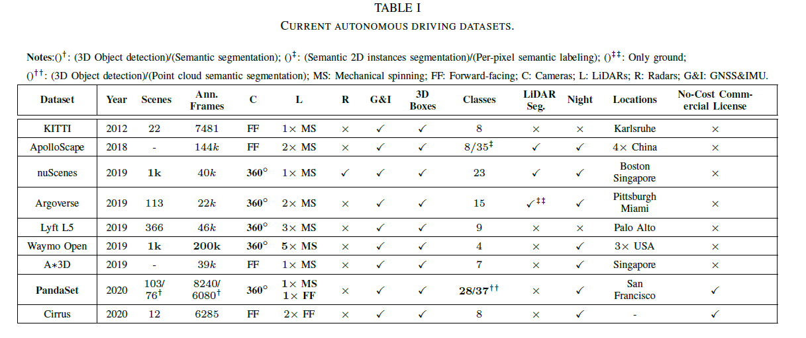
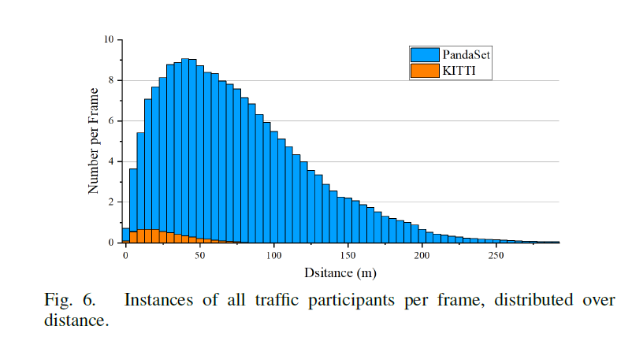
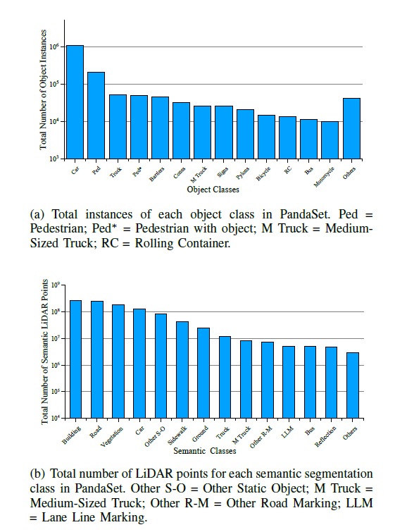
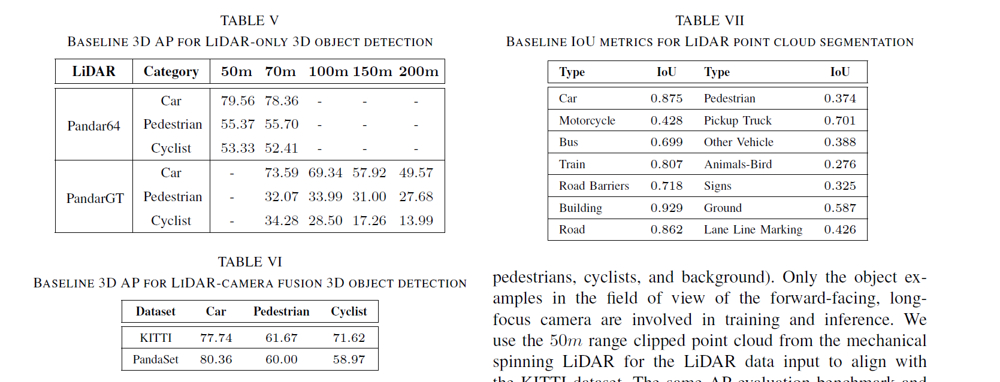

Advanced Sensor Suite Dataset for Autonomous Driving
===

2021/12/23 Pengchuan Xiao1, Zhenlei Shao1;, Steven Hao2, Zishuo Zhang3, Xiaolin Chai1, Judy Jiao1,
Zesong Li1, Jian Wu1, Kai Sun1, Kun Jiang4, Yunlong Wang4 and Diange Yang4;

https://arxiv.org/abs/2112.12610
https://scale.com/open-datasets/pandaset

（まとめ：yuji38kwmt）

---

## どんなもの？

* ScaleAIが自動運転用のオープンなデータセットを作った
    * mechanical spinningとfoward-facingのLidar両方を使っている
    * 研究や商用利用可能な無料なデータセット（Licenは[CC BY 4.0](https://scale.com/legal/pandaset-terms-of-use)）
    * 世界で初めて！
* データセットの中身
    * 8秒ごとのシーンが100個以上
    * 28 annotation classes
    * 37 semantic segmentation labels
    * 開発者用ツールも提供している
* 2種類のLidarと6種類のカメラを搭載している

---

## 先行研究と比べて何がすごい？

PandaSetの特徴
* 2種類のLidarを使っている
* クラス数が多い

---

## どうやって有効だと検証した？

### アノテーション

### baseline

* LiDAR-only 3D object detection
    * PV-RCNN
* LiDAR-camera fusion 3D object detection
    * DeepLabv3+, PointRCNN
* LiDAR point cloud segmentation
    * RangeNet53

---

## 技術や手法の肝は？

### 2種類のlidarの位置合わせ
>Moreover, to implement motion
compensation, we estimate the vehicle’s ego motion at each
timestamp of the point cloud with linear interpolation of the
vehicle’s GNSS/IMU data, helping better align LiDAR scans
and images, as well as consecutive LiDAR scans.

タイムスタンプやGNSS/IMUを参照して、2種類の点群の位置を合わせているらしい

---

## 議論はある？
なし

---

## 次に読むべき論文は？
* なし