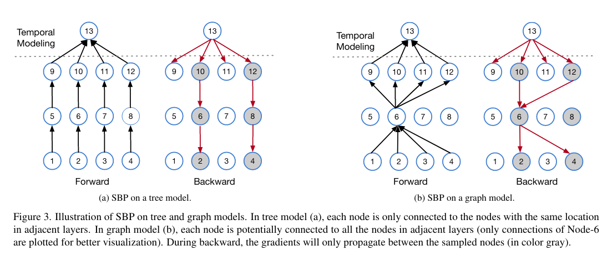
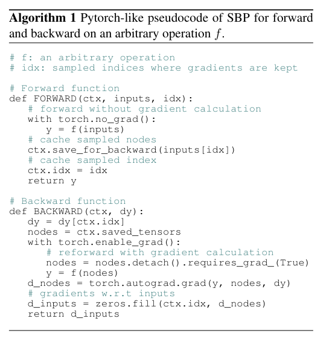
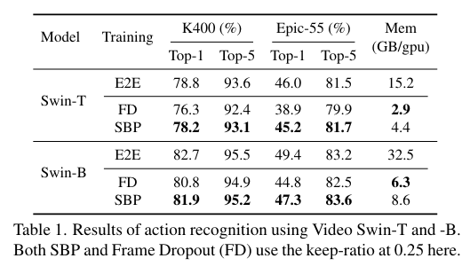
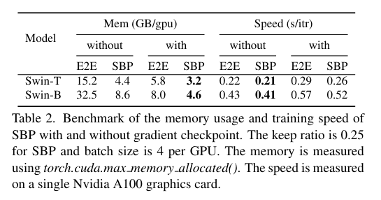
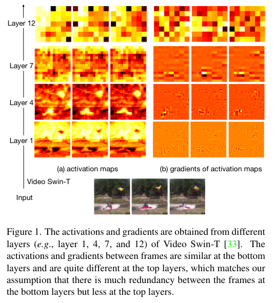

Stochastic Backpropagation: A Memory Efficient Strategy for Training Video Models
===
Feng Cheng 1 Mingze Xu 2 Yuanjun Xiong 2 Hao Chen 2 Xinyu Li 2 Wei Li 2 Wei Xia 2

*1 UNC Chapel Hill *2 AWS AI Labs

https://arxiv.org/abs/2203.16755

CVPR2022 Oral

@cohama

# どんなもの?

- Stochastic Backpropagation というモデル訓練時のメモリ使用量を大幅に低減する手法を提案
  - Backpropagation の計算を確率的に0にする
- 特にフレーム方向に冗長性がある動画認識で効果が高い。1% 未満の精度低下で最大80%メモリ使用量を節減、10%の高速化を達成

# 先行研究と比べて何がすごい？

- Gradient Checkpointing (recompute_grad) はメモリ使用量を50%程度まで削減できるものの学習速度が遅くなる
- Sparse Network, Sideways という手法もあるが限定的な状況でしか使えない
- 動画認識だと、空間方向の特徴抽出ネットワークをフリーズしたり、フレームを間引いたり、解像度を落とす工夫がこれまであったがいずれも最終的な精度に影響がある。

# 技術や手法の肝は？
## 概要

動画認識を行うモデルは大きく空間方向の特徴抽出を行う部分 (Spatial Model) と時間方向の特徴抽出を行う部分 (Temporal Model) に分けられる。
このうち、Spatial Model の部分についてのみ Stochastic Backpropagation (SBP) を適用する。

Forward の計算は普通に行う。
Backward の計算時はある特定のノードだけを残し、それ以外を通る計算はすべて省略する (0にする)。

## アルゴリズム
具体的なアルゴリズムは以下の通り。

Forward 計算時に勾配を保持しないように計算する。その代わりに SBP で選択されたノードの場所と値だけ覚えておく。
Backward 時には Forward 時に記録されたノードを使って自動微分を有効にした上で再計算を行い勾配を求める。
全部0のテンソルに対して記録されたノードのインデックスの場所に計算された勾配を代入。

Tree Model でも Graph Model でも上記のアルゴリズムは適用できる。

## ノードの選択

あるフレームを全部残すか、全部消すかで決める。
他にも活性や勾配のマグニチュードで決めるやり方も考えたが大きな差はない (ablation study)

# どうやって有効だと検証した？

## End to End, Frame Dropout との比較

## Gradient Checkpointing との比較

## 浅い層では勾配に冗長性があることの説明

# 議論はある？

- やっぱり精度低下はある。今はレイヤーごとに keep ratio は同じにしているが適応的に変えたりすることで改善するかもしれない。(場合によっては正則化により精度向上まであるかも)
- SBP は学習速度向上 (10%程度) の効果もあるが他の学習速度向上手法 (e.g. Multigrid) などと組み合わせるとどうなるかは今後の研究の余地がある。
- (私見) 今回は動画認識が対象だったが物体検出などにも応用できると期待。適応的なサンプル方法があれば背景部分の勾配計算をサボれるかもしれない

# 次に読むべき論文は？

- VATT: Transformers for Multimodal Self-Supervised Learning from Raw Video, Audio and Text
  - Frame Dropout として言及されているがこの論文自体はマルチモーダルな情報を自己教師で学習させる方法がメイン
- A Multigrid Method for Efficiently Training Video Models: https://arxiv.org/abs/1912.00998
  - 学習速度向上手法
- No frame left behind: Full Video Action Recognition: https://arxiv.org/abs/2103.15395
  - Frame Selection
