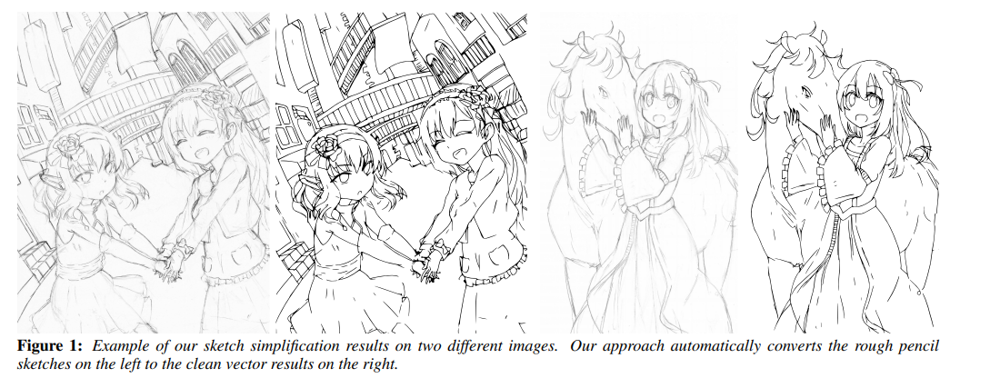
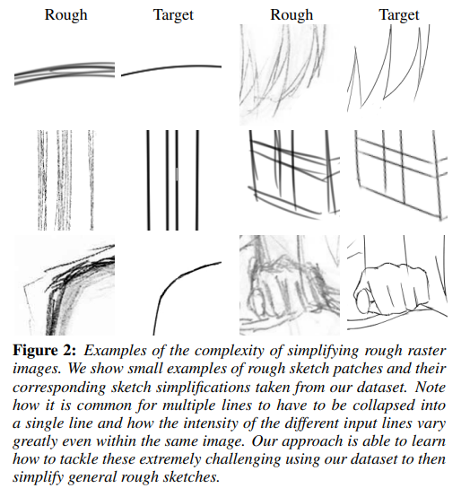
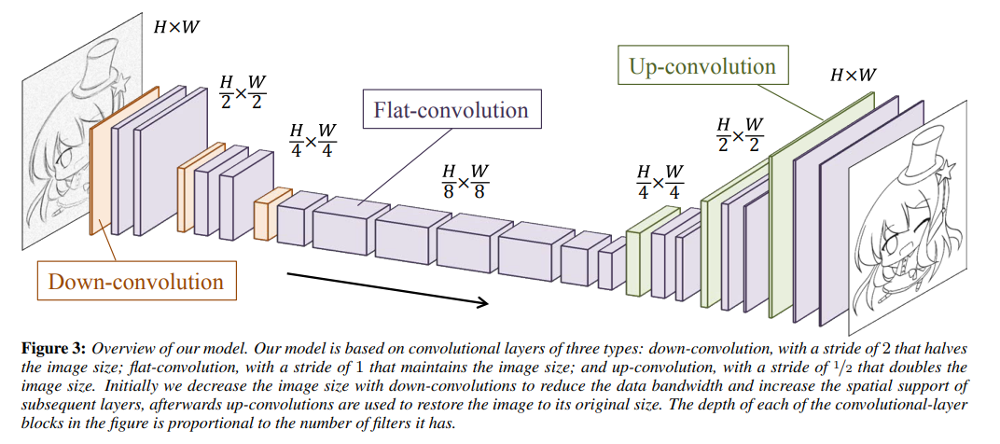
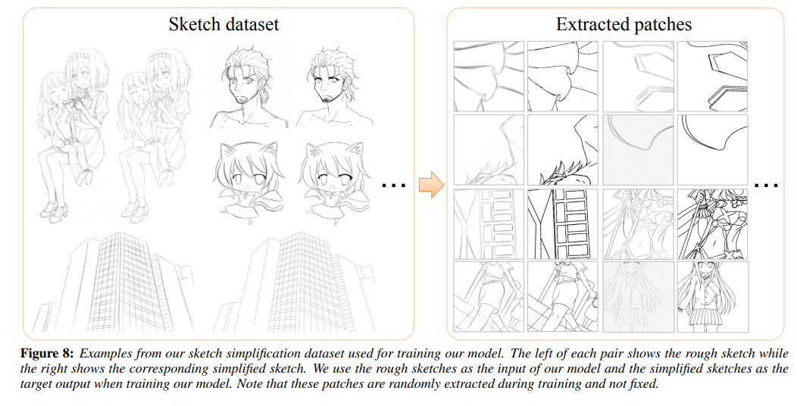
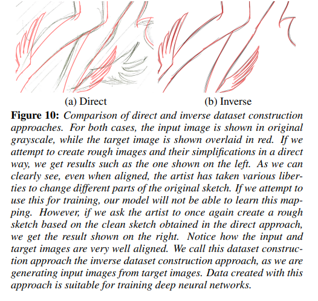
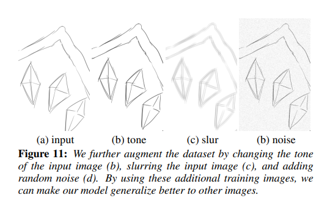
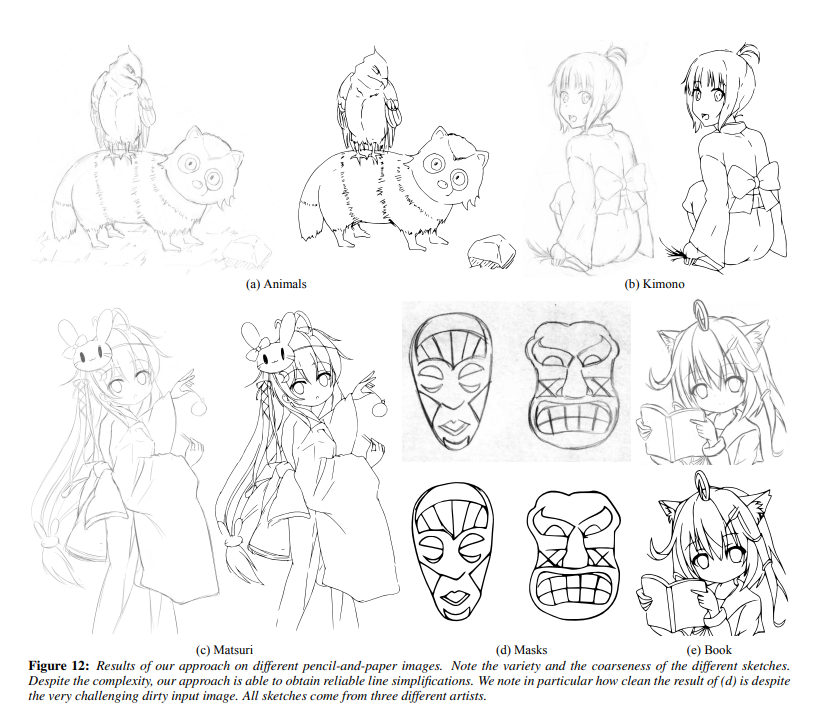
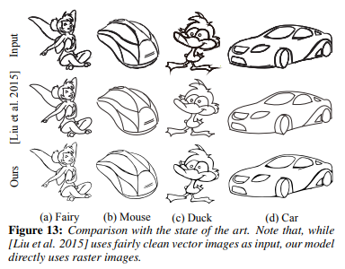
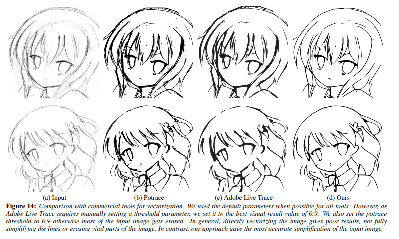

# Learning to Simplify Fully Convolutional Networks for Rough Sketch Cleanup

- 論文: https://esslab.jp/~ess/publications/SimoSerraSIGGRAPH2016.pdf
- 研究室HPでの紹介: https://esslab.jp/~ess/ja/research/sketch/

（まとめ @masahiro6510）

- 著者
    - Edgar Simo-Serra
    - Satoshi Iizuka
    - Kazuma Sasaki
    - Hiroshi Ishikawa

- 所属
    - 早稲田大学

- 発行年
    - 2016年

## どんなもの？

- 畳み込みニューラルネットワークを用いてラフスケッチを線画に自動変換する。

## 先行研究と比べてどこがすごい？

- 既存手法は単純なラフスケッチのベクター画像のみを対象としていたが、提案手法ではラスター画像にも対応し、スキャンした鉛筆画などの複雑なものも変換できる。
- 任意のサイズやアスペクト比をもつモデルを入力し、同じサイズの出力が得られる。
- ラフスケッチと線画がペアになった新しいデータセットを構築した（データは非公開）。
- 少ないデータ(68枚)で学習できる。

## 技術や手法の肝は？
- 全結合層なしで畳み込み層のみから構成されるため、入力画像のサイズやアスペクト比に依存しない。最初はdown-convolutionで小さな特徴マップに圧縮して処理し、最後にup-convolutionで解像度を戻してきれいな線画を出力する。

- アーティストの人に協力してもらい、ラフスケッチ(入力)と線画化した画像(教師)セットを用意した。訓練時には元データをそのまま使うのではなくランダムに取り出したパッチを使う。
    - 線画化した画像を用意して、後からその画像のラフスケッチを用意してもらった(普通にイラストを書く場合と逆)。先にラフスケッチを描くと、ラフト線画が大きく変わってノイズが大きくなる。

        
        
- 図に示す3種類のAugmentを行い、データ量を4倍にした。AugmentにはAdobe Photoshopのツールを使った。

    

## どうやって有効だと検証した？
- 3人の異なるアーティストに色んな紙・鉛筆でラフスケッチを描いてもらい、自動線画化をした結果例。ノイズを含む入力（特にdがノイズ多い）に対しても綺麗に線画化出来た。

- [SOTAモデル](http://www.cse.cuhk.edu.hk/~ttwong/papers/sketch/sketch.pdf)と比較。SOTAモデルの方はベクター画像しか変換できない。提案モデルの入力画像はベクター画像をラスター画像に変換したものを入力として比較した。これにより、SOTAモデルより不利な条件だが、目視で比較して同等の性能になっていることを著者自身の目視により確認。

- 商用ソフトと提案モデルの比較。イラストを描いている19人の人にどちらが優れているか聞いた結果、提案モデルが圧勝だった。

## 議論はある？

- 訓練データの量と質に依存するという制約がある。
- ラフスケッチを雑にして線画化の際に線を修正するのは再現できない？

## 次に読むべき論文は？
未定