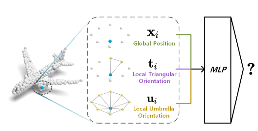
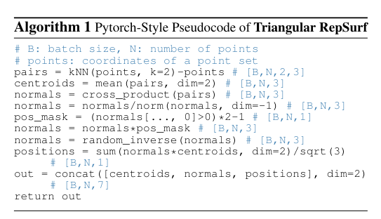
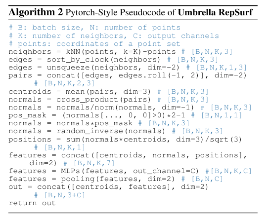
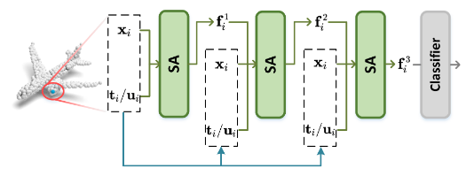
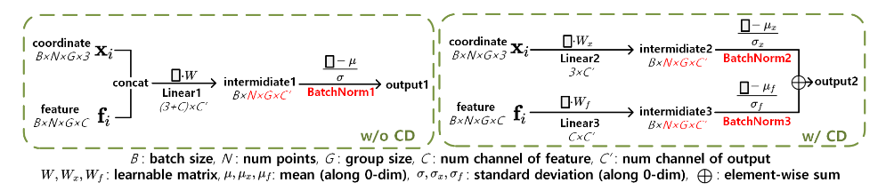
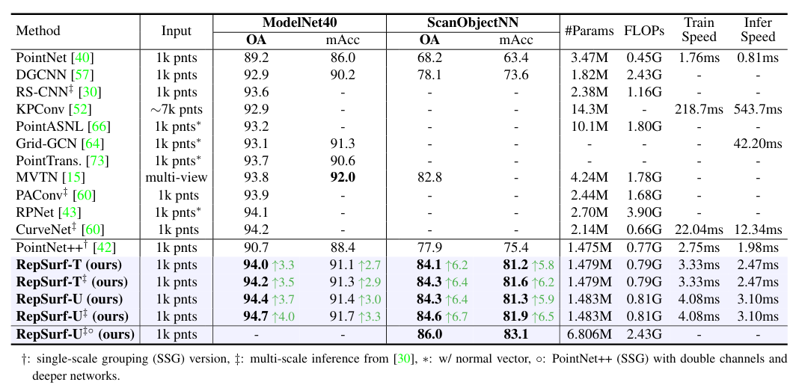
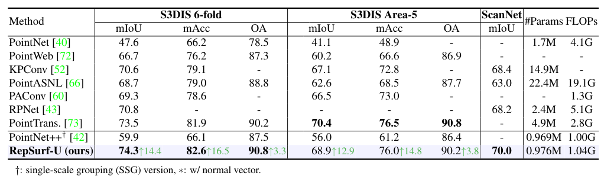
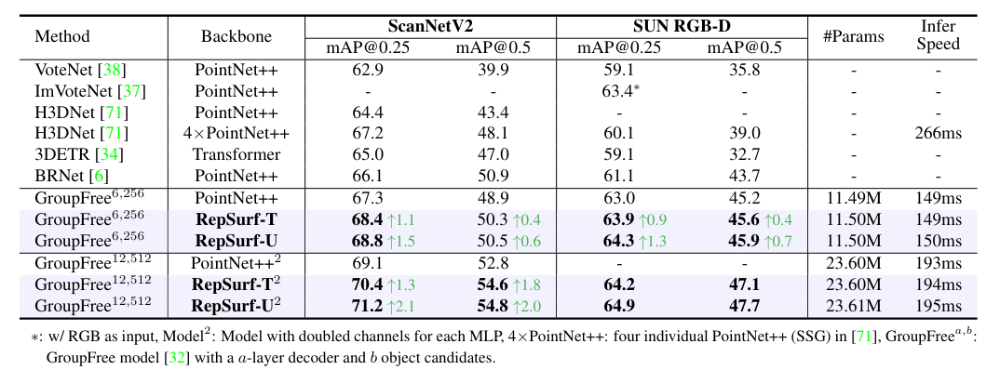

Surface Representation for Point Clouds
===
Haoxi Ran 1, Jun Liu 2, Chengjie Wang 2

1 Northeastern University, 2 Tencent Youtu Lab

https://arxiv.org/abs/2205.05740v2

CVPR2022 Oral

@cohama

# どんなもの?

- 点群認識のバックボーンに組み込んで汎用的に使える RepSurf という手法を提案
- 通常の点群の処理では単に xyz 座標のみを入力としていたが、それに加えて局所的な構造の情報も与える。
  - 局所的な構造とはある点とその近傍2点からなる三角形メッシュの情報、または近傍K個からなる傘状メッシュの情報
- 分類、セグメンテーション、検出等さまざまなタスクで大きな速度の損失なく精度向上を達成。
  - いろいろなタスクで SOTA 達成

# 先行研究と比べて何がすごい？

- マルチビューまたはボクセルベースの手法はそのまま畳み込みできる利点があるものの情報の損失や計算量の増加をもたらす
- 近年は点群をそのまま扱う手法が主流 (PointNet/PointNet++)。さらには近傍の点群情報を畳み込みや Transformer、GNN で処理するものもある。しかしいずれも局所的な形状の情報を明示的に扱っていない
- コンピュータグラフィックスの文脈で点群から表面を再構成する手法もある。

# 技術や手法の肝は？
## 概要

各点の座標 (x, y, z) に加えて近傍の点から計算した形状の情報も入力する。
Triangular RepSurf はある点とその近傍2点からなる三角形メッシュの情報を、
Umbrella ResSurf はある点とその近傍K点からなる傘状のメッシュの情報を追加で入力する。

## Triangular RepSurf

1. 近傍2点までのベクトルを求める
2. 座標値を三角形の重心にする
3. それらの外積から法線ベクトルを求めさらに長さを1にしておく。法線ベクトルは点の順番によって物体の外向きか内向きかが変わってしまう。これをケアする。
      - 法線ベクトルの最初の係数を常に正にする
      - 50%の確率でランダムに正負を反転させる
4. 法線ベクトルの係数から原点から三角形メッシュが属する平面までの距離を求める
5. 全部 concat する。`(x', y', z', a, b, c, p)` の7チャネル
      - `cx`, `cy`, `cz`: 基準となる点からみた三角形メッシュの重心の位置
      - `a`, `b`, `c`: 法線ベクトル
      - `p`: 原点から三角形メッシュまでの距離 `= (ax + by + cz)`

## Umbrella RepSurf

基本的には Triangular RepSurf を K 個集めたもの。

Umbrella 特有の工夫として以下2点がある。
- 近傍K点を集める際に角度でソートしておく。なおこの角度は xy 平面上での角度。
- チャネル数が K x 7 になるがこのまま使うのではなく MLP に通した後プーリングでチャネル数を C に削減する
  - ソースコード読むと C=7 なので単純に K 個の特徴を1つにまとめる操作

## その他実装上の工夫

### モデルアーキテクチャ

PointNet++ をベースとして SA (Set Abstraction / 代表的な点を選んで点の数を削減する。画像におけるプーリングみたいなもの?) の入力に RepSurf 特徴を追加で入れる。

### 極座標

三角形メッシュの重心 (x', y', z') だけでなく、極座標に変換した値 (ρ, θ, φ) も入力する。つまり最終的な RepSurf の特徴は 10 個。

ある点からみたまわりの近傍の情報は極座標で表したほうが距離、角度の変化を捉えやすいため

### Channel De-differentiation

入力として意味の異なるものを concat してたものを使っているが、チャネルごとにデータの分布が大きく異なるためそのまま Batch Norm にかけると都合が悪い。

concat して Linear 変換するのではなく concat するまえに Linear 変換したあと BN かけて elementwise-add する

# どうやって有効だと検証した？

## 点群分類

## 点群セグメンテーション

## 点群物体検出

## その他 Ablation
いろいろな工夫が効果あることを示している。詳細は論文参照。

- Umbrella RepSurf の点数は8くらいがいいらしい
- 一般的にはモデルに入力する前に適当にサンプリングして点の数を減らすことが行われるが、RepSurf は点の数を減らしたあとで計算したほうが良い

# 議論はある？

- 点から表面を再構成する都合上、やはりノイズに弱い
- (私見)局所特徴をハンドクラフトで作ってる感がある。が簡単に組み込めて精度出せるのは素直にすごい。既存の点群畳込みよりも優れているのを見るに、まだ点群畳込みは発展途上ということか。そういう意味ではこの手法はいずれ点群のいい感じのオペレータがでてきたら駆逐されてしまう類いの手法だと感じた

# 次に読むべき論文は？

- PointNet++ (https://arxiv.org/abs/1706.02413) 偉大な先行研究。この手法のベースになっている
- PointMLP (https://arxiv.org/abs/2202.07123v1) 局所特徴を自動て作る方針の方
