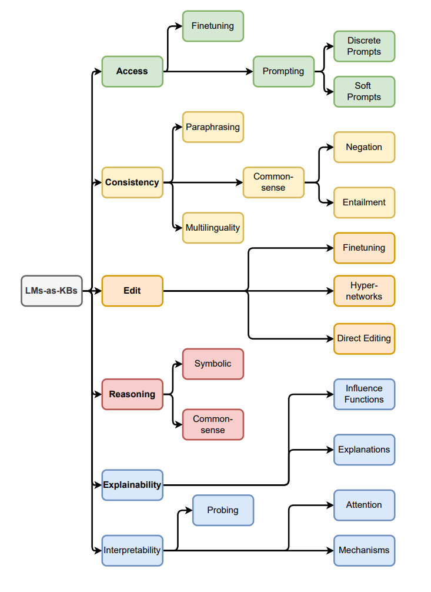

# A Review on Language Models as Knowledge Bases
[https://arxiv.org/abs/2204.06031](https://arxiv.org/abs/2204.06031)

(まとめ @n-kats)

著者
* Badr AlKhamissi
* Millicent Li
* Asli Celikyilmaz
* Mona Diab
* Marjan Ghazvininejad

Meta AI の人達。

# どんなもの？
言語モデルをKB（Knowledge Base）に応用する研究についてのサーベイ論文。

言語モデルの学習データに様々な知識が含まれている。その知識を活用できないか、という観点で研究されている。

* 昨今の言語モデルを応用するときに finetune 等はどうしているのか？
* KB 応用にどういうことが研究されているのか？

に感心があって読んでみた。

# 先行研究と比べてどこがすごい？
単なる言語モデルのサーベイではなく、KBに応用するにはどういう機能が必要かという観点でまとめられている。

# 技術や手法の肝は？
## おさらい
### 言語モデル
この論文で言語モデルと読んでいるものは、大量の教師なしデータで訓練した深層学習ベースの自然言語処理のモデル。

BERT, GPT-3, BART, T5 等を想定。

大量のデータを用いて、高クオリティの文書生成等が実現されている。
ただし、どうやって結論を出したのかは謎（説明可能性が低い）。

### KB
知識情報を持つデータベースのようなもの。

通常は、「A は B と C の関係にある」のように決まった形式で表現されたデータの集まり。
この情報を組み合わせて推論をするような使い方がされる。

どの知識を使ったかが辿りやすく、説明可能性に長けている。

## KB に要求される要素

* アクセス（知識を取り出す）
* 編集（知識を更新する）
* 一貫性（知識が矛盾しない）
* 推論能力
* 説明可能性

## これだけ分かればいい図

以降でこの図を説明する。

## アクセス
通常のKBでは、そのKBにあったクエリを作成してアクセスする。言語モデルでは、学習していないアクセス方法ではアクセスできない。

* fine tuning
* prompting
  * discrete prompts
  * soft prompts

の選択肢がある。

### fine tuning
目的のアクセス方法の教師を作って fine tune する。言語モデルで fine tune して知識が保たれていることは [http://arxiv.org/abs/2002.10640](http://arxiv.org/abs/2002.10640) 等で報告されている。

ただし、fine tuning のコストが高いという問題がある。

### prompting
言語モデルでは、空いた部分を補間する問題を学習する。それを使って、「A は B の [MASK] です。」という入力を与えて、[MASK] の部分を補間させて知識を取り出すことができる。（discrete prompts）

多数のテーマで良い結果が出ているが、都合のいい設問（prompt）を作るのが難しい。

テーマ毎に理想的な設問を作りたいが、AUTOPROMPT という手法で学習で良い設問を生成するという取り組みもある。

discrete prompts が言葉で設問が書かれるのに対して、soft prompts と呼べるグループでは、設問をベクトルの列として表現する。
soft prompts は discrete prompts より表現力が高く、AUTOPROMPT のアプローチも可能。

GPT3では in-context learning という手法を使っている。context を差し込んで推論させる。

人間レベルの性能が出ているわけではない。

## 一貫性
言語モデルは一貫性に問題がある。同じ結果を返すべき2つの質問に対して別の結果が返って来る場合がある。

一貫性と言っても、次の種類がある。

* Paraphraseing（同じことを別の表現で言っても変わらないか）
* common sense（出力する文章が正しいとは限らない）
* mutiltilinguality（言語を変えても結果が変わらないか）

### Paraphraseing
別の表現で答えが変わらないかを評価するベンチマークがある。
また、この一貫性のために、似た設問に対して似た結果が出るような損失関数を追加する方法も研究されている（[http://arxiv.org/abs/2102.01017](http://arxiv.org/abs/2102.01017)）。

### mutiltilinguality
同じ内容を複数の言語で訓練する対策がされている（XGLM等）。

### common sense
言語モデルが矛盾した文章を生成する。
"Birds can fly."と"Birds cannot fly."が両方生成しうる。Aとnot A のように文法的には正しいが、論理的には片方だけが正解という場合に弱い。

他にも、対偶等の論理的推論を言語モデルが上手く扱えない。

LeepOfThoughtというデータセットで研究がされている。

## 編集
新規の知識や時間が経って古くなった情報を更新したい。

* 編集するために、個別に訓練するようなことはしたくない。
* 編集した結果、編集と関係の無い事項に影響がないようにしたい。
* 編集した結果が一貫性のある形で反映されて欲しい。

露骨な方法は更新したいときに訓練しなおす方法だが、コストが高い。関係の強い部分の重みだけを更新する方法もあるが、関係の無い事項への精度が落ちる。

hyper networks という方法がある。新しい知識の分だけ重みを調整する。そのための調整分を小さいネットワーク（hyper network）で行う。
しかし、巨大なモデルではこの方法は上手く行かない。巨大モデルの場合のために、MENDやSLAGと呼ばれる手法が研究されている。

ROME という手法では、transformerのkey-valueを直接いじる（key,valueを新しく入れる）のを考えている。

## 説明可能性・解釈可能性
### 解釈可能性
モデルの内部でどういう推論をしているのかの情報を取り出したい。

#### probing
途中の層から線形な層を生やして分類器を作って調べる方法が取られる。

#### attention
attentionの内容を解釈だと思って捉える方法が昔からあるが、モデルの解釈としては十分に使えないという報告がある（重要な単語にattentionがかかっているとは限らない）。

#### feedfoward layers
トランスフォーマーを解釈するために feedfoward layerと呼ばれる層を追加して分析する手法が近年ある。

feedforward layerのトランスフォーマー部分のkey valueを知識を表現したものと思って因果関係を追跡する研究もある。[https://arxiv.org/abs/2202.05262](https://arxiv.org/abs/2202.05262)

## 説明可能性
モデルの出力を解釈する方法。

古くから influence function という考え方がある。2回微分まで分析する。

別のアプローチとして推論と一緒に推論の根拠も出力する言語モデルも考えられている（T5等）。しかし、現状では、一貫性が無く気まぐれな結果が多い。敵対的学習で補助する研究もあるがそこまで上手く行っていない。
もっと凝ったもので、推論プロセスを出力する（もっと詳しい説明を出力する）研究もある。

# どうやって有効だと検証した？
surveyなのでなし

# 議論はある？
言語モデルの発展は目覚ましいが、まだまだ課題が多い。

# 次に読むべき論文は？
途中のリンクの論文を
