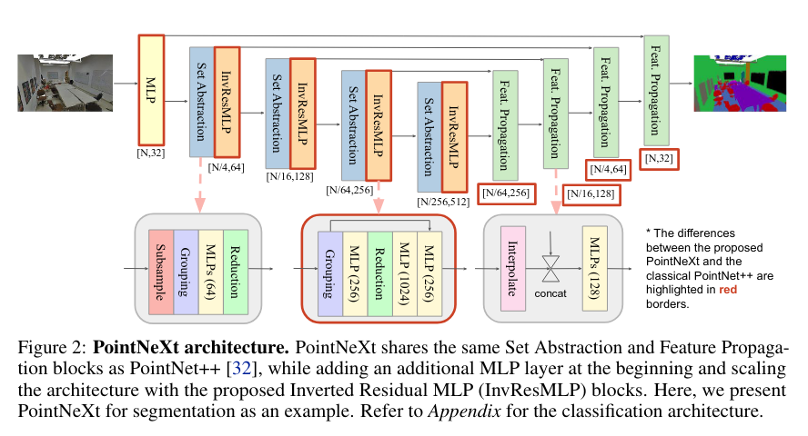
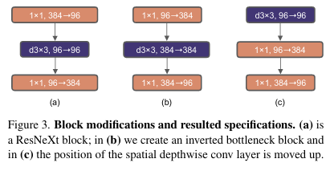
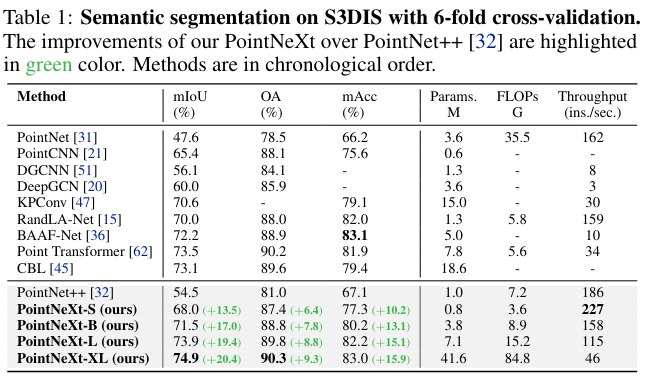
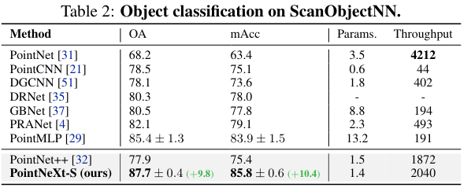
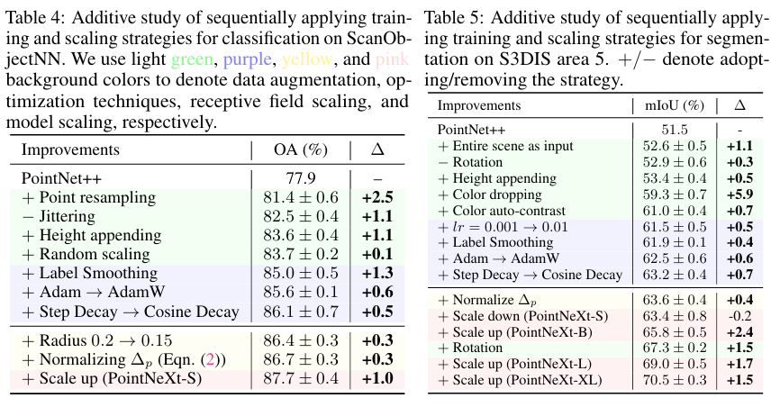
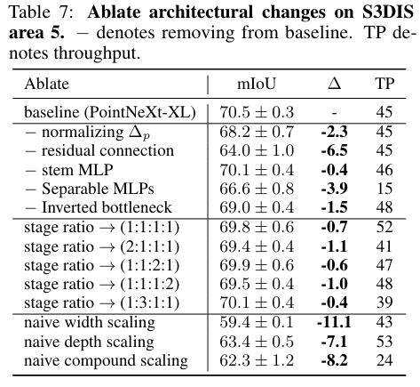

PointNeXt: Revisiting PointNet++ with Improved Training and Scaling Strategies
===

Guocheng Qian 1, Yuchen Li 1, Houwen Peng 2, Jinjie Mai 1, Hasan Abed Al Kader Hammoud 1, Mohamed Elhoseiny 1, Bernard Ghanem 1

1: King Abdullah University of Science and Technology
2: Microsoft Research

https://arxiv.org/abs/2206.04670v1

@cohama

# どんなもの？

- 近年の点群認識の進歩はアーキテクチャ以外でも学習手法や最適化手法によるところが大きい
- 改めて学習戦略を見直して PointNet++ でも SOTA の精度を出せることを確認
- さらにアーキテクチャに改良を加えた PointNeXt を考案
- PointMLP に比べてより高い精度を出しつつ推論時間は10倍速い

# 先行研究と比べて何がすごい？

- 点群認識はその順列不変性や近傍の情報をどのように扱うかなどが主に研究されてきた。
  - 点群の畳み込みや Transformer-Like な手法など
  - この論文ではモデルアーキテクチャよりも学習の戦略に重きをおいている
- モデルサイズを適切にスケーリングは画像などでは EfficientNet などで示されているが点群の認識ではあまりなかった
  - PointNet++ がパラメータ数 2M 程度に対して KPConv は 15M、PointMLP は 13M と開きが大きい
  - PointNet++ を適切にスケーリングする方法を研究した

# 技術や手法の肝は

## 前提知識 PointNet++

- SA (Set Abstraction) モジュールというのがある。
  - Sampling → 既存の点から適当に N 個選ぶ
  - Grouping -> N 個の選んだ点のうち半径r以内にある点を K 個選んでグループ化
  - PointNet -> 点ごとに MLP したあと Average Pooling でグループ化された点の特徴を混ぜる。後者は Reduction

## データオーグメンテーション

オリジナルの PointNet++ は点をランダムに平行移動、回転、拡大縮小、摂動のオーグメントを行っていた。
一方後発の上記以外の強力なオーグメントを行っている。
実際どのオーグメントが有効化を網羅的に調べた。

## 最適化手法

オリジナルの PointNet++ は普通の CrossEntropy で Adam、学習率は Step Decay だった。
後発のモデルはより強力な最適化手法を採っている。e.g. Label Smoothing, AdamW, Cosine Decay
これについても調べた。

## モデルアーキテクチャ

### Receptive Field

Receptive Field は重要。PointNet++ においてはグループ化の際の半径rが重要
この r はデータセットごとに変えるべきなのでこれを探索した。
また、サンプリングとグループ化の際に、選んだ代表点とそこから半径 r 内にある近傍 k 個を選ぶが、このとき代表点と近傍の点との相対位置 (`pj - pi`) を後段の処理に入力している。これだと実際の値が小さすぎるので半径 r で標準化する。(`(pj - pi) / r`)

### モデルスケーリング

PointNet++ は現在の点群認識モデルの中では相対的にはかなり小さい方のモデル。パラメータ増やして賢くしたい。
ただし、単純に SA モジュールを増やしたりやチャネルサイズを大きくするだけでは対して性能は上がらない。

以下のようにしてモデルのサイズを増やす。

1. ConvNeXt を参考にした Inverted Bottleneck -like な構造を追加
2. 最初に Stem 層の MLP を設ける
3. Decoder 側のチャネルサイズを Encoer 側と合わせる。(オリジナルより減っている？)
4. 分類でも4段階 SA が入る構造にする。オリジナルは2段階

参考: ConvNeXt の Inverterted Bottleneck

# どうやって有効だと検証した？

## 点群セグメンテーション

## 点群分類

## Ablation 学習戦略の効果

## Ablation モデルアーキテクチャ

# 議論はある？

- 比較的小さい点群データセットでしか訓練していない。実際画像モデルで使われるようなモデル (Swin-L 197M, ConvNeXt-XL 350M, ViT-L 305M) と比べると PointNeXt-XL は 44M くらい。もっと大きなモデルの探索が課題

# 次に読むべき論文

- PointNet++ (https://arxiv.org/abs/1706.02413) 偉大な先行研究。この手法のベースになっている
- RepSurf (https://arxiv.org/abs/2205.05740v2) 先月読んだ。入力となる点群に特徴を追加する方式なので本手法と組み合わせられるかも
- PointMLP (https://arxiv.org/abs/2202.07123v1) 参照されている
- PointTransformer (https://arxiv.org/abs/2012.09164) 参照されている
