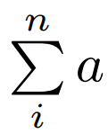
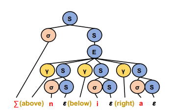
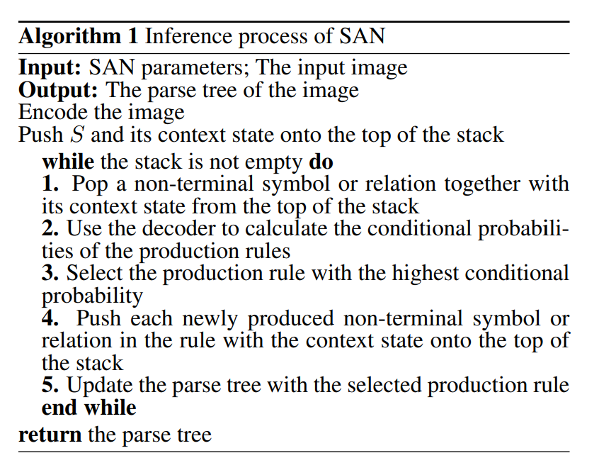
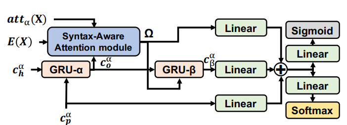
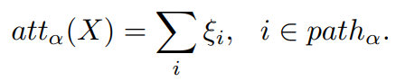
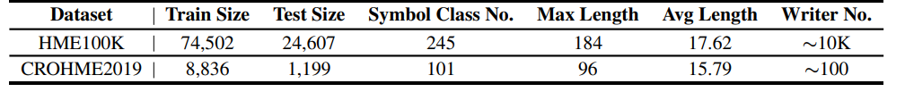
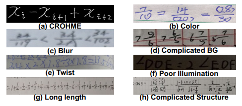
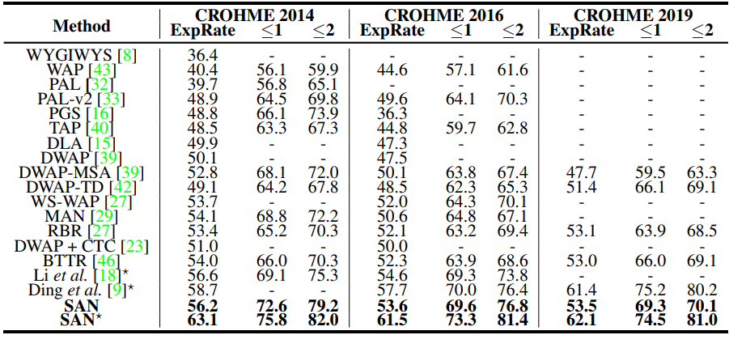
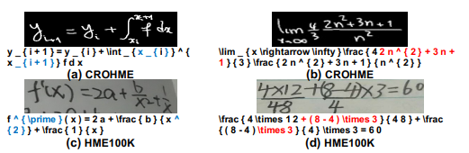

# Syntax-Aware Network for Handwritten Mathematical Expression Recognition
[https://arxiv.org/abs/2203.01601](https://arxiv.org/abs/2203.01601)

(まとめ @n-kats)

著者

* Ye Yuan
* Xiao Liu
* Wondimu Dikubab
* Hui Liu
* Zhilong Ji
* Zhongqin Wu
* Xiang Bai

TAL教育グループと華中科技大学の人たち

# どんなもの？
手書き数式の認識(HMER: Handwritten mathematical expression recognition)。
CVPR2022に採用されている。

単純な手書き文章と異なり、分数や添え字等の複雑な配置になっている。

# 先行研究と比べてどこがすごい？
単純なencoder-decoder方式だと、複雑な配置に対応しきれない。

SANは、数式の構造・パターンを考慮した手法。

推論結果はTeXとして解釈可能なものになる。

この研究のために、10万個の手書き数式を用意した（1万人の）。

# 技術や手法の肝は？
## 数式の階層構造

は次のように階層構造になっている。

* まず、Σ 記号を使った和の式
* Σ の上下右に子要素（数式）がある
* 子要素の数式を分解する（この例ではこれ以上は分解できない）

## syntax
数式の構文を次のように分解する。

* 数式の一塊の部分
* 親要素の数式と子要素の数式の関係（上下など）
* 末端の要素（数値や文字など）

左や左下の関係を取り除くと数式に対して構文が一意に決まる。

## アルゴリズム
端的にいうと、数式を全体から部分にかけて少しずつ分解していく。
具体的には次の画像の通りにする。

* 画像を入力する
* 適当なネットワークで特徴マップにする（エンコーダー）。
* 数式の構文木を作る準備をする（分解途中の部分を入れるリストを用意して、全体をその要素に入れておく）
* リスト空になるまで分解をする（リストの先頭から）。
  * リストの先頭から要素を取り出す。
  * その要素についての推論を行う（デコーダー）。
  * 構文木に結果を入れる。
  * 新しい子要素があったらリストに追加する。

## エンコーダー
なんでもいい。論文ではDenseNetを利用。

## デコーダー

親要素から子要素への時系列データとみなして、リカレントな方法（GRU）で推論する。

## アテンション
図の左上の "Syntax-Aware Attention module" の部分。それぞれの塊部分についてのアテンションを計算する。

子要素になるにつれて、アテンションの内容を加算していく。

# どうやって有効だと検証した？
既存データセットCROHME（2014,2016,2019）と新作データセット（HME100K）を使って評価。

HME100KはCROHMEの10倍程度のサイズのデータ。

左上以外はHME100K。

* ExpRate・・・ExpRate≦N はN文字のミスを許して正解する割合（この分野で標準的な評価方法）。
* ESPR・・・構造だけを評価したときの正解率（文字をミスってもいい）

データは、[https://ai.100tal.com/dataset](https://ai.100tal.com/dataset)。
ソースは、[https://github.com/tal-tech/SAN](https://github.com/tal-tech/SAN)

## CROHME

"Ding et al." とあんまりかわらないような・・・

## HME100K

速くて賢い

# 議論はある？
## 失敗例

積分の上のx_i + 1 の +1 が添え字に間違ったり、数式として足りていないものだったり、ひずんでいたり、後から付け足したような分母だったり・・・

## 私見
グラフ（木）を作りながら推論するアイデアで、気になっているやり方だった。

しかし、手元の9年前のノートは認識できなさそう（字が汚い・・・）。

# 次に読むべき論文は？
* WAP
* DWAP-TD
* "An Encoder-Decoder Approach to Handwritten Mathematical Expression Recognition with Multi-head Attention and Stacked Decoder" ・・・ CROHMEでよいスコアを出しているもの
