# Is Space-Time Attention All You Need for Video Understanding?
[https://arxiv.org/abs/2102.05095](https://arxiv.org/abs/2102.05095)
(まとめ @n-kats)

著者
* Gedas Bertasius
* Heng Wang
* Lorenzo Torresani

旧facebook AIの人たち

# どんなもの？
動画行動分類タスクにトランスフォーマーを使う手法TimeSformerを提案。

# 先行研究と比べてどこがすごい？
先行研究のCNNベースの手法（I3D、SlowFast）と比較すると、
* 長めの動画（数分）の認識で大きく性能が改善
* 学習が速く進む

# 技術や手法の肝は？
## 概要
* 入力・・・クリップ（Fフレームの画像）
* ネットワーク・・・ViT風の方法（パッチと分類タスクトークンを要素にするトランスフォーマー）
* アテンション・・・Divided Space-Time Attention（空間方向のアテンションと時間方向のアテンションを分離）
* 出力・・・分類タスクトークンに相当する箇所から分類結果を取得

## おさらい（ViT）

画像をパッチに分けて、（線形変換して）トランスフォーマーに入力（+位置埋め込み）。パッチとは別にタスク用のトークンがある。

（雑に）トランスフォーマーは、ある層zから、
* W * LN(z) の計算でQ(query),K(key),V(value)の3つの要素を算出
* アテンションをQ,Kから算出（A=softmax(Q*K/√D)）
* アテンションが反応した部分のVを引っ張ってくる（z + W\*(A\*V)）

## アテンション
### Q,K,Vの計算

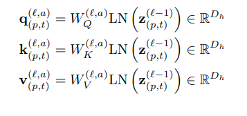

Q,K,Vの計算はViTと同じ（インデックスがパッチp以外に時刻tもある）（なので、ViTのpretrainの重みが使える）。

### アテンションの計算（Joint Space-Time）
素朴な方法だと、Fフレームの間のパッチ間でもアテンションを計算する。

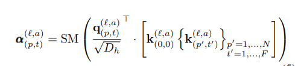

ただし、これだと計算量が多くなる（t0フレームのp0パッチからからt1フレームへp1パッチへのアテンションがあるため、F^2のオーダーの要素が必要）。

そこで、計算量を落とす工夫をする。

### アテンションの計算（Divided Space-Time Attention）
時間方向のアテンションだけを使う場合と空間方向のアテンションだけを使う場合とを組み合わせる方法。

* 空間方向のアテンション

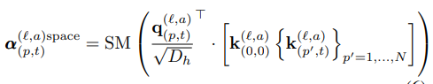

* 時間方向のアテンション

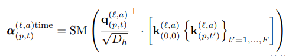

joint方式と違って、空間方向のアテンションは、同じフレームだけを見る。時間方向は、同じ位置のものだけをみる。

これでフレーム数が増えたときに計算コストが抑えれれる。

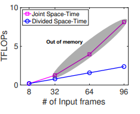

# どうやって有効だと検証した？
## データ
* Kinetics-400（K400）（時間方向の情報があまり重要でない）
* Kinetics-600（K600）
* Something-Something-V2（SSv2）（時間方向の情報が重要）
* Diving-48
* HowTo100M（数分の動画）

## 基本設定
* フレーム数8
* 画像サイズ224×224
* パッチサイズ16×16
* サンプリングレート32フレームに1フレームを使う(30FPSだと8フレームを入力すると約8秒間にを約1FPSでみることになる)

亜種の設定として、
* TimeSformer-HR（入力を単純に大きくした場合。フレーム数16、解像度448×448）
* TimeSformer-L（時間方向を密で長くした場合。フレーム数96、サンプリングレート4フレームに1フレーム）

（フレーム数96がメモリに乗る限界）

## アテンションの方式の効果
joint方式、divided方式以外に
* （Space）空間方向しかアテンションをしない場合
* （Axial）時間・縦方向・横方向の3つに分割する場合

* （Sparse Local Global）近傍H/2×W/2のパッチだけとのアテンションと、stride 2で荒くしたアテンションを組み合わせた場合

を比較した。

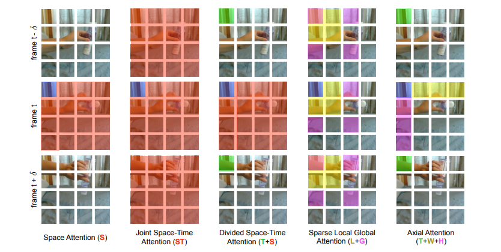

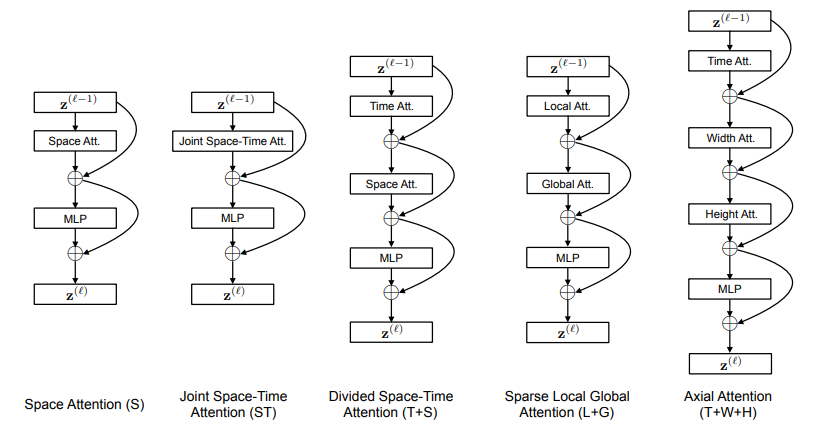

結果は、次のように、divided方式が良い性能がでることがわかった。joint方式も良い結果だが、計算コストのことを考えると、divided方式の方がすぐれている。
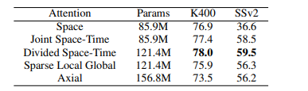

## 既存手法との差

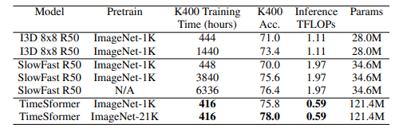

* TimeSformerは短い訓練（416GPU時間）で良い性能が出る
* TimeSformerの計算量が少ないにもかかわらず、パラメータ数が多い（キャパシティが大きい）

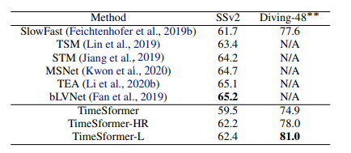

* TimeSformerより精度の出ている手法もある
* Diving-48を評価しているのが少ないが良い結果
* これらのデータだと著しくよくなるわけではない

## pretrainの差

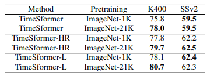

K400ではpretrainの効果は大きいが、SSv2ではそうでもない。SSv2が時間方向の情報が重要なことがこの結果になったと考えられる。

## 長い動画（HowTo100M）
K400で訓練したTimeSformer-Lをファインチューニングして実験。
動画が長いので、32フレームに1フレームのサンプリングレートで入力。
それでも1クリップの長さが動画より短いため、複数のクリップに分けて推論して平均をとる。

SlowFastと比較すると以下のようになる（大きな差がある）。

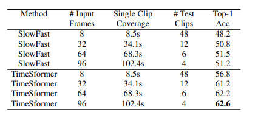

# 議論はある？
シンプルなアイデアで、SOTAを達成し、コストも低い。更に、長い動画について良い結果がでた。

action localizationやvideo caption、question-answering などの問題にも取り組みたいとのこと。

## 私見
訓練のコストが低いと言っても416GPU時間・32GPUで訓練で訓練している。使おうと思ったら、SSv2等のpretrainのものを使うのがよいのだろう

# 次に読むべき論文は？
* Attention Rollout（[https://arxiv.org/abs/2005.00928](https://arxiv.org/abs/2005.00928)）  
  attentionの可視化についての手法らしい
