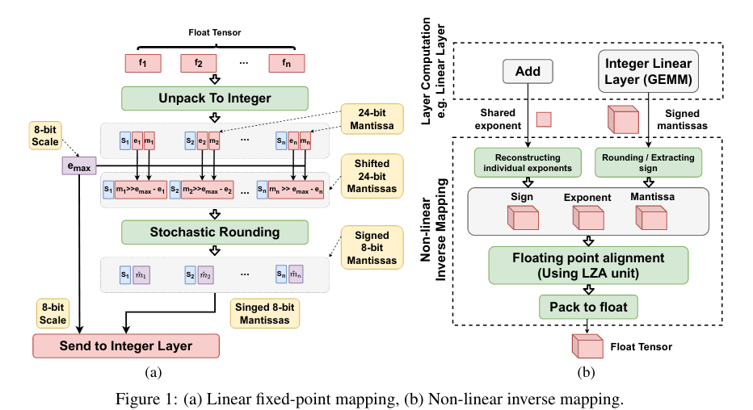
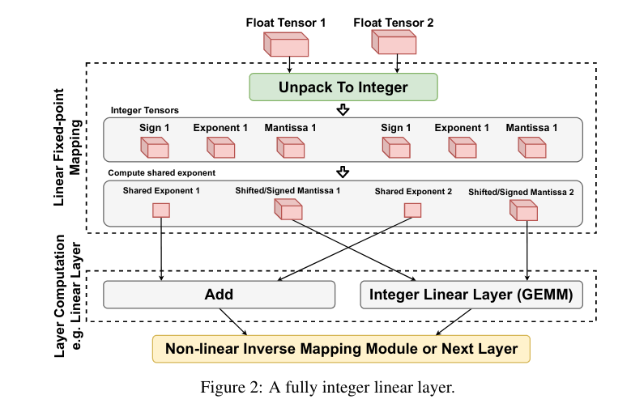
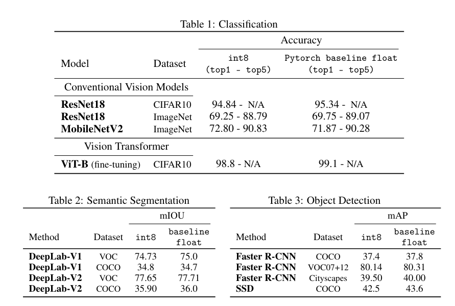

Is Integer Arithmetic Enough for Deep Learning Training?
===

Alireza Ghaffari, Marzieh S. Tahaei, Mohammadreza Tayaranian, Masoud Asgharian, Vahid Partovi Nia

(Huawei Noah’s Ark Lab の人たち)

https://arxiv.org/abs/2207.08822v1

@cohama

# どんなもの？

- 完全に整数 (int8) だけを使ってニューラルネットの訓練を行う手法を提案
- 一般的な量子化とは異なり数の表現方法自体を工夫し、その情報を int8 でもつ
- 整数のみで訓練しても float を使ったものとわずかな精度低下のみ

# 先行研究と比べて何がすごい？

- 活性、重み、勾配すべて int8 で行う
- 量子化手法は最初から int8 で計算できるわけではなく、適切なスケールを与える必要がある。提案手法はそのようなものは不要
- 勾配が unbiased?

# 技術や手法の肝は

## 元の float の値からの変換は以下の通り

- 符号、指数部、仮数部に分ける。
- 指数部は最大値をとり、それを1つのテンソルで共有する (つまりネットワークの各層で1つの int8)
- 共通の指数部を元に仮数部を適切にシフトする
- 24bit の仮数部を 7 bit に丸める。(確率的丸め)

## 整数での行列計算

## SGD

数学的に計算の特性を証明している。結論的には SGD やるにも本手法の表現であれば整数で十分ということらしい

(読んでない)

# どうやって有効だと検証した？

- ViT だけは fine-tune。あとはスクラッチ

## 議論はある?

### 私見

- 計算速度はどうなんだろう

