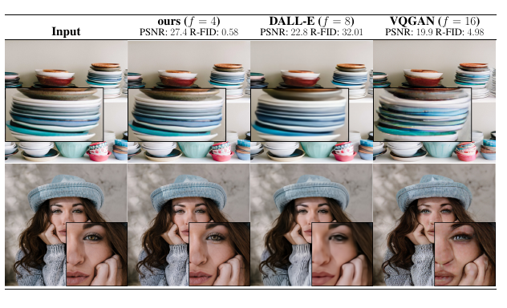
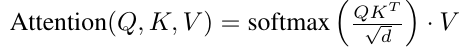
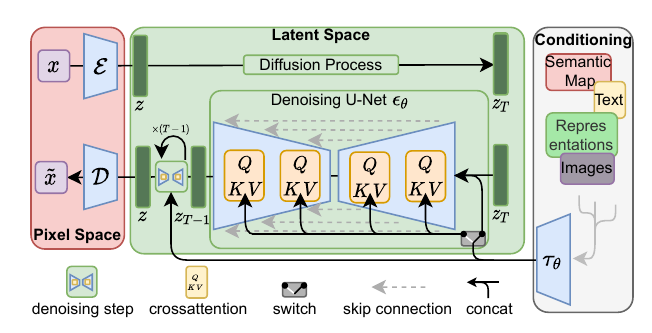
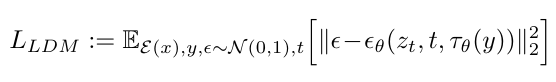
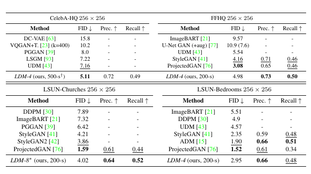
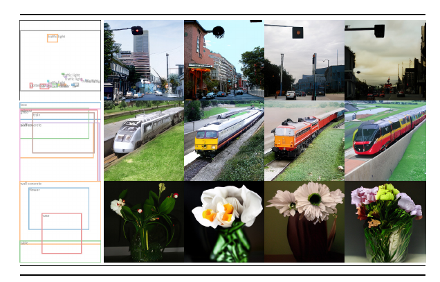
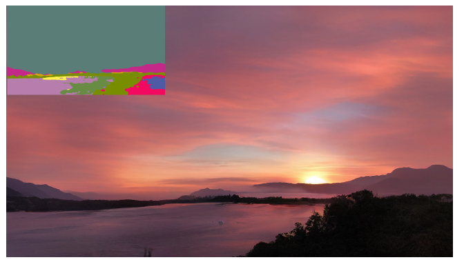
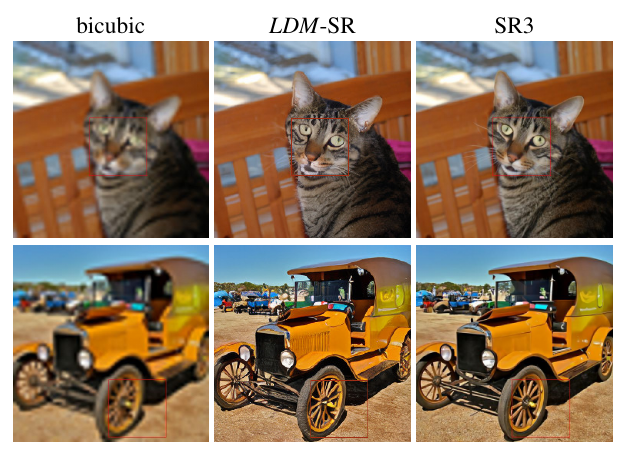
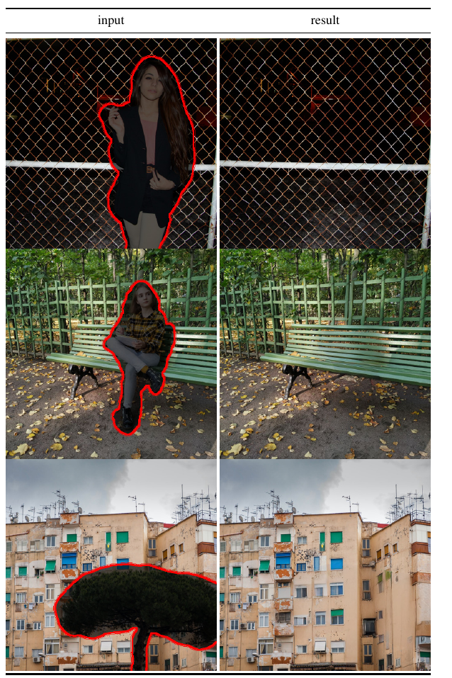

# High-Resolution Image Synthesis with Latent Diffusion Models
[https://arxiv.org/abs/2112.10752](https://arxiv.org/abs/2112.10752)
(まとめ @n-kats)

著者
* Robin Rombach
* Andreas Blattmann
* Dominik Lorenz
* Patrick Esser
* Björn Ommer

ミュンヘン大学の人たち

# どんなもの？
最近流行りの文章から画像を生成する系。

stable diffusionの元になった手法。

# 先行研究と比べてどこがすごい？
文書から画像を生成する系の手法は、これまでは計算コストが非常に高かった。
お手頃なコスト（メモリ10GB）で高解像度（512x512）の画像が生成できる。

（最近のstable diffusionの亜種たちは更に低コストで動くものもある）

# 技術や手法の肝は？
## テキストから画像を生成する手法
今回も diffusion model と呼ばれる画像生成手法。

### diffusion modelによる画像生成（前回のコピペ）
画像を与えると、そのノイズを（少し）取り除くモデルを使った生成モデル。

* 最初にノイズ画像を用意する
* ノイズ除去を少しする
* ノイズ除去を少しする
* ...
* ノイズ除去を少しする
* ノイズが少ない画像が得られる

完全にランダムな画像から生成したり、一部だけノイズをかけて生成するなどの方法がある。

逆に、取り除くべきノイズを加えて、もとになるノイズ画像を作ることができる（正確には作れない）

### テキスト情報の組み込み
トランスフォーマー系のモデル。Query,Key,Value を次のようにつくる

* Q: 画像に対応する特徴マップから作成
* K: テキスト等（をベクトル化したもの）から作成
* V: テキスト等（をベクトル化したもの）から作成

## 本手法のアイデア
* 画像を更新するのではなく、特徴マップの更新をする（潜在空間でdiffusion modelをする）
* 特徴マップの解像度は目的画像より小さくする。画像のまま（画像と同じサイズのまま）だと、学習が遅い。
* Unet風のネットワークで画像の構造のinductive bias を入れる
* クロスアテンションで文章やいろんな条件を挿入する

### メタアーキテクチャ

* $\mathcal{E}$, $\mathcal{D}$: 画像を特徴マップにするエンコーダー・デコーダー
* $z_T, z_{T-1}, \dots$: diffusion modelで特徴マップを更新していく、その過程の特徴マップ

### エンコーダー・デコーダー
2種類考えている。VAEとVQGAN（どっちがどれだけいいとかは読み取れなかった）。

通常のVQGANの場合に途中で量子化するが（名前のQは量子化の意味）、デコーダー部分では量子化しないようにしている。

diffusion modelと独立して訓練できる。

### 損失関数
diffusion model部分学習は、ノイズあり特徴マップからノイズを推論する。

損失関数は単純にノイズの誤差を使う。

* $\epsilon$: ノイズ
* $x_t$: ノイズあり特徴マップ
* $\epsilon_\theta$: ノイズを推論するネットワーク
* $\tau_\theta$: 条件（文章など）を挿入する際のネットワーク

$\epsilon_\theta$と$\tau_\theta$は同時に訓練する

## stable diffusion との関係
stable diffusionのリポジトリからは直接この論文が参照されている。

* stablility AIが計算リソースを提供
* LAIONデータセットの利用
* CLIP ViT-L/14のテキストエンコーダーを利用（Imagenの真似）

の要素が追加されている。

# どうやって有効だと検証した？
単純な生成の品質だけでなく、いくつかのタスクでSOTA相当の性能

## 画像生成（条件なし）

優れたFIDの値を出している。

## レイアウト指定(BBox)

COCOのデータセットで、BBoxを指定して画像を生成する。

## レイアウト指定(セグメンテーション)

左上のセグメンテーション画像から、画像生成。（OpenImagesやCOCOを利用？）

## 超解像

64x64を256x256に拡大。低解像度の画像を条件として入力する。

## 要素除去
マスクした範囲の対象物を取り除く。

# 議論はある？
* 低コスト化ができたが、GANに比べ計算コストが高い。
* 再構成のキャパシティが、細かいピクセルレベルでの再構成の際にボトルネックになる。

# 次に読むべき論文は？
* diffusionモデルの新しいサーベイ
  * https://arxiv.org/abs/2209.04747
  * https://arxiv.org/abs/2209.00796
