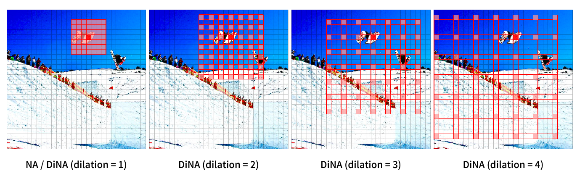
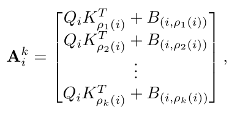
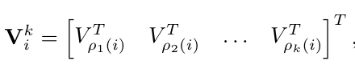
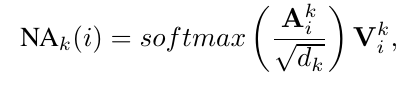
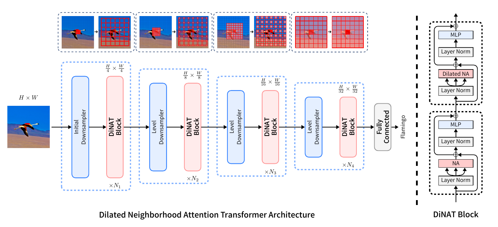
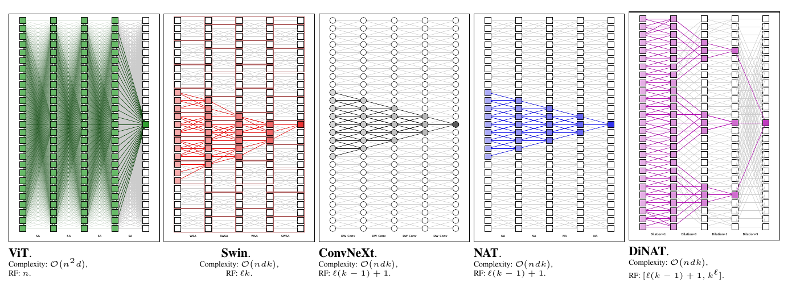
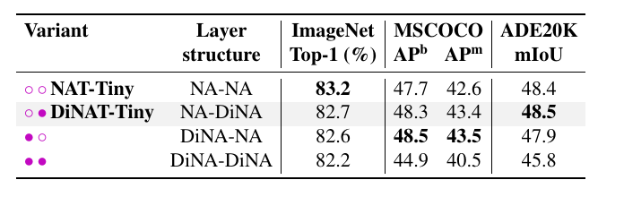
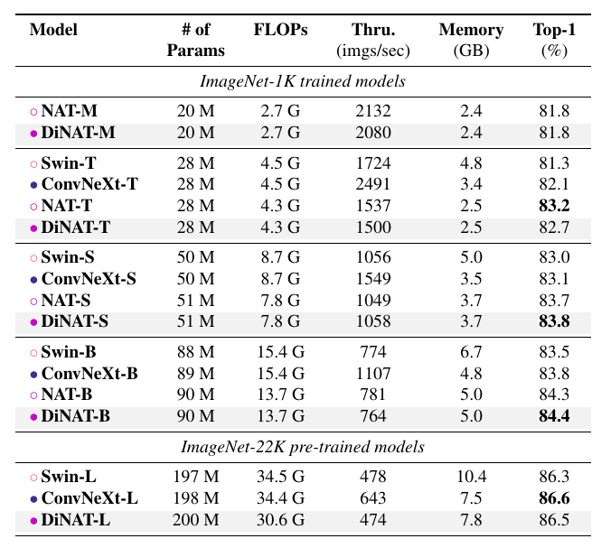
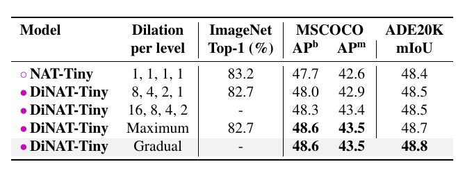

# Dilated Neighborhood Attention Transformer
[https://arxiv.org/abs/2209.15001](https://arxiv.org/abs/2209.15001)
(まとめ @n-kats)

著者
* Ali Hassani
* Humphrey Shi

SHI Lab・Picsartの人

# どんなもの？
vision transformerのアテンションの仕方の研究。

パッチの近くだけとアテンションを行うNA（Neighborhood Attention）を改良して、間隔を開けてアテンションを行うDiNA（Dilated Neighborhood Attention）を提案。

NAとDiNAを両方セットで使うDiNATが良い使い方ということを確認。

# 先行研究と比べてどこがすごい？
大きな解像度の画像でvision transformerをすると、アテンションの計算量が大きくなる。近くだけとアテンションを行うNAが先行研究で提案された。

しかし、NAだと近くしかみないため、遠くの情報を使うのはネットワークの最後の方まで待つ必要がある。

計算量を変えずに遠くまで見るために、DiNAを導入した。
ネットワークの基本設定を揃えて実験したところ、いくつかのタスクで1%程度の差をつけて精度改善が見られた。

また、cuda対応のDiNAが使えるpythonパッケージNATTEN（pytorch製）も作成。

# 技術や手法の肝は？
## 一般形
簡単のため、画像（2次元）の代わりに時系列（1次元）で考える。
つまり、$X \in \mathbb{R}^{n\times d}$ とする（n:空間の次元, d: チャンネル数）。

i: ピクセルのインデックス、$\rho_k(i)$: iのピクセルとAttentionするピクセル（複数あって、そのうちk個目）

のようにQ*Kでアテンションを計算するが、相対位置から来るバイアス項 B を考慮に入れて行う。

後はいつもと同じ。

## DiNA/DiNAT
$\rho_k(i)$ が $\delta$ ピクセル間隔で$k\times k$個のピクセルに対応する範囲を意味するように設定した場合がDiNA

DiNAだと、近くとの情報のやり取りが少なくなるので、NAと組み合わせて使う（DiNAT Block）。

図の上のように近くだけ見るのと遠くを見るのを交互に行う。

## receptive field
receptive fieldの違いは次の通り。

ViTは全体を見るが計算量が大きい。Swin等は近くしか見ないため receptive fieldは少しずつしか広がらない。

# どうやって有効だと検証した？
## NA DiNAの組み合わせ問題
DiNATはNA-DiNAの順で使うが別パターンも試した。

DiNAだけでは精度が悪いことが確認できる。

## 画像分類（ImageNet-1K）

他と同程度の精度にはなるが、そもそも解像度が低いからそこまで効果がない

## detection/instance segmentation（COCO）

$AP^b$ が検出、$AP^m$がインスタンスセグメンテーションのスコア。確かに精度が良くなっている（偶然では無さそう）。

（一番下のブロックは、pretrainにimagenet-22kを用いた場合）
## segmentation（ADE20k）

これでも改善が見られる（一番下のブロックは、pretrainにimagenet-22kを用いた場合）。

## Dilationの作戦
以上の実験では、dilationを8-4-2-1のようにストライドが入る毎に変化させていた。他のパターンも試している。1-1-1-1（NAに相当）や16-8-4-2、Maximum/Gradualの設定を比較した。

* Maximum: 可能な限り大きくしたパターン
* Gradual: 滑らかに変化させたパターン（1から順に増やしていく）

画像分類だと意味ないが、COCOやADEでちょっとだけ良くなっている

# 議論はある？
私見
* ちょっとした工夫をいれるだけで精度が改善していて良い
* DiNAを導入しつつも、前手法のNAと組み合わせて使うとよいというのも面白い特徴
  * SlowFast（動画認識で時間方向に密な推論と疎な推論を組み合わせるというアイデアに似ている）

# 次に読むべき論文は？
* NA([https://arxiv.org/abs/2204.07143](https://arxiv.org/abs/2204.07143))

（この論文で紹介されている手法は有名どころだから、抑えておくとよさそう）
