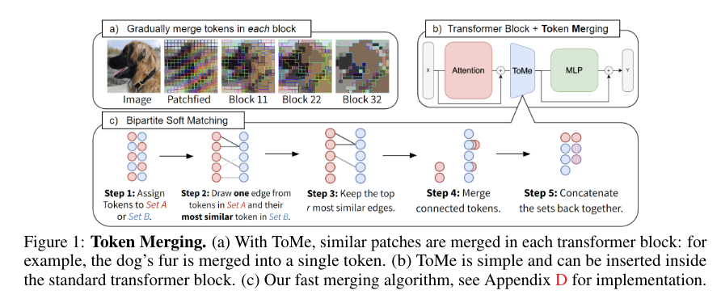
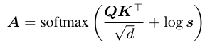
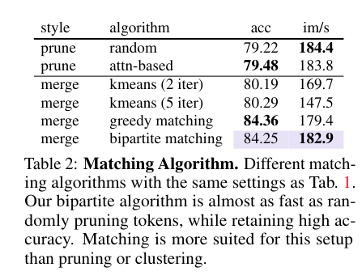
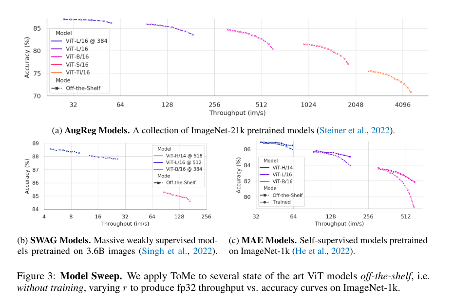
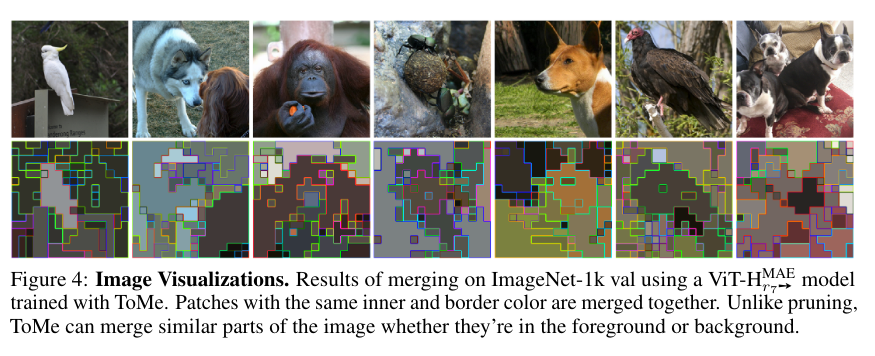

Token Merging: Your ViT But Faster
====
Daniel Bolya, Cheng-Yang Fu, Xiaoliang Dai, Peizhao Zhang, Christoph Feichtenhofer, Judy Hoffman

(Google と Meta の人たち)

https://arxiv.org/abs/2210.09461v1

@cohama

# どんなもの？

- Vision Transformer の学習、推論を高速化するための手法 Token Mergin (ToME) を提案
- 類似したトークン同士を徐々にマージさせていくことで計算量を削減する
- 最良の条件では 0.2%-0.3% の精度低下で2倍のスループット向上を達成
- 学習ではビデオの MAE (Masked Auto Encoder) で2倍高速化

# 先行研究と比べて何がすごい？

- 軽量な Transofomer の研究がある。Attension の計算を省いたり、特定のドメインに特化したモジュールを使うなど。本手法は既存の ViT に対してトークンをマージするという手法。場合によっては追加の学習無しで高速化できる
- トークンを少なくするのは既存研究としていくつかある。これらの多くは動的にトークンを削減する手法で、訓練時にはバッチにまとめるためにマスクを利用している。これは学習時の高速化には全く寄与していない
- トークンをマージするという研究も既にあるが高速化に着目したものではなく、類似のトークンを見つけるのに処理の遅い k-means ベースのアプローチを採っている

# 技術や手法の肝は？

既存の ViT に対してトークンをマージするためのモジュールを追加する。

Transofomer Block を減るごとに r 個ずつトークンを削除していく。最終的には全体 L ブロックで rL 個のトークンが削除されることになる。

r はハイパーパラメータであり、画像の内容に応じて変化するわけではない。画像ごとに r を変えても結局バッチ化する際にパッディングが必要で高速化に寄与しないため。

似ているトークンは冗長なので削除する。トークン同士の距離が十分近ければ似ているとする。Transofomer には Self-Attension があるので K のコサイン類似度を取れば良い。

次に、どのトークンをマジすべきかを考える。k-means などのクラスタリングは無視できないレベルで時間がかかる。
そこで、最適ではないが十分高速な以下のようなマッチングアルゴリズムを考案した。

1. トークンをだいたい同じサイズの A、B の2つに分ける
2. A のそれぞれのトークンについて、最も類似度が高い B を選ぶ
3. 全ての組のうち類似度が高い順に r 個を選ぶ
4. それらをマージする (特徴同士の平均を取る)
5. A, B を結合する

K のトークン数を減らした後、Attension の計算で softmax にかけるが、そのままだとマージしたトークンの重みが薄まってしまう。
それを補正するために改変した softmax を使う。

s は各トークンのマージ数。結局マージした分をコピーして計算したのと同じ結果になる

# どうやって有効だと検証した？

## pruning との比較

## r を変えた場合の精度と速度

## マージされたトークンの可視化

## その他

Video や Audio のタスクでも効果を確認

# 議論はある

- Swin や MViT のように階層的な ViT に適用するとどうなるか。
- Segmentation などの応用
- 学習も効率化するのでさらに巨大なモデルを訓練できる可能性もある

# 次に読むべき論文は

- AViT: Hongxu Yin, Arash Vahdat, Jose Alvarez, Arun Mallya, Jan Kautz, and Pavlo Molchanov. A-ViT: Adaptive tokens for efficient vision transformer. In CVPR, 2022.
- Dyanmic ViT: Yongming Rao, Wenliang Zhao, Benlin Liu, Jiwen Lu, Jie Zhou, and Cho-Jui Hsieh. Dynamicvit: Efficient vision transformers with dynamic token sparsification. NeurIPS, 2021.
- SP-ViT: Zhenglun Kong, Peiyan Dong, Xiaolong Ma, Xin Meng, Wei Niu, Mengshu Sun, Bin Ren, Minghai Qin, Hao Tang, and Yanzhi Wang. Spvit: Enabling faster vision transformers via soft token pruning. In ECCV, 2022.
