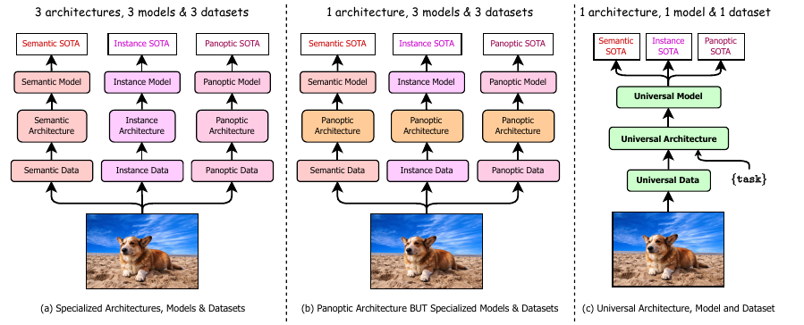
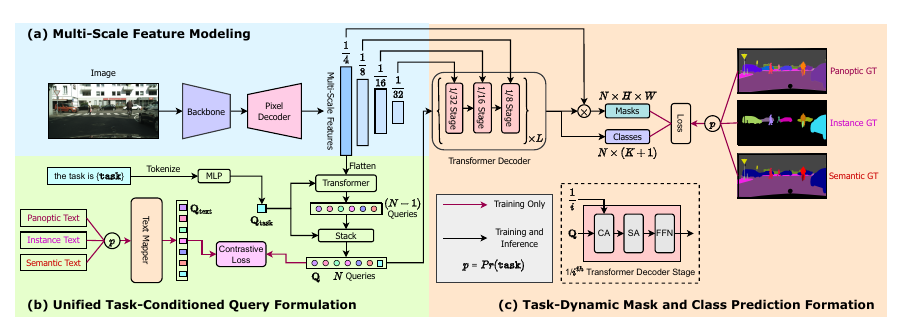
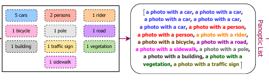
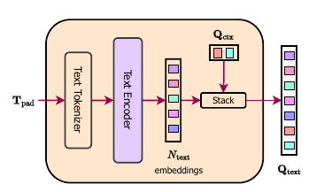
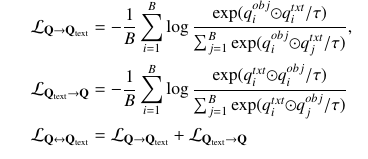
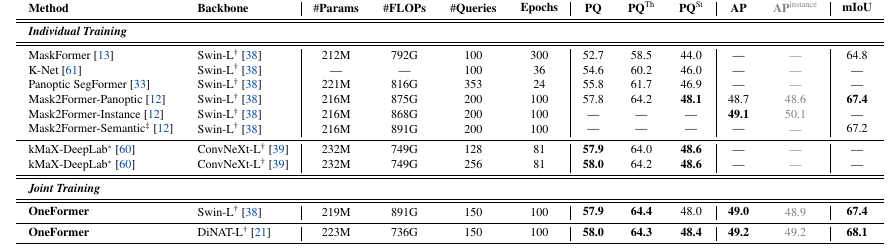

# OneFormer: One Transformer to Rule Universal Image Segmentation

[https://arxiv.org/abs/2211.06220](https://arxiv.org/abs/2211.06220)
(まとめ @n-kats)

著者

* Jitesh Jain
* Jiachen Li
* MangTik Chiu
* Ali Hassani
* Nikita Orlov
* Humphrey Shi

SHI Lab・Picsartの人（前回読んだDiNAの著者を含むメンバー）

# どんなもの？

semantic/instance/panoptic segmentation を単一のアーキテクチャ・モデルでやろうというマルチタスクに関する研究。

これらのタスクでSOTAを達成

# 先行研究と比べてどこがすごい？

先行研究だと、同じアーキテクチャだけど、重みは異なるというやり方ならこれまであった。
OneFormerは複数タスクに跨って訓練して、同じ重みで推論をする（画像とタスクの情報を入力する）。

# 技術や手法の肝は？

## メタアーキテクチャ

* 特徴抽出・クエリ作成・タスク推論の3つのパーツに分かれる
  * 特徴抽出は、好きなネットワークでよい
  * クエリ作成は、タスク情報（this task is {task}）をN個のクエリベクトルに変換する
  * タスク推論は、N個のベクトルをトランスフォーマーに入力し、CAで画像特徴の情報を取り込んでいき、最終出力を作る
* 損失関数は、タスクの損失だけでなく、クエリ作成部分でも損失を考える

タスク情報を入れ替えることで、そのタスクにあったクエリを作成し、推論に使うのが特徴。

## 特徴抽出

なんでもいい。
swin/ConvNeXt/DiNATを前半（backbone）にして、後半（PixelDecoder）はMask2Formerで使われるMSDeformAttn(Multi-Scale Deformable Transformer)を使う。

## クエリ作成

### タスク指定

the task is {task} というタスク文（task=semantic/instance/panoptic）を入力する。

### クエリ作成ネットワーク

タスク文をトークン化・MLPを使ってベクトル化する（$Q_{task}$）。

$Q_{task}$ を N-1 個並べて（位置ベクトルもつける？）、それをクエリとするトランスフォーマーで、推論のクエリを作る。
このときに、画像情報を使う（stride4の層からCAで取り込む）。

上記でできたN-1個のクエリと$Q_{task}$のN個のクエリを推論のクエリ（Q）とする。

### クエリの学習

N個のクエリが、具体的なタスク（車を見つけるとか）に対応するように対照学習の要領で学習する。

教師（車がk台あって・・・）から次のようなテキストのリストを作る。（Nに届かない場合は"a {task} photo"で埋める）

テキストをトークン化・トランスフォーマーで特徴ベクトル化する。ここで、画像のコンテキスト（画像毎の特徴ベクトル・$Q_{ctx}$）を結合させる。

損失関数は、次の形

## 推論

Qを入力にして画像特徴をCAで取り込むトランスフォーマーで推論する。ストライド32/16/8の画像特徴量を取り込むブロックを順に適用し、これをL回繰り返す。

最後にクエリ毎に対応したマスクと属性（分類）の推論を行う。

# どうやって有効だと検証した？

現在のランキング

* ADE20K
  * semantic 4位
  * instance 1位
  * panoptic 1位
* cityscape
  * semantic 5位
  * instance 1位
  * panoptic 2位
* coco
  * semantic 1位
  * instance 1位
  * panoptic 5位

たまに1位じゃないのはだいたい他データ使用の有無。

## ADE20K

Mask2Formerの他データ使用なしには勝利。
backboneはDiNATがいい

PQ=panoptic query・・・$\sum_{tp} \text{IoU}(tp) / (TP+FP/2+FN/2)$

AP: instance segmentation用

mIoU: semantic segmentation用

## CityScape

## COCO

# 議論はある？

マルチタスクユニバーサルなモデルを作った。

## 私見

* 属性が色々ある場合はどうなるんだろうか。回帰とか

# 次に読むべき論文は？

* Mask2Former
* GroupViT・・・トークン化アイデアの詳細が書いてあるらしい
